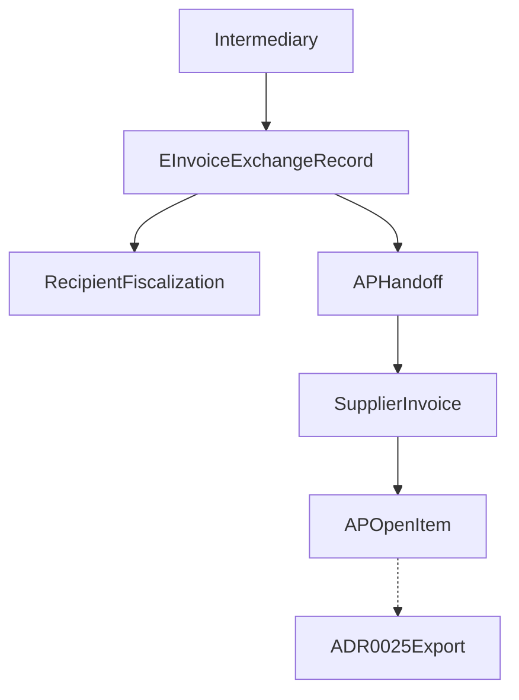

# ADR 0024: Incoming eInvoices and Recipient Fiscalization

## Status

Proposed

This ADR may be documented and merged while `Proposed`.

This ADR does not authorize an intermediary adapter, a FiskAplikacija client, an XML parser vendor, or application code.

## Date

2026-08-15

## Context

ADR 0010 owns the outgoing sales Invoice, B2C fiscalization, and issued-eInvoice exchange. ADR 0017 owns the permission catalog. ADR 0020 makes the server the only canonical offline authority. ADR 0023 owns `SupplierInvoice`, matching, approval, `POSTED`, `APOpenItem`, and supplier payment.

Without this ADR, an uploaded XML would look like a fiscalized receipt, two intermediaries would both believe they are the live receive route, a fiscal ACK for one invoice would attach to another with a similar number, the same bill arriving through two paths would become two payables, and a POS device would hold intermediary credentials.

Database names, API names, and source code use English. The user interface may localize them to Croatian and other languages.

This ADR locks inbound eInvoice exchange and recipient fiscalization **before** adapters. Physical schema details belong in a later implementation. The semantics below must not change once accepted.

Cite as legal duties, not as a complete wire specification: [Porezna uprava – issuing, receiving and fiscalizing eInvoices](https://porezna-uprava.gov.hr/hr/izdavanje-i-primanje-eracuna-i-fiskalizacija-eracuna/8047) (exchange is not recipient fiscalization; current official guidance says fiscalize within five working days of receipt — use a **versioned** deadline rule, do not hard-code “5 days”), [FiskAplikacija](https://porezna-uprava.gov.hr/hr/fiskaplikacija-8274/8274), [Zakon o fiskalizaciji, NN 89/2025](https://narodne-novine.nn.hr/clanci/sluzbeni/2025_06_89_1233.html).

The governing rule:

```text
Intermediary exchange     = structured eInvoice received
Recipient fiscalization   = report of receipt to Porezna uprava
EInvoiceExchangeRecord    = technical and evidence record
SupplierInvoice           = supplier business document     (ADR 0023)
APOpenItem                = payable only after POSTED      (ADR 0023)
```

```text
XML received              ≠ fiscalized receipt
Fiscalized receipt        ≠ AP approval
AP POSTED                 ≠ racunai.hr export
```

```text
Informacijski posrednik = primitak i fiskalizacija eRačuna   (this ADR)
Tablio AP               = provjera, approval i obveza        (ADR 0023)
racunai.hr              = knjiženje i izvještavanje          (ADR 0025)
```



## Decision

### 1. Ownership versus 0010, 0023, and 0025

ADR 0010 still owns the outgoing sales Invoice, B2C fiscalization, and issued-eInvoice exchange. This ADR does not reopen outgoing eInvoice.

ADR 0023 still owns matching, approval, `POSTED`, `APOpenItem`, and supplier payment. This ADR owns receive, original XML, recipient fiscalization, technical acknowledgements, deadline, eReporting **transport**, and AP **handoff**.

ADR 0025 later owns `AccountingExportBatch`, `accounting_integration_mode` (`MANUAL_EXPORT` | `RACUNAI_API`), and the racunai.hr outbox. This ADR is not ADR 0025. It only guarantees stable references, fiscal evidence, and AP handoff so 0025 can export without reading the intermediary raw feed.

```text
0024 fiscal ACK           ≠ AP POSTED
0023 AP POSTED            ≠ accounting exported
0025 export ACKNOWLEDGED  ≠ supplier paid
```

Accounting must not bypass match or approval by reading the intermediary raw record.

### 2. Legal entity and tenant binding

```text
LegalEntityEInvoiceProfile
--------------------------
tenant_id
legal_entity_id
tax_identifier
recipient_identifier
timezone
status
configuration_generation
```

Every eInvoice belongs to one legal entity. Buyer or recipient identity in the XML must match the configured entity. Wrong OIB or recipient → `QUARANTINED`. Location or cost center does not choose the recipient. After receive, the document does not move to another legal entity. The 0023 `SupplierInvoice` inherits the same `legal_entity_id`.

Tenant and legal entity come from the **connection**, never from a body field. ADR 0001 is not amended.

### 3. Intermediary and connection

```text
EInvoiceIntermediary
IntermediaryConnection
--------------------
legal_entity_id
intermediary_id
mode
status
credential_generation
configuration_generation
```

```text
PENDING
ACTIVE
REASSIGNING
SUSPENDED
BROKEN
REVOKED
```

The intermediary is not a Supplier and not an accounting system.

### 4. Receive assignment versus fiscal authorization

Receive route ≠ fiscalization authority:

```text
EInvoiceReceiveAssignment
RecipientFiscalizationAuthorization
```

Each has legal entity, intermediary, capability, validity, confirmation proof, FiskAplikacija or AMS reference, generation, and actor. API credentials alone do **not** prove fiscalization authority.

DB invariant — at most one **ACTIVE** receive assignment per identifier and overlapping validity:

```text
At most one ACTIVE EInvoiceReceiveAssignment
per legal_entity_id + recipient_identifier + validity interval
```

DB invariant — at most one **ACTIVE** fiscal authorization per obligation capability and overlapping validity:

```text
At most one ACTIVE RecipientFiscalizationAuthorization
per legal_entity_id + obligation capability + validity interval
```

Two intermediaries must not both believe they are the live receive route or the live fiscal authority. During migration the old assignment may only be `DRAINING` or `RECOVERY_ONLY`.

### 5. External authorization is a verified status

Writing configuration in Tablio does not prove that the authorization exists in FiskAplikacija.

```text
authorization_status:
REQUESTED
VERIFIED_ACTIVE
REVOKED
EXPIRED
UNKNOWN
```

```text
verified_at
verified_source
external_authorization_reference
valid_from
valid_until
last_checked_at
```

API fiscalization requires `VERIFIED_ACTIVE`. The backend re-checks that status before sending a fiscal request.

If the external status is `UNKNOWN`, Tablio must not send a new request as if authority were proven. The document stays in recovery. The deadline still runs.

### 6. MANUAL or API — one active receive path

```text
e_invoice_intermediary_mode:
MANUAL
API
```

One active mode per legal entity and receive assignment. Both create the same canonical `EInvoiceExchangeRecord`.

`MANUAL`: the user uploads original XML and attachments, enters exchange receipt and fiscal evidence, and confirms external ids and receive time. Upload alone is not fiscal ACK.

`API`: pull or webhook; store original XML and hash; idempotent receive; send or request recipient fiscalization; webhook or poll; `UNKNOWN` recovery; no blind non-idempotent retry.

Two active modes on one receive assignment are rejected.

### 7. RECOVERY_IMPORT while API is active

While API is the active mode, do **not** open a second `MANUAL` assignment. Emergency upload uses `RECOVERY_IMPORT`.

```text
RECOVERY_IMPORT
```

`RECOVERY_IMPORT` is bound to the existing API connection. It requires a reason and `einvoice.recovery_import`. It first looks up the existing external document or status, uses the same business fingerprint, does not create a second receive assignment, and does not re-send fiscalization if the external status is `UNKNOWN`. It is audited as an emergency transport path.

### 8. EInvoiceExchangeRecord and three independent statuses

One record = one technically received document.

Three independent columns:

```text
exchange_status:
NOT_RECEIVED | RECEIVED | VALIDATING | VALID
| REJECTED_TECHNICAL | QUARANTINED

recipient_fiscalization_status:
NOT_REQUIRED | REQUIRED | PENDING | SUBMITTED
| ACKNOWLEDGED | REJECTED | UNKNOWN | OVERDUE

ap_handoff_status:
NOT_READY | READY | SUPPLIER_UNMAPPED
| CREATED | LINKED_EXISTING | FAILED
```

`VALID` + fiscal `PENDING` + handoff `CREATED` is allowed. `SupplierInvoice` may enter matching and approval while fiscalization is still pending.

0023 `POSTED` must not flip fiscal status. Fiscal `ACKNOWLEDGED` must not approve goods, price, tax, IBAN, or the payable, and must not create `APOpenItem`.

### 9. Recipient fiscalization gate

Versioned gate on the legal entity or jurisdiction rule. It is not a device toggle.

```text
recipient_fiscalization_gate:
WARN_ONLY
REQUIRE_ACK_BEFORE_AP_POST
REQUIRE_ACK_BEFORE_PAYMENT
```

`REQUIRE_ACK_BEFORE_AP_POST` may block 0023 posting until ACK. `REQUIRE_ACK_BEFORE_PAYMENT` may block 0023 payment. `WARN_ONLY` does not block either.

### 10. received_at and deadline

Priority for legally relevant receipt:

1. intermediary delivery proof
2. structured exchange timestamp
3. manually confirmed receipt proof
4. Tablio upload timestamp as a **marked** fallback

Store `received_at`, `received_at_source`, and `server_recorded_at`. Deadline is computed from the legally relevant receipt, then frozen:

```text
fiscalization_due_at
deadline_rule_version
```

```text
RecipientFiscalizationDeadlineRule
----------------------------------
jurisdiction
valid_from
business_day_calendar
deadline_duration
rule_version
```

A later rule change does not rewrite an already frozen `fiscalization_due_at`. Mode or intermediary change does not reset an existing `fiscalization_due_at`.

The scheduler warns, escalates, and marks `OVERDUE`. It must not turn `UNKNOWN` into `REJECTED`, rewrite the invoice, fake a send date, or erase that a late success was overdue.

### 11. Immutable artifacts and untrusted XML

```text
EInvoiceArtifact
----------------
ORIGINAL_XML
RENDERED_PDF
ATTACHMENT
EXCHANGE_RECEIPT
FISCALIZATION_REQUEST
FISCALIZATION_RESPONSE
REJECTION_EVIDENCE
```

Original XML is never overwritten. PDF render is not the canonical eInvoice. A “corrected” user XML is a new artifact or revision. Hash is content proof. XML is not copied into ordinary logs. Attachments are scanned and hashed separately. Access is permission-protected.

Parser hard locks for untrusted XML:

- no XML External Entity resolution
- no remote schema or include fetch during processing
- limited entity expansion and nesting depth
- limited XML and attachment size
- protection against decompression bombs and ZIP path traversal
- parser runs in an isolated process or sandbox
- an attachment is not executable content
- a parser error yields `REJECTED_TECHNICAL` or `QUARANTINED`, never a partially normalized invoice

Validation layers: `TRANSPORT_VALIDATION` | `SCHEMA_VALIDATION` | `BUSINESS_VALIDATION` | `TAX_VALIDATION` | `AP_VALIDATION`. Intermediary technical ACK is not AP validation.

ADR 0009 still owns the tax model. This ADR records inbound `TAX_VALIDATION`.

### 12. Normalize and supplier mapping

`NormalizedEInvoice` is a parser projection. A new parser version does not change original XML or an already-approved `SupplierInvoice`. It may open review. AP stores a snapshot of values handed off.

Tax-id from the eInvoice must not auto-create or rewrite `Supplier`. Mapping: `MATCHED` | `UNMAPPED` | `AMBIGUOUS` | `BLOCKED`. IBAN from XML does not change Supplier master or become a verified pay account.

### 13. Transport duplicates and business fingerprint

```text
UNIQUE (intermediary_connection_id, external_document_id)
UNIQUE (legal_entity_id, exchange_message_id)
```

Same `external_document_id` + different XML hash → `QUARANTINED`.

`external_document_id` and `exchange_message_id` are not enough across MANUAL→API, intermediary change, the same XML on two paths, or a different envelope around the same invoice.

```text
EInvoiceBusinessFingerprint
---------------------------
legal_entity_id
supplier_identifier
invoice_identifier
document_type
issue_date
currency
gross_total
canonical_invoice_content_hash
fingerprint_version
```

- Same business fingerprint and same canonical content → link the existing record.
- Same business identity, different content → `MANUAL_REVIEW` or `QUARANTINED`.
- A different transport envelope is not automatically a new invoice.
- A different raw XML hash is not automatically a new business document.

The 0023 AP duplicate check (legal entity + supplier cluster + normalized number + type) remains an extra protection.

`IntermediaryInboxEvent`: verify signature before process; replay protection; timestamp tolerance; body hash; schema; rate and size limits; context from the connection. An inbox event with an invalid signature never enters the business domain.

### 14. Fiscal evidence and outbox

Fiscal ACK must be bound to the exact document, not only an external reference.

```text
RecipientFiscalizationEvidence
------------------------------
exchange_record_id
legal_entity_id
original_xml_hash
canonical_payload_hash
obligation_type
request_hash
external_reference
acknowledged_at
response_hash
```

Evidence for one invoice must not attach to another invoice with a similar number. A fiscal ACK whose XML or request hash does not match the invoice cannot be attached.

Idempotency is unique at least by:

```text
exchange_record_id + obligation_type + reporting_rule_version
```

Reprocessing the same invoice returns the same fiscal result, not a second submission.

`RecipientFiscalizationOutbox`: no API inside the transaction that creates the exchange record or `SupplierInvoice`. Timeout `SUBMITTED → UNKNOWN`. Reconcile by the same external reference. No blind retry.

### 15. Manual fiscalization evidence

`ManualFiscalizationEvidence`: screenshot upload is not automatic `ACKNOWLEDGED`. It needs structured confirmation or reference, maker-checker above a risk threshold, and actor/verifier audit. The person who uploads fiscal evidence must not alone verify it above the defined risk.

### 16. Document revision and correction

```text
EInvoiceDocumentRevision
------------------------
exchange_record_id
revision
relationship            # ORIGINAL | SUPERSEDES | CORRECTS
prior_revision_id
status
```

Only one revision is currently valid for a new AP handoff. The old revision stays immutable. The new revision has its own validation and fiscal evidence.

- If the previous `SupplierInvoice` is not yet approved, open a controlled revalidation.
- If it is already `APPROVED`, that approval becomes invalid.
- If it is already `POSTED`, the new revision does not overwrite it. Use a credit or debit note, or the 0023 compensation workflow.

The old revision’s deadline and receipt are not deleted.

A credit or debit note is a **new** eInvoice: own record, XML, hash, fiscal obligation, original reference, and own 0023 `SupplierInvoice`. No rewrite of the original eInvoice. No reuse of the original fiscal ACK.

### 17. Mode change and intermediary change

```text
ACTIVE → DRAINING → REASSIGNING → ACTIVE
```

Stop new receive on the old path; save high-waters; resolve `PENDING` and `UNKNOWN`; list documents without confirmed fiscal status; check that API will not re-ingest manuals; bump configuration generation; keep old credentials only for closed recovery. Two modes must not both create canonical records. API of an already-manual document links by evidence, hashes, and business fingerprint.

A mode switch with unresolved `UNKNOWN` stays `DRAINING` or `REASSIGNING`.

Changing intermediary is not a URL edit: confirm the new receive or AMS path and fiscal authority; stop old receive; drain; save both high-waters; record a cutover date; leave no gap and no double receive; keep the old connection read-only for recovery; stay `REASSIGNING` until done. During migration the old assignment may only be `DRAINING` or `RECOVERY_ONLY`.

### 18. Rejection and eReporting

Rejection kinds: `TECHNICAL_REJECTION` | `BUSINESS_REJECTION` | `AP_DISPUTE`. Business reject does not delete the exchange record or artifact.

If law requires eReporting of reject, ADR 0023 owns the business decision. This ADR sends the technical report.

`EReportingObligation` is versioned. ADR 0023 owns business `REJECTED`, dispute, and payment. This ADR creates the obligation and outbox. Timeout `UNKNOWN`. ACK does not change the AP decision. The same business event is not sent twice. The reportable event set is a jurisdiction rule, not a forever hard-code.

### 19. Security, offline, permissions, and audit

Credentials are encrypted and rotatable. Receive, fiscal, and report capabilities stay separate. Least privilege. XML and attachments are confidential financial data. No PII in ordinary logs. Raw-payload access is narrower than `SupplierInvoice` view. Malware scan. Audit every original-XML download. Retention stays ADR 0027. A security incident does not erase the evidence chain.

Server-only. A POS device must not receive a canonical eInvoice, send recipient fiscalization, confirm manual evidence, or store intermediary credentials. After sync it may show an allowed AP status only.

ADR 0017 owns the catalog. This ADR adds:

```text
einvoice.view
einvoice.artifact_view
einvoice.import_manual
einvoice.recovery_import
einvoice.validate
einvoice.map_supplier
einvoice.fiscalize
einvoice.evidence_verify
einvoice.resolve
einvoice.connection_manage
einvoice.security_manage
einvoice.reporting_submit
einvoice.reporting_resolve
```

`einvoice.view` cannot read original XML. `einvoice.artifact_view` is required. `einvoice.import_manual` is for the MANUAL receive assignment. `einvoice.recovery_import` is the emergency path while API is active; it is not a second receive mode.

Audit at least: legal-entity config; receive assignment and fiscal authorization, including `authorization_status`; intermediary, mode, and generation; original XML, hash, and schema; exchange receipt and `received_at` source; all validation results; parser versions; supplier mapping; duplicate and fingerprint decision; fiscal request, response, and evidence hashes; deadline and overdue; manual evidence and verification; API attempts, `UNKNOWN`, and recovery; `RECOVERY_IMPORT`; mode or intermediary change; AP handoff and `SupplierInvoice` link; revision lifecycle; rejection and eReporting lifecycle; actor, verifier, and then-current permissions.

### 20. Reserved for ADR 0025

Do not write ADR 0025 in this change.

Reserved shape only:

```text
accounting_integration_mode:
MANUAL_EXPORT
RACUNAI_API
```

Both later use a frozen `AccountingExportBatch` (legal entity, period, high-water, mapping version, counts, control totals, payload hash). Re-download returns the same hash. Correction is a new batch.

`RACUNAI_API` later sends that batch via `AccountingOutboxMessage`. No API inside AP posting. Timeout `UNKNOWN`. No blind retry. Same document and version = same idempotency key. `ACKNOWLEDGED` stores the external journal id. `REJECTED` does not void 0023 `POSTED`. racunai.hr must not rewrite Tablio’s eInvoice or AP document. Mode switch needs final high-water, already-submitted batches, API cursor, and dedupe so API does not rebook a manually delivered document.

### 21. Mandatory acceptance tests

An implementation of this ADR must cover at least:

- Buyer OIB or recipient id in the XML cannot select another legal entity. Mismatch is `QUARANTINED`.
- API credentials alone do not set `RecipientFiscalizationAuthorization`.
- XML upload without fiscal evidence does not set `ACKNOWLEDGED`.
- `MANUAL` and `API` of the same document link one `EInvoiceExchangeRecord` or `SupplierInvoice`.
- Same `external_document_id` + different XML hash → `QUARANTINED`.
- Two active modes on one receive assignment are rejected.
- `VALID` + fiscal `PENDING` + handoff `CREATED` is allowed.
- 0023 `POSTED` does not change `recipient_fiscalization_status`.
- Fiscal `ACKNOWLEDGED` does not create `APOpenItem` or approve the invoice.
- `REQUIRE_ACK_BEFORE_AP_POST` blocks 0023 posting until ACK. `WARN_ONLY` does not.
- `received_at` from upload fallback is marked. Deadline uses the legally relevant source.
- Deadline rule version is frozen at receive. A later rule change does not rewrite `fiscalization_due_at`.
- Scheduler marks `OVERDUE` without turning `UNKNOWN` into `REJECTED`.
- Original XML overwrite is rejected. A “fixed” XML is a new artifact.
- PDF render is not treated as the canonical eInvoice.
- New parser version does not rewrite an approved `SupplierInvoice`.
- Tax-id match `AMBIGUOUS` or `BLOCKED` does not auto-create a Supplier.
- IBAN from XML does not verify or replace `SupplierBankAccount`.
- Inbox event with invalid signature never enters the business domain.
- Fiscal outbox HTTP inside the create-record transaction is rejected and is not modeled.
- Outbound timeout is `UNKNOWN`. Blind retry is rejected.
- Screenshot-only evidence does not become `ACKNOWLEDGED` without verify.
- Mode switch with unresolved `UNKNOWN` stays `DRAINING` or `REASSIGNING`.
- Intermediary change without drain or high-water is rejected.
- Credit note creates a new exchange record and does not reuse the original fiscal ACK.
- Business rejection does not delete the artifact.
- eReporting ACK does not change 0023 `REJECTED` or dispute.
- Offline POS cannot import eInvoice or store intermediary credentials.
- `einvoice.view` cannot read original XML. `einvoice.artifact_view` is required.
- Uploader of manual evidence cannot alone verify it above the risk threshold.
- A second ACTIVE receive assignment for the same `legal_entity_id + recipient_identifier` and overlapping validity is rejected.
- Tablio config without `VERIFIED_ACTIVE` external authorization cannot fiscalize.
- External authorization `UNKNOWN` does not send a new fiscal request as if authority were proven.
- A fiscal ACK whose XML or request hash does not match the invoice cannot be attached.
- The same invoice through two intermediaries links via `EInvoiceBusinessFingerprint`.
- The same invoice number with different canonical content goes to review, not automatic link.
- A different transport envelope or raw XML hash is not automatically a new business document.
- Correction before approval opens controlled revalidation. After `POSTED` it does not overwrite AP.
- `RECOVERY_IMPORT` during API mode does not create a second assignment or a second fiscal submission.
- XML with an external entity, remote include, or decompression bomb is rejected or quarantined.
- Mode or intermediary change does not reset an existing `fiscalization_due_at`.

## Rejected alternatives

- XML upload as fiscal proof.
- One status for exchange, fiscalization, and AP.
- Intermediary as AP approver.
- Fiscalization creating `APOpenItem`.
- AP `POSTED` meaning fiscal ACK.
- Buyer OIB in the payload selecting tenant or legal entity.
- Overwriting original XML.
- PDF as the canonical eInvoice.
- Parser as authority without a snapshot.
- API timeout as rejection.
- Blind fiscal retry.
- Screenshot auto-`ACKNOWLEDGED`.
- Two active MANUAL and API paths.
- A second ACTIVE receive assignment for the same recipient identifier.
- Tablio config treated as proven FiskAplikacija authority.
- Fiscal ACK attached only by external reference or similar invoice number.
- Treating a different envelope or raw XML hash as automatically a new business document.
- Correction overwriting a `POSTED` AP invoice.
- A second `MANUAL` mode while API is active instead of `RECOVERY_IMPORT`.
- XXE, remote include, or decompression-bomb parse that still yields a partial invoice.
- Intermediary change without drain.
- Credit note mutating the original eInvoice.
- Physically deleting a rejected record.
- Intermediary credentials on a POS device.
- eReporting changing an AP decision.
- Accounting reading the intermediary raw feed to skip AP.
- Writing ADR 0025 in this change.

## Consequences

### Positive

- An inbound XML cannot become a fiscalized receipt or a payable by itself.
- Two intermediaries cannot both act as the live receive route or fiscal authority.
- A fiscal ACK is cryptographically and logically bound to the exact document.
- The same business invoice arriving through two transports links instead of duplicating.

### Negative

- API fiscalization cannot proceed on Tablio config alone; external verification is required.
- Emergency upload while API is active needs a distinct permission and audit path.
- Untrusted XML cannot be parsed in-process without isolation and size limits.

### Neutral

- Documentation can merge without an intermediary adapter, FiskAplikacija client, or parser vendor.
- ADR 0010 still owns outgoing Invoice. ADR 0023 still owns AP. ADR 0009 still owns the tax model.
- ADR 0025 stays a reserved roadmap entry.

## Invariants

1. XML received ≠ fiscalized receipt ≠ AP approval ≠ racunai.hr export.
2. Tenant and legal entity come from the connection. Buyer or recipient identity in the XML cannot select them. After receive, the legal entity does not move.
3. At most one ACTIVE `EInvoiceReceiveAssignment` per `legal_entity_id + recipient_identifier` and overlapping validity. At most one ACTIVE `RecipientFiscalizationAuthorization` per `legal_entity_id + obligation capability` and overlapping validity.
4. API credentials do not prove fiscal authority. API fiscalization requires `VERIFIED_ACTIVE`. `UNKNOWN` does not send a new request as if authorized.
5. One active receive mode per assignment. `RECOVERY_IMPORT` is not a second MANUAL assignment.
6. `exchange_status`, `recipient_fiscalization_status`, and `ap_handoff_status` are independent. `VALID` + `PENDING` + `CREATED` is allowed.
7. 0023 `POSTED` does not flip fiscal status. Fiscal `ACKNOWLEDGED` does not create `APOpenItem` or approve the invoice.
8. Original XML is immutable. PDF is not canonical. Parser error is `REJECTED_TECHNICAL` or `QUARANTINED`, never a partial invoice.
9. Fiscal evidence binds `exchange_record_id`, XML hashes, and request hash. Reprocess returns the same fiscal result.
10. Same business fingerprint and same canonical content link. Same identity with different content goes to review. Envelope or raw XML hash alone does not create a new business document.
11. Only one revision is current for a new AP handoff. After `POSTED`, a new revision does not overwrite AP.
12. Deadline is frozen at receive. Mode or intermediary change does not reset `fiscalization_due_at`.
13. Server-only. A POS device must not hold intermediary credentials or send recipient fiscalization.
14. Tenant isolation. Ids alone do not authorize.

## Follow-up ADRs

```text
Accounting Posting and Export
Reporting, Analytics and Historical Snapshots
Audit Trail, Data Retention and Privacy
```

Do not implement an intermediary adapter, FiskAplikacija client, XML parser, or racunai.hr export from this ADR.

## See also

- [ADR 0009: Tax Model](0009-tax-model.md)
- [ADR 0010: Invoices and Fiscalization](0010-invoices-and-fiscalization.md)
- [ADR 0017: Staff Identity, Roles and Operator Authorization](0017-staff-identity-roles-and-operator-authorization.md)
- [ADR 0020: Offline POS Operation and Synchronization](0020-offline-pos-operation-and-synchronization.md)
- [ADR 0023: Supplier Invoices and Accounts Payable](0023-supplier-invoices-and-accounts-payable.md)

## Out of scope

This ADR does not define:

- AP match, approval, or payment (ADR 0023)
- GL, journal, or racunai.hr export (ADR 0025)
- AP aging dashboards (ADR 0026)
- retention or privacy execution (ADR 0027)
- Tablio public API (ADR 0028)
- a concrete intermediary API
- a concrete XML parser
- KPD mapping UX
- a commercial contract with the intermediary
- outgoing eInvoice beyond ADR 0010
- MIKROeRAČUN automation
- exact deadline duration, evidence-verify risk threshold, webhook skew, payload-size, or rate-limit numbers
- POS screen layout
