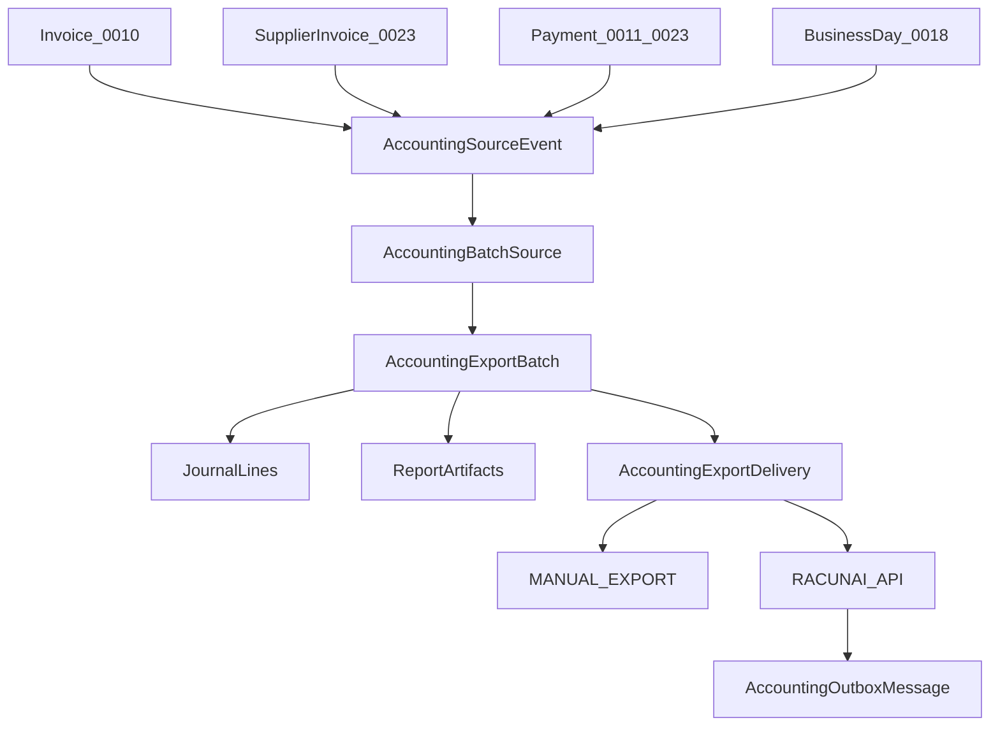

# ADR 0025: Accounting Posting and Export

## Status

Proposed

This ADR may be documented and merged while `Proposed`.

This ADR does not authorize a racunai.hr SDK, a report renderer vendor, or application code.

## Date

2026-08-15

## Context

ADR 0009 owns the tax model. ADR 0010 owns the outgoing sales Invoice and fiscalization. ADR 0011 owns customer Payment. ADR 0017 owns the permission catalog. ADR 0018 owns cash accountability and `BusinessDay`. ADR 0020 makes the server the only canonical offline authority. ADR 0023 owns `SupplierInvoice`, `POSTED`, `APOpenItem`, and supplier payment. ADR 0024 owns inbound eInvoice exchange and recipient fiscalization.

Without this ADR, Tablio `POSTED` would look like a racunai.hr journal, a fiscal ACK would look like statutory booking, the same cash would be posted from a payment and again from the day summary, a technical provider receipt would look like a booked document, and a POS device would hold accounting credentials.

Database names, API names, and source code use English. The user interface may localize them to Croatian and other languages.

This ADR locks accounting posting and export **before** adapters. Physical schema details belong in a later implementation. The semantics below must not change once accepted.

Cite as duties, not as a racunai.hr wire specification. racunai.hr is **knjiženje i izvještavanje**, not an eInvoice intermediary and not a second invoice issuer.

The governing rule:

```text
Tablio Invoice / SupplierInvoice / Payment  = operational facts
AccountingExportBatch                       = frozen export of those facts
AccountingExportDelivery                    = MANUAL_EXPORT or RACUNAI_API of that batch
racunai.hr / vanjski računovođa             = statutory books
```

```text
0010 issued / fiscalized     ≠ accounting exported
0023 POSTED                  ≠ racunai.hr journal
0025 RECEIVED_BY_PROVIDER    ≠ IMPORTED ≠ BOOKED_CONFIRMED
0025 BOOKED_CONFIRMED        ≠ supplier or customer paid
0018 day CLOSED              ≠ GL period CLOSED
CUSTOMER_PAYMENT             ≠ BUSINESS_DAY_CASH_SUMMARY cash posting
0026 dashboard               ≠ accountant export pack
```



## Decision

### 1. Ownership versus source ADRs and 0026

ADR 0010 still owns the outgoing sales Invoice and fiscalization. ADR 0023 still owns AP. ADR 0011 still owns customer Payment. ADR 0018 still owns cash accountability and `BusinessDay`. ADR 0024 still owns inbound eInvoice exchange. ADR 0009 still owns the tax model.

This ADR owns GL mapping, accounting period lock, `AccountingSourceEvent`, `AccountingBatchSource`, `AccountingExportBatch`, report artifacts, `AccountingExportDelivery`, `AccountingOutboxMessage`, and the racunai.hr adapter.

Export is built from canonical Tablio documents and stored tax and payment snapshots. It must **not** read the 0024 intermediary raw feed, rewrite a fiscal XML, or become a second invoice issuer.

ADR 0026 later owns operational analytics. Accountant packs are this ADR, not 0026. This ADR is not ADR 0026.

### 2. Tablio is not the statutory ledger

Tablio is the operational system of record. racunai.hr or the external accountant keeps the statutory books.

```text
Tablio does not replace the accountant
racunai.hr must not re-issue a Tablio legal invoice
racunai.hr must not rewrite Tablio Invoice, SupplierInvoice, Payment, or eInvoice
REJECTED delivery does not void 0010 issue, 0023 POSTED, or 0011 CAPTURED
```

Tablio does not own the Croatian statutory chart of accounts as its master. It stores a **versioned map** onto the accountant’s accounts.

### 3. Legal entity, default mode, and connection

```text
LegalEntityAccountingProfile
----------------------------
tenant_id
legal_entity_id
functional_currency
accounting_integration_mode
period_calendar
status
configuration_generation
```

Tenant and legal entity come from the **connection / profile**, never from an export body field. ADR 0001 is not amended.

```text
accounting_integration_mode:
MANUAL_EXPORT
RACUNAI_API
```

One **ACTIVE** default delivery mode per legal entity. Mode lives on the profile and connection, **not** on the batch. Both channels deliver the same canonical batch. A later API delivery of an already-frozen manual batch must not create a second economic booking.

```text
AccountingConnection
--------------------
legal_entity_id
provider                   # RACUNAI | MANUAL_ACCOUNTANT
mode
status                     # PENDING | ACTIVE | REASSIGNING | SUSPENDED | BROKEN | REVOKED
credential_generation
configuration_generation
```

At most one ACTIVE `AccountingConnection` per `legal_entity_id` and overlapping validity. During switch the old connection may only be `DRAINING` or `RECOVERY_ONLY`. Two connections must not both **create** batches for the same high-water.

`RACUNAI_API` credentials alone do not prove the external company is ready:

```text
connection_status:
REQUESTED
VERIFIED_ACTIVE
REVOKED
EXPIRED
UNKNOWN
```

API submit requires `VERIFIED_ACTIVE`. If the external status is `UNKNOWN`, Tablio must not send a new booking as if the link were proven. The batch stays in recovery.

### 4. Source events and eligibility

```text
AccountingSourceEvent
---------------------
legal_entity_id
source_type
source_id
source_version
source_hash
posting_date
document_dates_snapshot
eligibility
```

v1 `source_type`:

```text
SALES_INVOICE
SALES_CREDIT_NOTE
SUPPLIER_INVOICE
SUPPLIER_CREDIT_NOTE
CUSTOMER_PAYMENT
SUPPLIER_PAYMENT
BUSINESS_DAY_CASH_SUMMARY
```

Eligibility is fail-closed:

- sales: 0010 `ISSUED`, with a stored tax snapshot
- AP: 0023 `POSTED` only
- customer payment: 0011 `CAPTURED`, or the proven executed equivalent
- supplier payment: 0023 proven executed, not `UNKNOWN`
- cash summary: 0018 `BusinessDay = CLOSED`

`APPROVED` AP, draft invoices, open days, and payment `UNKNOWN` are not exportable. Offline cash is not an export source until the server has accepted it (ADR 0020).

A later mapping or parser version does not rewrite an already exported source hash.

Inventory / COGS (0003), loyalty liability (0021), and platform commission / settlement (0022) are versioned hooks only. Naming them does not authorize v1 export.

### 5. Cash summary must not re-post payments

`CUSTOMER_PAYMENT` and `SUPPLIER_PAYMENT` create the cash journal lines. `BUSINESS_DAY_CASH_SUMMARY` is primarily a **control / reconciliation** source.

Only float, variance, and other movements that are not already posted may create extra journal lines. Every summary must reference the included movements and prove there is no duplicate cash posting. A cash summary without movement references cannot freeze.

### 6. Journal lines, currency, and account map

```text
AccountingAccountMap
--------------------
legal_entity_id
source_event_type
dimension keys             # tax class, tender, document type, location, cost center
account_code               # accountant / racunai.hr account
mapping_version
status
```

Deterministic precedence, most specific first:

```text
legal entity
→ source type
→ document / tender / tax type
→ location / cost center
→ default
```

Equally specific overlapping rows are rejected at **map activation**, not at export time. An unmapped required dimension cannot freeze the batch. Activating a map is audited. A map change does not mutate a frozen batch.

```text
AccountingJournalLine
---------------------
batch_id
source_event_id
account_code
source_amount
source_currency
functional_amount
functional_currency
debit
credit
fx_snapshot_ref
tax_snapshot_ref
description
```

Source amount and currency stay stored. Functional amount uses the frozen FX snapshot. Decimal precision is per currency. Amounts are non-negative. Polarity is debit or credit.

A frozen batch must balance: sum(debit) = sum(credit) in functional currency. Any rounding remainder goes **only** to the configured rounding account. Inventing a balancing row to hide an error is forbidden.

Export uses **stored** tax and FX snapshots. It does not recalculate ADR 0009 tax. Payment FX difference is a source event derived from the frozen payment and invoice snapshots, not a silent rewrite.

### 7. Frozen batch, hashes, and delivery

```text
AccountingExportBatch
---------------------
legal_entity_id
period_id
mapping_version
report_pack_version
cutoff_at
high_water
counts
control_totals
economic_payload_hash
status                     # OPEN | FROZEN | SUPERSEDED
```

The batch has **no** `mode`. It contains a balanced `AccountingJournalLine` set and rendered report artifacts for the external accountant.

```text
economic_payload_hash     # canonical lines and control totals
artifact_hash             # each individual report file
delivery_envelope_hash    # exactly what was sent to the provider
```

Every artifact and delivery references the same `economic_payload_hash`.

v1 report artifacts:

```text
SALES_VAT_REGISTER
AP_REGISTER
PAYMENT_REGISTER
CASH_DAY_SUMMARY
JOURNAL_LISTING
```

Re-download of an artifact returns the same `artifact_hash`. A correction, rematerialize, or mapping change is a **new** batch. The old batch stays immutable.

```text
AccountingExportDelivery
------------------------
batch_id
channel                    # MANUAL_EXPORT | RACUNAI_API
connection_id
status
envelope_hash
external_reference
```

`MANUAL_EXPORT` delivers artifacts. `RACUNAI_API` delivers booking records derived from the same journal lines. A later API delivery of a manually downloaded batch reuses the batch. It does not create a second economic booking. A different envelope or file format is not a new economic batch.

### 8. Source claim and freeze cutoff

High-water alone is not enough.

```text
AccountingBatchSource
UNIQUE (legal_entity_id, source_event_id, source_version, posting_effect)
```

Freeze is one transaction: lock the candidate sources, re-check eligibility and claim, then freeze the batch. Two parallel freezes cannot include the same source event.

At freeze start the server stores one cutoff / high-water. A document voided, changed, or re-versioned after that cutoff must not enter the batch in part. Freeze re-checks source version and hash, eligibility, legal entity, open period, mapping, and existing claim.

### 9. Independent export status

Source document status stays on 0010, 0011, 0018, and 0023. Batch status is not delivery status.

```text
source_export_status:
NOT_ELIGIBLE | NOT_EXPORTED | INCLUDED
| PENDING | REJECTED | UNKNOWN

batch_status:
OPEN | FROZEN | SUPERSEDED

delivery_status:
PENDING | DELIVERED | SUBMITTED
| RECEIVED_BY_PROVIDER | IMPORTED | BOOKED_CONFIRMED
| REJECTED | UNKNOWN
```

External ACK means only what the provider can prove:

```text
RECEIVED_BY_PROVIDER   = technical receipt
IMPORTED               = provider accepted the payload
BOOKED_CONFIRMED       = statutory books show the booking
```

If racunai.hr returns only a technical receipt, Tablio must not show `BOOKED_CONFIRMED`. A generic `ACKNOWLEDGED` is not a delivery status.

`MANUAL_EXPORT`: freeze → download → operator may mark `DELIVERED`. `DELIVERED` means the pack was handed to the accountant. It is **not** `BOOKED_CONFIRMED`.

`RACUNAI_API`: freeze → `SUBMITTED` → `RECEIVED_BY_PROVIDER` / `IMPORTED` / `BOOKED_CONFIRMED` / `REJECTED` / `UNKNOWN`. Store the external reference on the delivery, not as proof of a new batch.

Download or submit must not flip 0010, 0023, or 0011 source status.

### 10. Outbox, idempotency, and duplicates

`AccountingOutboxMessage`: no racunai.hr HTTP inside 0010 issue, 0023 `POSTED`, 0011 capture, or 0018 day close. Timeout `SUBMITTED → UNKNOWN`. No blind retry. Reconcile by the same external reference.

Idempotency is unique at least by:

```text
legal_entity_id
+ source_type + source_id + source_version
+ mapping_version + report_pack_version
```

Reprocessing returns the same export result, not a second booking. Outbox messages belong to a **delivery**, not to a new batch.

MANUAL then API of the same batch create two `AccountingExportDelivery` rows with the same `economic_payload_hash` and different `delivery_envelope_hash`. They must not create a second statutory booking. Mode switch needs final high-water, already-created deliveries, API cursor, and the source claim table.

### 11. Period lock

```text
AccountingPeriod
----------------
legal_entity_id
period
status                     # OPEN | CLOSING | CLOSED
closed_at
closed_by
```

This ADR owns this lock. 0018 `BusinessDay CLOSED` is not a GL close. The 0023 late-entry rule stays: original issue and supply dates are kept; posting and export date use an **open** period. Dates are not rewritten to pass the lock.

A `CLOSED` period cannot receive newly included source events. Re-download of an old batch is allowed. Correction of a closed period is a new batch in an open period, or an explicit audited reopening — not a silent edit.

### 12. Mode and connection change

```text
ACTIVE → DRAINING → REASSIGNING → ACTIVE
```

Stop new batches on the old path; freeze in-flight `OPEN` batches or abandon them without export; save high-waters; resolve delivery `PENDING` and `UNKNOWN`; list sources without a `BOOKED_CONFIRMED` or manual `DELIVERED` delivery; bump `configuration_generation`; keep old credentials only for closed recovery.

Two modes must not both **create** canonical batches for the same high-water. A second channel may only add a delivery to an already-frozen batch.

### 13. Correction

A frozen batch is never overwritten. Source corrections stay on 0010 / 0023 (credit or debit) or 0011 opposite allocation. This ADR emits new source events and a new batch. Reversing journal lines reference the prior batch and source event. After `BOOKED_CONFIRMED`, Tablio does not delete the external journal; it exports the compensating batch.

### 14. Security, offline, permissions, and audit

Credentials are encrypted and rotatable. Least privilege. Export files are confidential financial data. No PII or raw XML in ordinary logs. 0024 original XML is not in the accountant pack unless a later ADR says so. v1 pack uses snapshots and registers.

Server-only. A POS device must not prepare, download, or submit an accounting batch, and must not store racunai.hr credentials.

ADR 0017 owns the catalog. This ADR adds:

```text
accounting.view
accounting.mapping_manage
accounting.period_close
accounting.export_prepare
accounting.export_download
accounting.export_submit
accounting.export_resolve
accounting.connection_manage
accounting.security_manage
```

`accounting.view` cannot download the pack. `accounting.export_download` is required. The person who prepares a batch must not alone close the period and mark `DELIVERED`, resolve `UNKNOWN`, or confirm `BOOKED_CONFIRMED` above the defined risk.

Audit at least: profile and default mode; connection and `VERIFIED_ACTIVE`; mapping version and rejected overlaps; period open and close; source eligibility; freeze cutoff; source claims; batch freeze, `economic_payload_hash`, counts, and control totals; artifact hashes; deliveries and envelope hashes; cash-summary movement references; downloads; outbox attempts, `UNKNOWN`, and recovery; mode switch; actor, verifier, and then-current permissions.

### 15. Mandatory acceptance tests

An implementation of this ADR must cover at least:

- `POSTED`, issued, or `CAPTURED` does not set `BOOKED_CONFIRMED`.
- `BOOKED_CONFIRMED` does not mark a supplier or customer paid.
- A technical provider ACK is `RECEIVED_BY_PROVIDER`, not `BOOKED_CONFIRMED`.
- racunai.hr booking of a Tablio sales Invoice does not create a second legal invoice number.
- This ADR cannot build an export from a 0024 raw XML or inbox event.
- An unmapped required account blocks batch freeze.
- Equally specific mapping overlap is rejected at activation, not at export.
- A frozen batch with debit ≠ credit is rejected.
- The system must not invent a balancing row to hide an error. Rounding may hit only the configured rounding account.
- Source amount and currency stay stored. Functional amount uses the frozen FX snapshot.
- Re-download of an artifact returns the same `artifact_hash`.
- Manual and API deliveries of the same batch share `economic_payload_hash` and have different delivery hashes. They do not create a second booking.
- `AccountingExportBatch` has no `mode`. Delivery channel lives on `AccountingExportDelivery`.
- A mapping change does not mutate a frozen batch. It opens a new batch.
- Two connections creating batches for the same high-water are rejected.
- Two parallel freezes cannot include the same source event.
- A source voided or re-versioned after freeze cutoff cannot partially enter the batch.
- Payment plus cash summary do not post the same cash twice.
- A cash summary without movement references cannot freeze.
- Outbox HTTP inside 0023 `POSTED`, 0010 issue, 0011 capture, or 0018 close is rejected and is not modeled.
- Outbound timeout is `UNKNOWN`. Blind retry is rejected.
- Tablio config without `VERIFIED_ACTIVE` cannot submit `RACUNAI_API`.
- External connection `UNKNOWN` does not send a new booking as if authorized.
- A `DELIVERED` manual pack is not `BOOKED_CONFIRMED`.
- Draft AP, payment `UNKNOWN`, and an open `BusinessDay` cannot enter a batch.
- 0018 day `CLOSED` does not close `AccountingPeriod`.
- A late 0023 invoice keeps original dates. Export posting date is in an open period.
- A closed period rejects newly included source events.
- Correction after `BOOKED_CONFIRMED` is a new compensating batch.
- Export does not recalculate 0009 tax.
- Offline POS cannot prepare, download, or submit a batch, and cannot store racunai credentials.
- `accounting.view` cannot download the pack. `accounting.export_download` is required.
- The preparer cannot alone close the period and resolve delivery above the risk threshold.

## Rejected alternatives

- Tablio as the statutory GL.
- racunai.hr re-issuing Tablio invoices.
- Reading 0024 raw XML to skip AP.
- `POSTED` or fiscal ACK meaning exported.
- One status for source, batch, and delivery.
- Treating a technical provider ACK as `BOOKED_CONFIRMED`.
- Putting `mode` on the batch.
- One hash for journal, XLSX/PDF, and API envelope.
- High-water without a source claim.
- Two parallel freezes claiming the same source.
- Cash summary re-posting already-exported payments.
- Equally specific mapping overlap surviving activation.
- Inventing a balancing row to hide an error.
- Converting without a frozen FX snapshot.
- API inside issue, post, capture, or day-close.
- Blind retry.
- Mutating a frozen batch.
- Two connections creating batches for the same high-water.
- Day close as GL close.
- 0026 dashboards as the accountant pack.
- Exporting drafts, `UNKNOWN` payments, or open days.
- Recalculating tax at export.
- POS holding racunai credentials.
- Writing ADR 0026 in this change.

## Consequences

### Positive

- An operational posting cannot become statutory booking by itself.
- The same economic batch can be downloaded and later sent by API without a second booking.
- Cash from a payment cannot be posted again from the day summary.
- A technical provider receipt cannot be shown as a booked document.

### Negative

- API submit cannot proceed on Tablio config alone; external verification is required.
- Freeze is fail-closed on mapping gaps, unbalanced lines, and missing cash-summary movement references.
- Period close and delivery resolve stay separated from batch prepare.

### Neutral

- Documentation can merge without a racunai.hr SDK or a report renderer.
- ADR 0010 still owns outgoing Invoice. ADR 0023 still owns AP. ADR 0009 still owns the tax model.
- ADR 0026 stays a reserved roadmap entry.

## Invariants

1. Issued / fiscalized ≠ exported. `POSTED` ≠ racunai.hr journal. `RECEIVED_BY_PROVIDER` ≠ `IMPORTED` ≠ `BOOKED_CONFIRMED`. `BOOKED_CONFIRMED` ≠ paid.
2. Tenant and legal entity come from the profile or connection. An export body field cannot select them.
3. The batch has no `mode`. Delivery channel lives on `AccountingExportDelivery`. Two connections must not both create batches for the same high-water.
4. API credentials do not prove the link. Submit requires `VERIFIED_ACTIVE`. `UNKNOWN` does not send a new booking as if authorized.
5. `UNIQUE (legal_entity_id, source_event_id, source_version, posting_effect)`. Freeze is one transaction. Two parallel freezes cannot claim the same source.
6. Payments post cash. The day cash summary is control / reconciliation unless it proves unposted float, variance, or other movements.
7. Source amount and currency stay stored. Functional amount uses the frozen FX snapshot. Rounding hits only the configured rounding account. No invented balancing row.
8. `economic_payload_hash`, `artifact_hash`, and `delivery_envelope_hash` are distinct. Artifacts and deliveries reference the same economic hash.
9. 0018 day `CLOSED` is not GL period `CLOSED`. A closed period rejects newly included source events. Dates are not rewritten to pass the lock.
10. Export uses stored tax snapshots. It does not recalculate ADR 0009 tax and does not read the 0024 raw feed.
11. A frozen batch is immutable. Correction is a new batch. After `BOOKED_CONFIRMED`, Tablio exports a compensating batch and does not delete the external journal.
12. Server-only. A POS device must not hold racunai credentials or submit an accounting batch.
13. Tenant isolation. Ids alone do not authorize.

## Follow-up ADRs

```text
Reporting, Analytics and Historical Snapshots
Audit Trail, Data Retention and Privacy
```

Do not implement a racunai.hr SDK, report renderer, inventory / COGS export, loyalty liability posting, or platform-commission posting from this ADR.

## See also

- [ADR 0009: Tax Model](0009-tax-model.md)
- [ADR 0010: Invoices and Fiscalization](0010-invoices-and-fiscalization.md)
- [ADR 0011: Payments and Settlement](0011-payments-and-settlement.md)
- [ADR 0017: Staff Identity, Roles and Operator Authorization](0017-staff-identity-roles-and-operator-authorization.md)
- [ADR 0018: Shifts, Cash Drawers and Daily Closing](0018-shifts-cash-drawers-and-daily-closing.md)
- [ADR 0020: Offline POS Operation and Synchronization](0020-offline-pos-operation-and-synchronization.md)
- [ADR 0023: Supplier Invoices and Accounts Payable](0023-supplier-invoices-and-accounts-payable.md)
- [ADR 0024: Incoming eInvoices and Recipient Fiscalization](0024-incoming-einvoices-and-recipient-fiscalization.md)

## Out of scope

This ADR does not define:

- source document workflows (ADR 0010, 0011, 0018, 0023, 0024)
- inventory valuation or COGS
- loyalty liability or platform settlement posting
- operational analytics (ADR 0026)
- retention or privacy execution (ADR 0027)
- Tablio public API (ADR 0028)
- a concrete racunai.hr SDK or method names
- report chrome or file-format layout
- payroll
- exact chart-of-accounts codes, rounding-account code, period length, or maker-checker amounts
- POS screen layout

## Amendment — 2026-08-16: Operational analytics owned by ADR 0026

The original Decision that this ADR owns accounting export, and that a dashboard is not an accountant pack, remain in the original text.

ADR 0026 now owns reporting, projections, and historical snapshots. Accountant packs stay this ADR. Export status may appear in analytics as status only. `BOOKED_CONFIRMED` or a technical ACK must not increment sales.

This amendment does not change batch versus delivery, source claims, or layered provider ACK.
