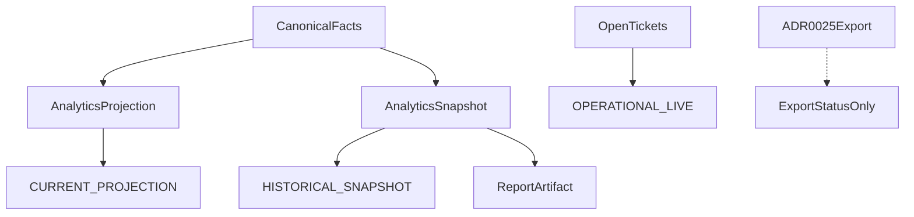

# ADR 0026: Reporting, Analytics and Historical Snapshots

## Status

Proposed

This ADR may be documented and merged while `Proposed`.

This ADR does not authorize a data warehouse, a BI vendor, or application code.

## Date

2026-08-16

## Context

Operational ADRs own business facts. ADR 0025 owns accounting export. ADR 0017 owns the permission catalog and `LocationAssignment`. ADR 0018 owns `BusinessDay`. ADR 0020 makes the server the only canonical offline authority. ADR 0021 owns customer PII and loyalty. ADR 0022 owns channel facts.

Without this ADR, a dashboard would query operational tables on every request, a late refund would rewrite yesterday’s published report, a tenant role would open every location’s numbers, an accounting ACK would increment sales a second time, and a stale projection would look like live till state.

Database names, API names, and source code use English. The user interface may localize them to Croatian and other languages.

This ADR locks reporting and historical snapshots **before** a BI product. Physical schema details belong in a later implementation. The semantics below must not change once accepted.

The governing rule:

```text
Operational models stay the canonical source.
Reports read derived, versioned projections.
Closed periods read immutable snapshots.
Analytics never mutates operational records
and is never statutory accounting.
```

```text
PostgreSQL read models + async projections
No separate data warehouse in v1
A later warehouse export is a versioned hook, not a v1 requirement
```

```text
Operational ADRs  → business facts
ADR 0025          → accounting export
ADR 0026          → management reports and analytics
ADR 0027          → retention and privacy execution
```

```text
Ticket POSTED                 ≠ daily analytics snapshot
BusinessDay CLOSED            ≠ report permanently frozen
AccountingExportBatch         ≠ dashboard dataset
AnalyticsSnapshot PUBLISHED   ≠ statutory booking
CURRENT_PROJECTION            ≠ OPERATIONAL_LIVE
AS_RECORDED                   ≠ RESTATED
```



## Decision

### 1. Ownership

Source ADRs still own their facts. This ADR owns `MetricDefinition`, `AnalyticsProjection`, `AnalyticsProjectionFact`, `AnalyticsSourceCutoff`, `AnalyticsSnapshot`, restatement, reconciliation quality, and `ReportArtifact`.

This ADR may **read** canonical facts. It must not correct them, stand in for source documents, or replace ADR 0025. The 0018 `CLOSED` day snapshot stays ADR 0018. The 0025 batch stays ADR 0025.

ADR 0027 later owns retention. This ADR is not ADR 0027.

### 2. Three read kinds

```text
OPERATIONAL_LIVE
CURRENT_PROJECTION
HISTORICAL_SNAPSHOT
```

`OPERATIONAL_LIVE` is current work state, for example open Tickets. `CURRENT_PROJECTION` is a derived dashboard and may lag. `HISTORICAL_SNAPSHOT` is the frozen result of a closed interval.

The contract must expose the read kind and last-refresh time. A lagging projection must not look like live state.

### 3. Derived read models and safe rebuild

```text
AnalyticsProjection
-------------------
tenant_id
scope_type
scope_id
projection_type
metric_definition_version
source_cutoff_id
projected_through
status
generation
```

```text
BUILDING
CURRENT
STALE
REBUILDING
FAILED
```

The worker applies canonical events **idempotently**. A replay must not increment sales, covers, or item quantity twice. Two parallel workers produce one projection generation per `scope + projection_type`.

Every applied fact has a stable identity and version claim:

```text
AnalyticsProjectionFact
-----------------------
projection_id
source_type
source_id
source_version
source_hash
effect_type                # APPLY | REVERSE | CORRECT

UNIQUE (projection_id, source_type, source_id, source_version, effect_type)
```

A correction is a new fact or effect. It never edits an already consumed fact in place. Event transport order is not business order. Projection logic uses the source version and sends an impossible version gap to reconciliation rather than guessing.

v1 is PostgreSQL. Dashboards must not run ad-hoc multi-join aggregates over operational tables on every request.

Rebuild writes a new generation beside the current one. Readers stay on the last complete generation until the rebuild passes validation and an atomic pointer swap publishes it. `REBUILDING` must not blank a working dashboard. A failed rebuild must not replace the last-good generation.

### 4. Scope and tenancy

```text
TENANT
LEGAL_ENTITY
LOCATION
SERVICE_AREA
SALES_CHANNEL
PRODUCTION_DESTINATION
STAFF_MEMBER
```

Tenant is never taken from a client filter. The backend derives it from the authorized context. ADR 0001 is not amended.

Rolling up several locations is allowed only if the user has access to **each** included location. A tenant role alone must not open location reports contrary to ADR 0017. `analytics.view_tenant` does not bypass `LocationAssignment` for location-scoped reports. Cross-tenant datasets are forbidden.

### 5. Time and BusinessDay

```text
occurred_at
recorded_at
business_day_id
posting_date               # ADR 0025 owns this
```

Location reports use that location’s timezone and `BusinessDay` bounds snapshotted on 0018 open. A tenant rollup must not assume one midnight or one timezone.

Intervals are `[from, until)`. DST ends at one determined instant.

### 6. Versioned metric catalog

Names without a formula are not metrics.

```text
MetricDefinition
----------------
metric_code
definition_version
formula
included_source_types
inclusion_rules
currency_rule
effective_from
status
fact_grain
aggregation_kind           # ADDITIVE | SEMI_ADDITIVE | NON_ADDITIVE
allowed_dimensions
denominator_rule
zero_denominator_result    # NULL / NOT_APPLICABLE, never an invented zero
```

v1 catalog (shape locked; concrete formula text is versioned, not a forever constant):

```text
GROSS_SALES
NET_SALES
DISCOUNT_TOTAL
COMP_TOTAL
TAX_TOTAL
PAYMENT_TOTAL
AVERAGE_TICKET
COVER_COUNT
TABLE_TURN_TIME
CANCELLATION_RATE
NO_SHOW_RATE
LABOR_HOURS
CASH_VARIANCE
```

A formula change creates a new `definition_version`. It must not silently rewrite a `PUBLISHED` snapshot.

Rollups aggregate from one declared grain. The same Ticket, Invoice, Payment, guest, or session must not be counted once through a location branch and again through a tenant branch. Ratios such as average Ticket and cancellation rate are recomputed from frozen numerator and denominator. Percentages are not summed or averaged from child percentages.

`MetricDefinition` versions are immutable after activation. Equally applicable definitions or overlapping effective ranges for the same `metric_code + scope` are rejected at activation, not selected arbitrarily at query time.

### 7. Historical snapshots and linear restatement

```text
AnalyticsSnapshot
-----------------
tenant_id
scope_type
scope_id
snapshot_type
interval_from
interval_until
timezone_snapshot
metric_definition_versions
source_cutoff_id
source_counts
control_totals
payload_hash
status
```

```text
BUILDING
VALIDATED
PUBLISHED
SUPERSEDED
FAILED
```

`PUBLISHED` is immutable. Re-download returns the same `payload_hash`. Historical display uses names and attributes frozen on the snapshot, not today’s Product, customer, or staff label.

Publication has a database claim. There is at most one current `PUBLISHED` snapshot for the same:

```text
tenant + scope + snapshot_type + interval
+ history_kind + metric_definition_set
```

Two publishers cannot create competing current snapshots. A restatement must link to the current lineage head. A stale concurrent restatement is rejected and retried from the new head, so history cannot silently fork.

```text
AS_RECORDED
RESTATED
```

A later refund, credit note, offline sync, or correction does **not** mutate the old `PUBLISHED` snapshot. It creates a new snapshot:

```text
supersedes_snapshot_id
restatement_reason
restatement_source_ids
```

The UI must mark a restated version.

### 8. Multi-source cutoff and freeze

A single scalar high-water cannot consistently describe independent Invoice, Payment, KDS, seating, offline, and BusinessDay streams. Freeze first creates an immutable cutoff vector:

```text
AnalyticsSourceCutoff
---------------------
tenant_id
cutoff_id
server_cutoff_at
source_stream
partition_key
high_water
captured_at
```

Every required source stream or partition has exactly one high-water in the cutoff. A missing required watermark makes quality `PARTIAL`. It must not be silently treated as zero activity.

Build against one frozen `source_cutoff_id`:

1. choose cutoff
2. freeze every required source/partition high-water
3. fetch sources only up to their frozen high-water
4. check tenant, scope, eligibility, hashes, and versions
5. compute metrics
6. check control totals and completeness
7. publish atomically

An event that arrives during compute belongs to the **next** generation. It must not partially enter this snapshot.

Eligibility is metric-specific and evaluated again at freeze. Draft, temporary, or `UNKNOWN` business states do not become final revenue, payment, cost, labor, or cash facts merely because an event was observed. A state transition after the cutoff belongs to a later generation or restatement.

### 9. Currency

A location report may show the legal entity’s functional currency. A multi-currency tenant rollup must pick an explicit rule:

```text
NO_CONVERSION
REPORTING_CURRENCY
GROUPED_BY_CURRENCY
```

Conversion uses a stored FX snapshot and its version. Today’s rate must not silently change historical results. Currencies must not be summed without a visible rule.

### 10. v1 sources

```text
v1:  0010/0012 sales, tax, voids
     0011 payments and settlement facts
     0013/0015 tables, covers, seating duration
     0014 KDS times
     0016 discounts and comps
     0018 shifts, labor hours, cash variance, BusinessDay
     0022 channels and delivery
     0023 AP summaries as operational cost overview only
     0025 export status as status only, never as a second sales source
later: loyalty, detailed inventory/COGS, advanced profitability
```

0024 raw XML and inbox payload, and 0021 customer PII and notes, do not enter generic datasets. 0025 `BOOKED_CONFIRMED` or a technical ACK must not increment sales a second time.

AP summaries are labelled operational AP exposure, not recognized accounting expense or profitability. Customer Payments and 0018 cash summaries must not double-count the same money. The cash summary contributes reconciliation and control data, and only separately identified variance, float, or movements that are not already represented by Payment facts.

### 11. Quality and reconciliation

Every projection and snapshot stores:

```text
source_count
accepted_count
rejected_count
duplicate_count
late_count
control_totals
quality_status
```

```text
COMPLETE
PARTIAL
STALE
RECONCILIATION_FAILED
```

`PARTIAL` may display only with a visible warning. It must not be presented as final.

Only `COMPLETE` and successfully reconciled data may become the current `PUBLISHED` final snapshot. `PARTIAL`, `STALE`, or `RECONCILIATION_FAILED` output may be retained for diagnosis or shown as provisional with a warning, but cannot replace the last-good published snapshot. Resolving a mismatch records evidence and produces a new generation. It never overwrites control totals.

Reconcile at least to issued invoices, payments, closed business days, and accounting export. A difference is not “fixed” by an invented analytics row.

### 12. Privacy, security, and permissions

Default grain is aggregates. Customer PII, note content, and raw intermediary payloads stay out of generic datasets.

ADR 0017 owns the catalog. This ADR adds:

```text
analytics.view_location
analytics.view_tenant
analytics.view_financial
analytics.view_staff
analytics.export
analytics.snapshot_publish
analytics.snapshot_restate
analytics.definition_manage
analytics.reconciliation_resolve
```

A staff report must not automatically expose personal data or locations without assignment. Server-only workers. A POS device must not publish or restate snapshots.

Authorization is checked again on every view, download, and export using the actor’s **current** membership episode, current assignments, and current permissions. Possession of an old report URL, artifact id, snapshot id, or previously valid permission must not grant continued access after revocation, rehire, or location reassignment. Artifact links are short-lived and tenant/scope bound.

### 13. Report artifacts

CSV, XLSX, and PDF are renders of the same dataset:

```text
ReportArtifact
--------------
snapshot_id / projection_generation
format
report_version
dataset_hash
artifact_hash
```

CSV and PDF will not share a file hash. They must share `dataset_hash`.

### 14. Mandatory acceptance tests

An implementation of this ADR must cover at least:

- The same source event does not increment a metric twice.
- An `APPLY` / `REVERSE` / `CORRECT` replay with the same stable identity has one effect. An impossible source-version gap enters reconciliation.
- Two parallel workers yield one projection generation.
- A failed rebuild leaves the last complete generation readable. Successful rebuild publication is an atomic generation swap.
- A `PUBLISHED` snapshot cannot be edited.
- Two concurrent publishers cannot create two current snapshots for the same scope, interval, history kind, and metric-definition set.
- A late refund creates a restatement and does not change `AS_RECORDED`.
- Two concurrent restatements cannot fork one snapshot lineage.
- A formula change creates a new definition version and does not rewrite a published snapshot.
- Equally applicable or overlapping active metric definitions are rejected at activation.
- Each source stream or partition is frozen in one cutoff vector. A missing required watermark is `PARTIAL`, not zero activity.
- An event after its stream high-water enters only the next generation.
- Ratios are recomputed from numerator and denominator. Child percentages are not summed or averaged.
- A zero denominator returns `NULL` / `NOT_APPLICABLE`, not an invented zero.
- The same business fact cannot be counted through both a child scope and its rollup.
- A tenant user cannot report another location. A tenant role without covering assignment cannot open that location’s report.
- Revoking membership, permission, or location assignment blocks later view or download even with an old artifact or snapshot id.
- Two currencies are not summed without an explicit conversion rule.
- DST and `BusinessDay` produce a deterministic `[from, until)` interval.
- A partial projection is visibly marked and is not shown as live or complete.
- CSV and PDF share `dataset_hash` and have their own `artifact_hash`.
- An accounting ACK does not increment sales a second time.
- Customer Payment plus `BusinessDay` cash summary does not count the same money twice.
- An AP summary is not labelled recognized expense or profit.
- A Product rename does not change an old published snapshot.
- `PARTIAL`, `STALE`, and `RECONCILIATION_FAILED` cannot replace the last-good final `PUBLISHED` snapshot.
- `OPERATIONAL_LIVE` and `CURRENT_PROJECTION` are distinguishable in the contract by kind and refresh time.
- This ADR cannot correct a Ticket, Invoice, Payment, or 0025 batch.

## Rejected alternatives

- Per-request heavy queries on operational tables.
- A separate v1 data warehouse.
- Analytics as the statutory GL or a replacement for ADR 0025.
- Mutating a `PUBLISHED` snapshot.
- Silently changing old results after a formula change.
- Summing currencies without a visible rule.
- A cross-tenant dataset.
- Showing stale or partial results as live and complete.
- Using today’s Product, customer, or staff name on a historical snapshot.
- Inventing an analytics row to close a reconciliation gap.
- One scalar high-water for independent source streams.
- Replacing last-good data with a failed rebuild.
- Summing or averaging child percentages.
- Treating a missing source watermark as zero activity.
- Branching restatement history.
- Tenant from a client filter.
- A tenant role bypassing location assignment.
- An old artifact URL bypassing current authorization.
- Incrementing sales from an accounting ACK.
- Double-counting Payment through a cash summary.
- Writing ADR 0027 in this change.

## Consequences

### Positive

- A dashboard cannot pretend to be the till, the day close, or the statutory books.
- A late correction restates history instead of rewriting what was published.
- Independent source streams freeze as a vector, so a missing watermark is visible as `PARTIAL`.
- Revoked access cannot keep reading an old report URL.

### Negative

- v1 cannot ship a separate warehouse or ad-hoc operational-table dashboards.
- Rebuild and restatement need extra generations and linear lineage claims.
- Multi-currency tenant rollups require an explicit conversion rule before they can sum.

### Neutral

- Documentation can merge without a BI vendor or warehouse product.
- Source ADRs still own operational facts. ADR 0025 still owns accountant export.
- ADR 0027 stays a reserved roadmap entry.

## Invariants

1. Operational models are canonical. Analytics reads projections and snapshots. Analytics never mutates operations and is never statutory accounting.
2. `OPERATIONAL_LIVE` ≠ `CURRENT_PROJECTION` ≠ `HISTORICAL_SNAPSHOT`. `AS_RECORDED` ≠ `RESTATED`.
3. Tenant comes from the authorized context. Location reports need covering `LocationAssignment`. Cross-tenant datasets are forbidden.
4. Every applied fact has `UNIQUE (projection_id, source_type, source_id, source_version, effect_type)`. Replay has one effect. A version gap goes to reconciliation.
5. Rebuild writes beside the current generation. Failed rebuild keeps last-good. Success is an atomic pointer swap.
6. Metrics declare grain and `ADDITIVE` / `SEMI_ADDITIVE` / `NON_ADDITIVE`. Ratios recompute from numerator and denominator. A missing watermark is `PARTIAL`, not zero.
7. At most one current `PUBLISHED` snapshot per tenant, scope, type, interval, history kind, and definition set. Restatement history is linear.
8. Cutoff is a vector of source/partition high-waters. Events after a stream high-water enter only the next generation.
9. Payment and cash summary do not count the same money twice. AP overview is not recognized expense or profit. Accounting ACK does not increment sales.
10. Authorization is re-checked on every view and download against the current episode, permissions, and assignments.
11. CSV and PDF share `dataset_hash` and have distinct `artifact_hash` values.
12. Tenant isolation. Ids alone do not authorize.

## Follow-up ADRs

```text
Audit Trail, Data Retention and Privacy
Public API, Webhooks and Integration Idempotency
```

Do not implement a data warehouse, BI vendor, loyalty metrics, inventory / COGS profitability, or retention execution from this ADR.

## See also

- [ADR 0017: Staff Identity, Roles and Operator Authorization](0017-staff-identity-roles-and-operator-authorization.md)
- [ADR 0018: Shifts, Cash Drawers and Daily Closing](0018-shifts-cash-drawers-and-daily-closing.md)
- [ADR 0020: Offline POS Operation and Synchronization](0020-offline-pos-operation-and-synchronization.md)
- [ADR 0021: Customer Profiles, Consent and Loyalty](0021-customer-profiles-consent-and-loyalty.md)
- [ADR 0022: Ordering Channels, Delivery and External Platforms](0022-ordering-channels-delivery-and-external-platforms.md)
- [ADR 0025: Accounting Posting and Export](0025-accounting-posting-and-export.md)

## Out of scope

This ADR does not define:

- source document workflows
- accountant packs (ADR 0025)
- retention or privacy execution (ADR 0027)
- Tablio public API (ADR 0028)
- loyalty, detailed inventory / COGS, or advanced profitability
- a warehouse product
- dashboard chrome
- exact metric formula text, refresh SLA, or FX reporting-currency pair
- POS screen layout

## Amendment — 2026-08-16: Erasure covers identifying analytics artifacts

The original Decision that operational models stay canonical, and that a published snapshot is not rewritten, remain in the original text.

ADR 0027 owns retention and privacy execution. Erasure covers identifying report artifacts and projections. A published aggregate remains only if it is no longer personal data. If it re-identifies a small group, rebuild, restrict, or retain on a valid basis.

This amendment does not change live versus projection versus snapshot, cutoff vectors, or restatement history.
