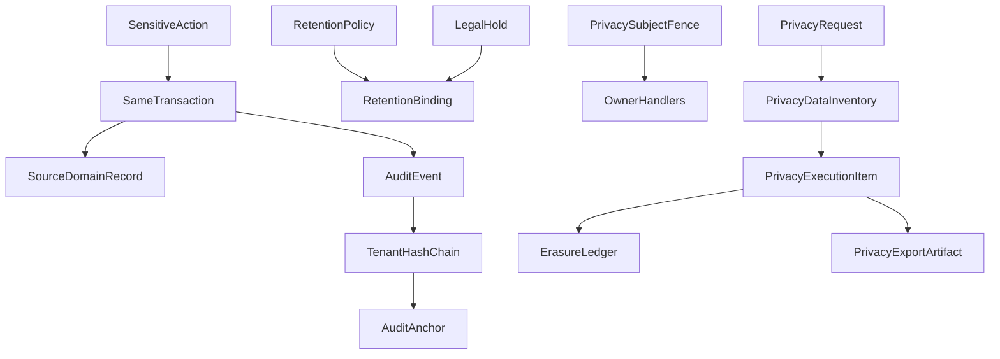

# ADR 0027: Audit Trail, Data Retention and Privacy

## Status

Proposed

This ADR may be documented and merged while `Proposed`.

This ADR does not authorize a SIEM product, a DPA template, or application code.

## Date

2026-08-16

## Context

Source ADRs own business history. ADR 0017 owns membership episodes and the permission catalog. ADR 0020 makes the server the only canonical offline authority. ADR 0021 owns `CustomerProfile`, `ConsentEvent`, and purpose legal-basis minting. ADR 0025 owns accounting export. ADR 0026 owns analytics snapshots.

Without this ADR, audit would copy full old records, a marketing-retention expiry would erase an invoice, a late webhook would revive erased PII, a legal hold would race a deleter, and a DSAR in one tenant would search another.

Database names, API names, and source code use English. The user interface may localize them to Croatian and other languages.

This ADR locks audit, retention, and privacy execution **before** a compliance product. Physical schema details belong in a later implementation. The semantics below must not change once accepted.

Cite as duties, not as a complete compliance program: [GDPR official text](https://eur-lex.europa.eu/eli/reg/2016/679/oj?locale=EN) (purpose limitation, minimisation, storage limitation, security — no universal retention year), [AZOP – records of processing](https://azop.hr/vodenje-evidencije-aktivnosti-obrade/), [GDPR Article 32](https://eur-lex.europa.eu/eli/reg/2016/679/oj?locale=EN).

The governing rule:

```text
Tenant-scoped, append-only, tamper-evident audit
proves business and security actions
without copying unnecessary personal data.

Retention, anonymization, and deletion
follow a versioned catalog by data category,
purpose, legal basis, and legal entity.

The right to erasure is not deletion of
legally required documents, and not deletion
of the proof that an action occurred.
```

```text
Domain history     = source-ADR business history
AuditEvent         = proof who performed a sensitive action
ConsentEvent       = 0021 purpose-specific consent proof
PrivacyCase        = access, rectification, erasure, restriction
```

```text
Invoice correction       ≠ editing an old audit
ConsentEvent             ≠ generic AuditEvent
AuditEvent deleted       ≠ a valid correction
CustomerProfile erased   ≠ legal invoice erased
Retention expired        ≠ backup immediately overwritten
LegalHold                ≠ permission to read
```



## Decision

### 1. Ownership

Source ADRs still own business status. ADR 0021 still owns `CustomerProfile`, `ConsentEvent`, and `ProcessingPurposePolicy` legal-basis minting. `retention_class` there is a handle; this ADR binds it to `RetentionPolicy` and `RetentionBinding`. `privacy.request_manage` may record or forward a request. **Execution** is this ADR.

This ADR owns `AuditEvent`, `AuditAnchor`, `AuditPartitionClosure`, `RetentionPolicy`, `RetentionBinding`, `PrivacyRequest`, `PrivacyDataInventory`, `PrivacyExecutionItem`, `ProcessingRestriction`, `LegalHold`, `ErasureLedger`, `PrivacySubjectFence`, `PrivacySubjectAlias`, `PrivacyExportArtifact`, and `TenantDataDisposition`.

ADR 0028 later owns the public API. This ADR is not ADR 0028.

### 2. Audit event types and when to write

```text
BUSINESS_CONTROL
AUTHORIZATION
SECURITY
PRIVACY
CONFIGURATION
EXPORT_ACCESS
EMERGENCY_OVERRIDE
```

Ordinary GET is not audited. Mandatory audit includes: login, step-up, revoke, and device change; staff, role, and permission changes; approval, comp, refund, and emergency override; fiscal and accounting decisions; shift, day, and period open or close; connection and credential-generation changes; access to especially sensitive reports; export or download of personal or financial data; privacy request, legal hold, and erasure execution; attempted cross-tenant or unauthorized access.

### 3. AuditEvent and actors

```text
AuditEvent
----------
tenant_id
legal_entity_id?
location_id?
event_type
action
object_type
object_id
object_version
actor_type
actor_principal_id
actor_membership_id?
actor_membership_episode_id?
on_behalf_of_membership_episode_id?
service_identity_id?
support_access_case_id?
operator_session_id
device_id
authorization_generation
occurred_at
server_recorded_at
request_id
correlation_id
outcome
reason_code
policy_version_id
payload_schema_version
previous_event_hash
event_hash
```

```text
actor_type:
STAFF
CUSTOMER
DEVICE
SYSTEM
EXTERNAL_PLATFORM
PLATFORM_SUPPORT
ANONYMOUS
```

Tenant and scope come from the authorized server context, never a request body. ADR 0001 is not amended.

Actor is not always staff. For `STAFF`, the ADR 0017 membership episode is required. Rehire must not display as the same work episode. `SYSTEM` is not an anonymous bucket: it needs a named `service_identity_id` and a job or correlation reference. Platform support into another tenant needs a separate support or break-glass case, a reason, a time-boxed scope, and an audit of the platform actor.

`server_recorded_at` is canonical audit time. Device time is untrusted context only.

### 4. Minimized payload

Generic audit must not store passwords, tokens, or credentials; a full payment instrument; raw eInvoice XML; whole request or response bodies; CRM note content; arbitrary exception stacks with PII; or a full CustomerProfile before and after.

Allowed instead:

```text
changed_field_codes
value_commitment?
reason_code
source_document_reference
approval_reference
```

A raw value is copied only when the `event_type` schema requires it to prove that decision.

A plain hash of email, phone, or OIB is not anonymization and is dictionary-attackable. If a commitment is stored at all:

```text
value_commitment =
tenant-scoped keyed HMAC
+ purpose
+ key_generation
```

That HMAC remains personal or pseudonymized data while a key or linking method exists. For most field changes, `changed_field_code` is enough. The event schema decides whether a commitment is required. It must not default to an unkeyed SHA of PII.

### 5. Append-only, hash-chain, and partition closure

`AuditEvent` is not updated or deleted by ordinary CRUD. Correction is a new event that references the previous one.

Hash-chain per tenant partition:

```text
tenant_id + partition_id + sequence
previous_event_hash
canonical_event_hash
```

Canonical encoding is deterministic. Sequence assign and insert are atomic. Two parallel events cannot share a sequence.

```text
AuditAnchor
-----------
tenant_id
partition_id
sequence_from
sequence_until
root_hash
signed_at
signing_key_generation
```

The chain proves later mutation. It is not a backup, an access-control substitute, or a qualified timestamp.

Append-only is not “keep forever”. Audit retention expires only by **closed partition**, never by deleting a mid-chain event.

```text
AuditPartitionClosure
---------------------
tenant_id
partition_id
final_sequence
final_root_hash
anchor_id
closed_at
retention_policy_version_id
destroyed_at
destruction_evidence_hash
```

After the partition due date, event content may be destroyed. A minimal closure or anchor may remain as proof of integrity and controlled destruction, without event payloads. Deleting a single event from the middle of the chain stays forbidden.

### 6. Failed business transaction

Audit must not claim success that did not happen. For sensitive commands, the domain change and the successful audit event commit in the **same** transaction. A rejected action may write a separate `DENIED` event. External timeout stays `UNKNOWN`. Recovery adds a new event. It does not edit the first.

High-volume failed security attempts may use a dedicated ingestion path with loss and overload protection.

### 7. Versioned retention catalog and multi-purpose bindings

```text
RetentionPolicy
---------------
policy_code
policy_version
data_category
processing_purpose
controller_scope
jurisdiction
legal_basis
retention_trigger
retention_duration
terminal_action
effective_from
status
```

```text
DELETE
ANONYMIZE
PSEUDONYMIZE
ARCHIVE_RESTRICTED
RETAIN_LEGAL_BASIS
```

One record may serve several purposes. A single `retention_policy_version_id` or `retention_due_at` on the row is not enough.

```text
RetentionBinding
----------------
object_type
object_id
processing_purpose
retention_policy_version_id
retention_triggered_at
retention_due_at
status
```

A later policy must not silently rewrite an already computed binding due date. Retroactive change is only an audited explicit policy migration. Equally applicable or overlapping active policies are rejected at publish.

The object may be destroyed only when all of these are true:

- every active purpose binding allows destruction
- no restriction requires preservation
- no legal hold applies
- no other documented legal basis remains

Expiry of a marketing purpose must not delete data that still lawfully exists on an invoice.

Concrete years and days are **not** hard-coded. The policy cites the rule source and regulation version.

The clock starts from the **business trigger**, not always `created_at`: relationship ended, reservation completed, invoice issued, AP posted, membership ended, device retired, period closed, privacy case completed, incident closed. A legal document and its attachment may have different categories and due dates.

### 8. Pseudonymization versus anonymization

```text
PSEUDONYMIZED = still personal data
ANONYMIZED    = reasonably not re-identifiable
```

Deleting a name while keeping email, phone, an external id, or a stable reversible identifier is not anonymization. An anonymized analytics result must not keep a lookup table that restores identity.

### 9. Privacy request, aliases, identity, and inventory

```text
PrivacyRequest
--------------
tenant_id
controller_scope
request_type               # ACCESS | RECTIFICATION | ERASURE
                           # | RESTRICTION | PORTABILITY | OBJECTION
subject_reference
received_at
deadline_policy_version
status
identity_verification_status
assigned_to
completed_at
```

```text
RECEIVED
IDENTITY_VERIFICATION
SCOPING
IN_PROGRESS
WAITING_LEGAL_REVIEW
COMPLETED
PARTIALLY_COMPLETED
REJECTED_WITH_BASIS
```

A request in tenant A must not search, link, or process a profile in tenant B.

One person may have several emails, phones, loyalty accounts, or merged profiles **inside one tenant**. The request must find that whole history without a global cross-tenant identity.

```text
PrivacySubjectAlias
-------------------
tenant_id
subject_id
alias_type
alias_token
valid_from
valid_until
source
```

ADR 0021 merge joins the alias cluster after approval. Split does not erase the historical link, but it changes what future privacy execution includes, with audit. `ErasureLedger` must track former alias tokens so restore or a late import cannot revive a profile under an old email.

Identity proof is proportionate. The agent must not collect more than needed. Proof has its own short retention. The verification **result** stays. A document copy does not stay by default. Barcode, loyalty id, or knowing a reservation number is not enough for a full profile export.

```text
PrivacyDataInventory
--------------------
owner_component
data_category
subject_link_type
processing_purpose
controller_role
export_handler
rectify_handler
erase_handler
restrict_handler
retention_policy_code
```

The workflow does not run uncontrolled SQL across all tables. It calls versioned owner-component handlers.

```text
PrivacyExecutionItem
--------------------
component
object_reference
decision                   # EXPORTED | RECTIFIED_AT_SOURCE | ERASED
                           # | ANONYMIZED | RESTRICTED
                           # | RETAINED_LEGAL_OBLIGATION
                           # | RETAINED_LEGAL_CLAIM | NOT_FOUND
legal_basis
executed_at
evidence_hash
```

### 10. Erasure must not destroy legal records

Erasure does **not** automatically delete an issued or fiscalized invoice; a posted AP invoice; payment or refund proof; an accounting batch; a legally required tax record; the minimal security audit needed to prove the action; or data under a valid legal hold.

Keeping the document does not keep all related marketing or CRM data.

```text
CustomerProfile PII      → erase or anonymize if no other basis
Invoice                  → retain under legal policy
Invoice customer label   → only the legally required minimum
Marketing consent        → keep grant and withdraw proof
Generic CRM attributes   → delete
```

### 11. Restriction, legal hold, and the deletion race

`RESTRICTION` keeps the data. Ordinary business and marketing processes must not use it. `ProcessingRestriction` is checked at processing time. A profile flag is not enough if an async worker or export ignores it.

```text
LegalHold
---------
tenant_id
legal_entity_id?
scope_type
scope_reference
reason
authority_reference
approved_by
starts_at
review_at
expires_at
status
```

Hold stops only **destructive** retention for the named scope. It does not extend all tenant data, does not grant extra read rights, needs reason, approver, and periodic review, and on release re-evaluates due retention. It is not a permanent “never delete” switch. Self-approved hold is forbidden for sensitive categories. Maker and approver must differ.

Retention worker and legal hold can race. One DB protocol:

1. lock the target retention scope
2. re-check policy bindings
3. re-check restriction
4. re-check active legal holds
5. claim the retention job
6. execute the terminal action
7. store evidence

A hold that loses the race after a committed destruction cannot undelete the data. It receives an audited result `TOO_LATE_ALREADY_DESTROYED`.

### 12. Privacy fence against PII reappearance

A finished privacy scan is not enough. A late webhook, offline sync, or outbox can write the same PII again.

```text
PrivacySubjectFence
-------------------
tenant_id
subject_token
privacy_generation
state                      # ACTIVE | RESTRICTED | ERASURE_PENDING | ERASED
effective_at
```

Every owner handler, import, outbox, and async worker must check the current generation before write or send.

After `ERASED`:

- an old generation must not rematerialize PII
- a late event goes to privacy review or quarantine
- a new business relationship needs a new explicit generation and a valid purpose

### 13. Derived copies, backup, and tenant end

Erasure or anonymization covers the primary row, search index, cache, materialized projection, report artifact with identifying data, undelivered outbox, temporary export, and object-storage copies.

A 0026 published aggregate may remain only if it is no longer personal data. If it re-identifies a small group, rebuild, restrict, or retain on a valid basis.

Active database and operational copies delete through the privacy workflow. An immutable backup is not surgically edited if that would break integrity. Backup has its own limited life, is not available to the ordinary app, restores into isolation, and re-applies `ErasureLedger` before use. Deleted data must not reappear to users after restore.

```text
ErasureLedger
-------------
tenant_id
subject_token              # tenant-scoped HMAC, not a global id
component
action
effective_at
policy_version
evidence_hash
```

Individual erasure is not tenant shutdown.

```text
TenantDataDisposition
---------------------
tenant_id
termination_at
export_window_until
operational_delete_at
retained_categories
legal_holds
completed_at
```

After access ends the tenant must not keep using the app only because legal delete is pending. Tablio may keep minimal platform security and billing records for its own legal purpose, separate from the tenant’s customer and staff data.

### 14. Controller and processor

For most business processing the tenant or its legal entity is controller and Tablio is processor. For Tablio account security, abuse prevention, and SaaS billing Tablio may be a separate controller. This is not one global flag.

ADR 0021 still owns purpose to legal basis and consent minting. This ADR owns retention binding, controller and processor parties, restriction behavior, and the data-subject handler. The same data may serve several purposes. Each purpose has its own basis and retention decision.

### 15. Security, permissions, and DSAR delivery

ADR 0017 owns the catalog. This ADR adds:

```text
audit.view
audit.export
audit.verify_integrity
privacy.request_manage
privacy.identity_verify
privacy.export
privacy.erase_execute
privacy.restriction_manage
retention.policy_manage
retention.run
legal_hold.manage
legal_hold.approve
```

`privacy.request_manage` already exists on ADR 0021 as record-or-forward. This ADR keeps that name and owns execution through the other `privacy.*` permissions.

`audit.view` does not grant `audit.export`. The same actor must not approve and execute sensitive erasure. Legal-hold maker and approver must differ. Viewing the audit trail itself creates an audit event. Audit export has cutoff, payload hash, and included partitions. Emergency override must not bypass tenant or a legal retention or hold.

Authorization is re-checked on every audit or privacy view and export against the current 0017 episode, permissions, and assignments. An old URL does not retain access.

A DSAR export is itself highly sensitive:

```text
PrivacyExportArtifact
---------------------
privacy_request_id
subject_scope
dataset_hash
artifact_hash
encryption_key_generation
expires_at
download_count
revoked_at
```

Download only after a fresh identity check and a current request status. The link is short-lived, one-time or count-limited, and expires automatically. Every download is audited. The export must not reveal other people’s data, internal security secrets, or unfiltered audit payloads. Regenerating or revoking invalidates the old artifact.

### 16. Mandatory acceptance tests

An implementation of this ADR must cover at least:

- An audit event cannot be updated or deleted by ordinary CRUD.
- Changing an old event fails hash-chain verify.
- Two parallel events do not receive the same sequence.
- An audit partition may expire only after closure and anchor. A mid-chain event cannot be deleted.
- Rehire keeps the original membership episode on the historical action.
- A `SYSTEM` audit has a service identity, not a fake staff actor.
- Audit payload rejects a token, raw XML, and disallowed PII.
- An email commitment is not a plain SHA hash. A keyed HMAC commitment is still treated as personal or pseudonymized data.
- A failed transaction does not write a false `SUCCESS`.
- Expiry of one purpose binding does not delete the record while another binding still applies.
- A privacy request in one tenant does not search other tenants.
- A merged profile includes every tenant-scoped alias and no cross-tenant alias.
- Restore recognizes former alias tokens and does not revive an erased profile under an old email.
- A late offline or webhook event after erasure does not rematerialize PII.
- A pseudonymized record is not labelled anonymized.
- A legal invoice remains. Unrelated CustomerProfile PII is erased.
- Legal hold blocks deletion only for its scope and grants no extra read.
- Concurrent legal hold and deletion have one deterministic winner. A late hold after committed destroy is `TOO_LATE_ALREADY_DESTROYED`.
- Hold expiry re-activates due retention actions.
- A retention-policy change does not rewrite old binding due dates without migration.
- Two overlapping active policies are rejected.
- Backup restore re-applies `ErasureLedger`.
- Cache, search index, and pending outbox do not keep erased PII.
- Restriction blocks an async worker and export, not only the UI.
- An old report, audit, or privacy-export URL does not bypass current permissions.
- An expired or revoked privacy export cannot be downloaded again.
- A privacy export does not include another person’s data from a shared reservation or invoice.
- Audit export is tenant-scoped and reproducible by hash.
- The same actor cannot approve and execute sensitive erasure.

## Rejected alternatives

- Audit as a full old-record store.
- Ordinary CRUD update or delete of `AuditEvent`.
- Deleting a mid-chain audit event.
- Treating append-only as keep-forever without partition closure.
- `ConsentEvent` as a generic audit row.
- One retention due date for all purposes on a row.
- Erasing a legal invoice because marketing retention expired or a profile was erased.
- Treating an unkeyed SHA of email, phone, or OIB as anonymization.
- Treating a keyed HMAC commitment as anonymous.
- A finished scan without `PrivacySubjectFence`.
- A late webhook rematerializing erased PII.
- Undeleting after `TOO_LATE_ALREADY_DESTROYED`.
- `SYSTEM` as a fake staff actor.
- A global cross-tenant subject id.
- Legal hold as extra read permission or a never-delete switch.
- Surgical rewrite of an integrity-protected backup.
- Restore that re-exposes erased PII or an old alias.
- A profile flag that async workers ignore.
- An expired DSAR link that still downloads.
- A DSAR that includes another person’s data from a shared reservation or invoice.
- Self-approved sensitive hold or self-executed sensitive erase.
- Emergency override of tenant or hold.
- Writing ADR 0028 in this change.

## Consequences

### Positive

- Audit proves the action without becoming a second copy of every old record.
- Marketing expiry cannot erase a still-lawful invoice.
- A late offline or webhook event cannot revive erased PII.
- Legal hold and deletion have one deterministic winner.

### Negative

- Multi-purpose records need several `RetentionBinding` rows and a destroy check across all of them.
- Audit expiry needs partition closure; operators cannot prune a single mid-chain event.
- DSAR delivery needs short-lived artifacts and a second identity check.

### Neutral

- Documentation can merge without a SIEM, DPA template, or backup vendor.
- ADR 0021 still owns consent. ADR 0026 still owns analytics snapshots.
- ADR 0028 stays a reserved roadmap entry.

## Invariants

1. Append-only audit is not a store of full old data. It stores minimal proof. Personal data is retained or erased by versioned policy.
2. `ConsentEvent` ≠ `AuditEvent`. Domain history stays on the source ADR.
3. Tenant and scope come from the authorized context. A tenant-A request does not search tenant B.
4. `AuditEvent` is not ordinary CRUD. Sequence assign and insert are atomic. Mid-chain delete is forbidden. Partition content expires only after `AuditPartitionClosure`.
5. One object may have many `RetentionBinding` rows. Destroy only when every active binding, restriction, hold, and legal basis allows it.
6. A plain SHA of PII is not anonymization. A keyed HMAC commitment remains personal or pseudonymized while linkable.
7. `PrivacySubjectFence` is checked before write or send. After `ERASED`, a late event is quarantined and must not rematerialize PII.
8. Retention versus hold uses one lock protocol. A late hold after committed destroy is `TOO_LATE_ALREADY_DESTROYED`.
9. `STAFF` requires a membership episode. `SYSTEM` requires a named service identity.
10. Aliases are tenant-scoped. `ErasureLedger` tracks former tokens. Restore must not revive an erased profile under an old email.
11. A DSAR artifact expires, is re-authorized on download, and must not include another person’s data.
12. `audit.view` ≠ `audit.export`. The same actor cannot approve and execute sensitive erasure. Hold maker ≠ approver.
13. Tenant isolation. Ids alone do not authorize.

## Follow-up ADRs

```text
Public API, Webhooks and Integration Idempotency
```

Do not implement a SIEM, DPA contract, breach-notification procedure, or public API from this ADR.

## See also

- [ADR 0017: Staff Identity, Roles and Operator Authorization](0017-staff-identity-roles-and-operator-authorization.md)
- [ADR 0020: Offline POS Operation and Synchronization](0020-offline-pos-operation-and-synchronization.md)
- [ADR 0021: Customer Profiles, Consent and Loyalty](0021-customer-profiles-consent-and-loyalty.md)
- [ADR 0025: Accounting Posting and Export](0025-accounting-posting-and-export.md)
- [ADR 0026: Reporting, Analytics and Historical Snapshots](0026-reporting-analytics-and-historical-snapshots.md)

## Out of scope

This ADR does not define:

- concrete statutory year counts
- legal interpretation of each Croatian tax rule
- DPA contract text
- supervisory-authority breach-notification procedure
- a SIEM product
- physical backup location
- Tablio public API (ADR 0028)
- a durable data warehouse
- POS screen layout
