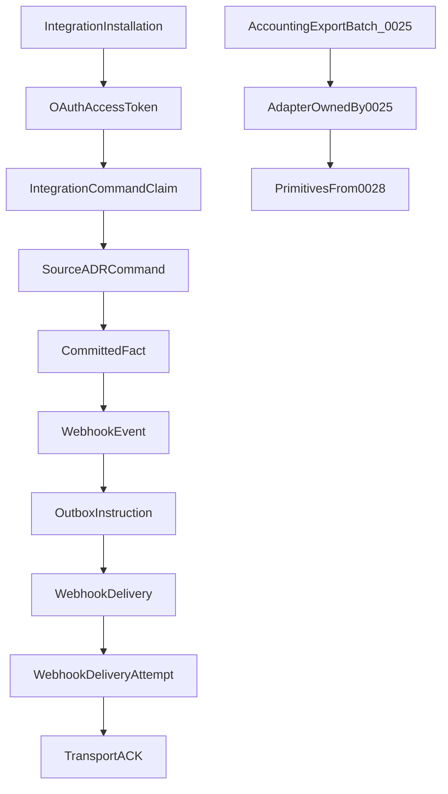

# ADR 0028: Public API, Webhooks and Integration Idempotency

## Status

Proposed

This ADR may be documented and merged while `Proposed`.

This ADR does not authorize an OpenAPI schema, a developer portal, an OAuth product, or application code.

## Date

2026-08-16

## Context

Source ADRs own Tickets, invoices, payments, reservations, profiles, and accounting export. ADR 0001 already says the host selects the surface and authentication selects the tenant. ADR 0022 owns the provider inbound inbox and provider outbound outbox. ADR 0025 owns the frozen accounting batch. ADR 0027 owns audit, retention, and `PrivacySubjectFence`.

Without this ADR, a partner would INSERT into Ticket, a webhook ACK would look like a business confirmation, a retry would rebuild today’s resource, a late retry after cache expiry would issue a second invoice, and a pending webhook would leak after a scope reduction.

Database names, API names, and source code use English. The user interface may localize them to Croatian and other languages.

This ADR locks the public API, tenant-facing webhooks, and integration idempotency **before** a developer portal. Physical schema details belong in a later implementation. The semantics below must not change once accepted.

Cite as duties, not an OpenAPI specification: [IETF OAuth 2.0 Security BCP — RFC 9700](https://www.rfc-editor.org/info/rfc9700/), [RFC 9457 Problem Details](https://www.rfc-editor.org/rfc/rfc9457.html), [RFC 9421 HTTP Message Signatures](https://www.rfc-editor.org/info/rfc9421/).

The governing rule:

```text
The public API is a versioned contract over existing Tablio domains,
never direct table access.

Each integration gets a tenant-scoped installation,
limited scopes, and limited locations.

Mutations use a server-side idempotency claim.
Webhooks are delivered at least once from an immutable outbox event.

An API call and a webhook ACK never themselves
bypass the owner ADR’s business rules.
```

```text
API idempotency     ≠ webhook idempotency
API claim           = same command must not change Tablio twice
Webhook event_id    = receiver may see the same already-committed event
                      and must not apply it twice
```

```text
Source ADR command        = only owner of the business change
Public API                = authenticated entry into that command
Webhook event             = notice of an already-committed fact
Webhook delivery ACK      = transport confirmation
Integration idempotency   = protection against a repeated command
```

```text
POST /tickets             ≠ direct INSERT into Ticket
Webhook invoice.issued    ≠ a new Invoice
Webhook ACK               ≠ business confirmation
Idempotency-Key           ≠ optimistic concurrency
API 202                   ≠ the job finished successfully
```



## Decision

### 1. Ownership

Source ADRs still own Tickets, invoices, payments, reservations, profiles, and accounting export. This ADR must not redefine them.

ADR 0022 still owns the **provider inbound inbox** and **provider outbound outbox**. Those are not tenant-facing webhooks.

ADR 0025 still owns `AccountingExportBatch`, journal lines, `AccountingConnection`, adapter capability profile, accounting payload translation, accounting delivery status, and `AccountingOutboxMessage`. This ADR does **not** own `AccountingProviderAdapter` and does not invent a second connection model.

ADR 0027 still owns audit, retention, legal hold, and `PrivacySubjectFence`.

This ADR owns `IntegrationApplication`, `IntegrationInstallation`, `IntegrationCommandClaim`, `IntegrationCommandTombstone`, `IntegrationOperation`, `WebhookEvent`, `WebhookSubscription`, `WebhookDelivery`, `WebhookDeliveryAttempt`, and reusable primitives: authentication, credential rotation, HTTP transport safety, idempotency, `UNKNOWN` recovery, rate limiting, and audit hooks.

Accounting adapters **use** those primitives. They must not bypass a frozen batch, control totals, or 0025 booking rules through a generic API adapter.

ADR 0001 is not amended. “API key” there remains the tenancy principle: authentication selects the tenant; the client must not send `tenant_id`. The v1 public-API credential is an OAuth 2.0 Client Credentials access token bound to `IntegrationInstallation`.

ADR 0029 later owns menu publishing. This ADR is not ADR 0029.

### 2. Application versus installation

```text
IntegrationApplication
----------------------
application_id
owner
name
status
authentication_profile
redirect_uri_set
webhook_capabilities
```

```text
IntegrationInstallation
-----------------------
installation_id
application_id
tenant_id
legal_entity_ids
allowed_location_ids
granted_scopes
status
authorization_generation
credential_generation
installed_by
activated_at
revoked_at
```

```text
PENDING
ACTIVE
SUSPENDED
REASSIGNING
REVOKED
COMPROMISED
```

The application registry is platform-scoped. Installation is strictly tenant-scoped. One partner application may have many installations. There is no shared cross-tenant business token.

Tenant, legal entity, and location come from the installation and the authorized resource, never from an arbitrary request body.

### 3. Authentication

v1:

```text
MACHINE_TO_MACHINE = OAuth 2.0 Client Credentials
DELEGATED_USER     = later versioned flow
```

A long-lived static API key is not the sole protection for **new** public-API integrations. Follow RFC 9700. No deprecated or unsafe OAuth flows.

The token must contain, or the server must resolve from it:

```text
application_id
installation_id
tenant_id
granted_scopes
authorization_generation
credential_generation
issued_at
expires_at
token_id
```

Short-lived access token. Client secret and signing keys are rotatable. Rotation does not restore an older generation.

Writing `authorization_generation` into a self-contained JWT is not enough. **Every request** must confirm:

```text
token.authorization_generation
    == current installation.authorization_generation

token.credential_generation
    == allowed current credential generation
```

After revoke, scope reduction, or `COMPROMISED`, an old token must stop working immediately or inside an explicitly bounded cache window. Short expiry alone is not enough for emergency revoke of a compromised installation.

ADR 0001 storage and HTTP outcomes still apply to credential material: hash + prefix, raw secret shown once, headers not logged; unknown or expired → 401; suspended tenant → controlled 404; insufficient scope → 403.

### 4. Authorization is an intersection

```text
API capability
∩ application capability ceiling
∩ installation granted scopes
∩ tenant / legal-entity / location scope
∩ current domain policy
∩ current privacy restriction
```

A later delegated-user flow also intersects the current ADR 0017 episode, permissions, and `LocationAssignment`.

An integration never receives a permission the installer could not delegate.

v1 scopes:

```text
tickets.read
tickets.write
reservations.read
reservations.write
customers.read
customers.write
invoices.read
payments.read
inventory.read
reports.read
webhooks.manage
```

`*.write` does not mean approval, refund, comp, fiscalization, or emergency override. Those need dedicated scopes **and** the existing domain rights.

### 5. Versioned contract

```text
/api/v1/...
```

This is already the API surface in ADR 0001. Compatible additions in one version: a new optional field; a new endpoint capability; a new enum value only if the contract is marked extensible. A breaking change requires a new major version. Every response carries the contract version. Deprecation and sunset need a published date, migration notes, and telemetry of active consumers. Never change the meaning of an existing field under the same version.

### 6. Stable public identifiers

Do not expose internal sequential primary keys as a security boundary.

```text
public_id
tenant-bound lookup
resource_type
```

Knowing `public_id` does not grant access. Every lookup re-applies tenant and scope. Identifiers are not recycled after delete or merge. A merged resource may return a controlled canonical reference. It must not open another tenant.

### 7. Mutations and the frozen idempotency claim

`Idempotency-Key` is required on every endpoint that can create money, a document, a Ticket, a reservation, or another business fact.

```text
IntegrationCommandClaim
-----------------------
installation_id
tenant_id
api_version
method
canonical_route
idempotency_key_hash
request_fingerprint
status
operation_id
response_status
response_headers_snapshot
response_body_snapshot
response_schema_version
response_hash
created_at
expires_at
```

A large response may store an immutable result artifact instead of an inline body. Retry returns the **frozen original result**. It must not re-render today’s resource. `response_hash` alone is not enough.

ADR 0027 privacy or retention may destroy the full response. What remains is a minimal tombstone and a controlled recovery result, not reconstructed PII.

Key scope:

```text
installation
+ tenant
+ API version
+ method
+ canonical route
+ Idempotency-Key
```

The claim is created only after authentication, authorization, and safe request parse, and **before** the domain command.

Not every failure permanently consumes the key:

```text
Authentication / authorization failure → no claim
Malformed JSON / invalid media type    → no claim
Rate limit                             → no claim
Domain validation failure              → FAILED_FINAL
Committed domain rejection             → FAILED_FINAL
Unexpected pre-commit server failure   → claim may be safely released
Unclear commit outcome                 → UNKNOWN
Successful commit                      → SUCCEEDED
```

### 8. Request canonicalization

`request_fingerprint` has a precise procedure. Duplicate JSON keys, numeric format differences, or Unicode variants must not bypass comparison.

- reject duplicate JSON keys
- limit body size and nesting
- define Unicode normalization where a field applies it
- fingerprint the parsed canonical JSON, not arbitrarily formatted bytes
- canonicalize decimal amounts without floating-point rounding
- fingerprint includes API and schema version
- `Idempotency-Key` has a bounded length and a minimum entropy
- the raw key is neither stored nor logged

Fingerprint also includes the canonical body hash, content type, relevant query parameters, and target resource.

One transaction: authenticate the installation → authorize tenant and scope → parse and canonicalize → claim the key → compare fingerprint → execute the domain command → store the frozen result → mark the claim complete → commit.

```text
IN_PROGRESS
SUCCEEDED
FAILED_FINAL
UNKNOWN
```

Same key and same fingerprint after success return the frozen original result. Same key and a different fingerprint return a conflict. Parallel identical requests must not execute the domain command twice. A client timeout retries the same key. `UNKNOWN` is reconciled first by `operation_id`.

Authentication and current installation status are re-checked before returning a stored result. A revoked client must not use the idempotency store as a way to read old responses.

### 9. Minimal idempotency tombstone

If the claim is fully deleted after `expires_at`, an old retry can issue a second invoice, reservation, or payment.

```text
IntegrationCommandTombstone
---------------------------
installation_id
canonical_route
idempotency_key_hash
request_fingerprint
terminal_outcome
business_result_reference
destroyed_response_at
```

For financial and legal commands the minimal tombstone lasts according to the matching domain or retention rule. The full response may expire earlier. Expiry of the response cache is **not** permission to execute the command again.

### 10. Idempotency is not concurrency control

Existing-resource updates use `ETag` / `If-Match`. A stale version ends as a controlled `412 Precondition Failed` or a defined `409 Conflict`. Idempotency prevents double execution of the same command. It does not stop two different commands from overwriting each other.

### 11. Asynchronous operations

Long work returns `202 Accepted` with `Location: /api/v1/operations/{operation_id}`.

```text
IntegrationOperation
--------------------
operation_id
installation_id
command_claim_id
status                     # PENDING | RUNNING | SUCCEEDED
                           # | FAILED | UNKNOWN | CANCELLED
submitted_at
completed_at
result_reference
error_reference
```

`202` means accepted for processing only. Retry with the same key returns the same `operation_id`.

### 12. Error contract

Use `application/problem+json` (RFC 9457). ASCII host in examples: `https://api.tablio.hr/problems/...`.

```json
{
  "type": "https://api.tablio.hr/problems/idempotency-conflict",
  "title": "Idempotency key conflict",
  "status": 409,
  "code": "idempotency_key_reused",
  "request_id": "...",
  "errors": []
}
```

Errors must not reveal whether a resource exists in another tenant; SQL or a stack trace; a token, secret, or signature; a raw provider payload; or unnecessary PII. Foreign and missing resources share the same safe external result when the difference would enable enumeration.

### 13. Pagination and rate limit

Collections use an opaque signed cursor, not offset as the contract basis. The cursor is bound to `tenant_id`, `installation_id`, `resource_type`, `filter_hash`, `sort`, `snapshot_high_water`, and `expires_at`. A filter change with an old cursor is rejected. One traversal uses one high-water so new rows do not skip or duplicate across pages.

Rate limit is at least per application, installation, tenant, and endpoint capability. Response is `429 Too Many Requests` with `Retry-After`. Rate limit is not the only brute-force defense. A security limit may be stricter and need not reveal remaining attempts. One noisy tenant must not exhaust others.

### 14. Canonical webhook and outbox

A webhook is created only after the business fact commits.

```text
WebhookEvent
------------
event_id
tenant_id
event_type
event_version
occurred_at
server_recorded_at
subject_type
subject_id
subject_version
payload_schema_version
payload
payload_hash
source_high_water
```

`WebhookEvent` is immutable. A delayed webhook must not rebuild payload from today’s resource. Payload is a minimal snapshot at event time, or a thin event with an authorized resource reference. It is not an uncontrolled domain dump.

The domain transaction writes the domain change, the canonical `WebhookEvent`, and the outbox instruction. No external HTTP inside the business transaction. A down webhook endpoint does not roll back an issued invoice, payment, reservation, Ticket, AP posting, or privacy decision.

### 15. Subscription and SSRF-safe endpoint

```text
WebhookSubscription
-------------------
subscription_id
installation_id
tenant_id
endpoint_url
allowed_event_types
allowed_location_ids
payload_schema_versions
status                     # PENDING_VERIFICATION | ACTIVE | PAUSED
                           # | REASSIGNING | REVOKED | COMPROMISED
signing_key_generation
configuration_generation
```

A subscription cannot request an event type, location, or field outside the installation. A rights change immediately narrows or suspends the subscription. The old configuration must not keep leaking events.

Endpoint control is proven by challenge-response before `ACTIVE`. Required: HTTPS; no credentials in the URL; reject localhost, loopback, private, link-local, and metadata addresses; DNS re-checked at connect; redirects not followed, or every target fully re-validated; response size and timeout limits; a separate egress policy. Webhook registration is not an SSRF tool.

### 16. Signature, delivery, and per-attempt proof

The signature covers at least HTTP method, request target or path, body digest, `event_id`, `delivery_id`, `subscription_id`, timestamp, nonce, and `key_generation`. It may follow RFC 9421. The signature does not replace TLS.

The receiver must verify key generation, reject an expired timestamp, reject a repeated nonce in the replay window, hash the exact raw body bytes, and support a controlled key overlap during rotation. The secret is shown only at issue or rotation and is not logged.

```text
WebhookDelivery
---------------
delivery_id
event_id
subscription_id
payload_hash
created_authorization_generation
created_configuration_generation
signing_key_generation
status                     # PENDING | DELIVERING | ACKNOWLEDGED
                           # | RETRY_SCHEDULED | UNKNOWN
                           # | DEAD_LETTER
                           # | CANCELLED_PRIVACY
                           # | CANCELLED_SCOPE
                           # | CANCELLED_INSTALLATION
next_attempt_at
acknowledged_at
```

`attempt_count` on the delivery is not enough for nonce, signature, and per-try proof.

```text
WebhookDeliveryAttempt
----------------------
attempt_id
delivery_id
attempt_number
request_timestamp
nonce
signing_key_generation
request_hash
started_at
completed_at
outcome
http_status
response_metadata_hash
```

Rules:

- `event_id` stays the same
- `delivery_id` stays the same for subscription + event
- each attempt has a new `attempt_id`, timestamp, and nonce
- payload hash stays the same
- manual replay has a separate `replay_id` and reason
- the receiver still deduplicates business effect by `event_id`

Semantics are **at least once**. Tablio does not promise exactly-once or a global order. If order matters, use `subject_id` and `subject_version`. An older event must not overwrite a newer resource version.

Any expected `2xx` is a **transport** ACK, not business processing at the receiver. Timeout is `UNKNOWN`. Retry is allowed because event, `delivery_id`, `event_id`, and payload hash stay the same. The receiver must be idempotent. Retry uses exponential backoff with jitter and a bounded horizon. `Retry-After` may be honored inside a safe limit.

Manual replay uses the same `event_id`, the same canonical payload, a new `replay_id` and attempt proof, and an audited actor and reason. It does not build today’s payload for an old event. Manual replay uses **current** rights, not the historical scope.

### 17. Re-check rights immediately before webhook send

A delivery may have been created while the subscription had a wider scope. Before **every** attempt, re-check:

```text
installation ACTIVE
subscription ACTIVE
authorization_generation
configuration_generation
location scope
event type scope
PrivacySubjectFence
```

`WebhookDelivery` stores the generations under which it was created. If they are no longer current:

```text
CANCELLED_SCOPE
CANCELLED_INSTALLATION
CANCELLED_PRIVACY
```

A pending webhook from an old configuration must not go out after a rights reduction.

### 18. Privacy and retention

Webhook payload, delivery response metadata, and idempotency responses follow ADR 0027.

- The raw receiver response body is not kept indefinitely.
- A pending webhook checks the current `PrivacySubjectFence` immediately before send.
- After erasure, a late event must not re-export PII.
- Minimal delivery proof may remain without the full payload, per retention policy.
- Destroying a full idempotency response leaves `IntegrationCommandTombstone`, not reconstructed PII.
- Legal hold does not give a subscription extra data.
- Revoking the installation blocks new deliveries.

### 19. Lifecycle

Owner, tenant, or scope change is not in-place:

```text
ACTIVE → REASSIGNING → ACTIVE
```

During `REASSIGNING`: new commands are blocked; new webhooks wait or are not created for the old scope; existing `UNKNOWN` commands are reconciled; pending deliveries are classified; generation increments; there is no mixed tenant or location context. Failure stays visible in `REASSIGNING`. There is no silent rollback.

### 20. Accounting adapters stay ADR 0025

Tablio will not bind accounting integration exclusively to racunai.hr.

```text
ADR 0025 owns:
- accounting provider selection
- AccountingConnection
- adapter capability profile
- accounting payload translation
- accounting delivery status

ADR 0028 owns reusable primitives:
- authentication
- credential rotation
- HTTP transport safety
- idempotency
- UNKNOWN recovery pattern
- rate limiting
- audit hooks
```

Do not replace `AccountingConnection`. This ADR does not own `AccountingProviderAdapter`. `provider` / `provider_code` on the existing 0025 connection is extensible. Add `adapter_version` and `capability_profile` there. Delivery channel names `MANUAL_EXPORT` and `RACUNAI_API` stay. Later adapters add channels without forking the batch. A new provider must not bypass the frozen batch, control totals, or booking rules through a generic API adapter.

First adapter: `RACUNAI`. Later, as a client needs: `OTHER_ACCOUNTING_PROVIDER`, `CUSTOM_ACCOUNTING_API`, `MANUAL_ACCOUNTANT_EXPORT`.

- racunai.hr is first, not the only possible accounting system
- a new accounting service gets its own versioned adapter
- every adapter starts from the same frozen `AccountingExportBatch`
- an adapter must not change canonical journal lines to “pass” a provider
- provider-specific fields stay in adapter configuration
- no per-client application or business-logic fork
- capability profile says whether the provider supports journal lines, documents, attachments, import ACK, booking status, and corrections
- a missing capability is a controlled fallback or manual export, not invented success
- timeout stays `UNKNOWN`; recovery uses the same external reference
- changing provider must not send the same batch twice
- the accounting system books Tablio documents and does not re-issue the same invoices
- one provider’s ACK cannot attach to another provider’s delivery

A concrete racunai.hr or other wire format is **not** permanently locked.

### 21. Audit and permissions

ADR 0027 audits at least: application create or suspend; installation grant or revoke; scope and location changes; credential and webhook-key rotation; subscription verification or change; idempotency conflict; security replay; manual webhook replay; recovery `UNKNOWN`; API export of personal or financial data.

ADR 0017 owns the catalog. This ADR adds:

```text
integrations.view
integrations.application_manage
integrations.install
integrations.scope_manage
integrations.credentials_rotate
integrations.webhooks_manage
integrations.webhooks_replay
integrations.recovery_resolve
```

The same actor must not both widen a sensitive application’s scope and activate that change above the defined risk. `integrations.view` does not grant credentials or raw webhook secrets.

### 22. Mandatory acceptance tests

An implementation of this ADR must cover at least:

- An API request cannot select another tenant with a body field.
- A one-location installation cannot read another location.
- Same key and fingerprint execute the command at most once.
- Same key with a different body returns conflict.
- Two parallel identical requests produce one result.
- A timeout retry returns the same `operation_id`.
- Idempotency does not block a stale update; `If-Match` rejects it.
- A revoked installation cannot read a stored idempotency response.
- A cursor from another tenant or filter is rejected.
- An event is created only after the domain commit.
- A down webhook does not undo the business transaction.
- A delayed webhook has the original payload hash.
- A receiver may get the same `event_id` more than once.
- An older `subject_version` must not win over a newer one.
- Invalid signature, timestamp, or replay nonce is rejected.
- Rotation supports a limited overlap and rejects the old generation after expiry.
- A subscription cannot widen the installation scope.
- An endpoint to a private or link-local address is rejected.
- DNS rebinding and redirects do not bypass SSRF protection.
- A timed-out delivery stays the same event and delivery, not a new business event.
- Manual replay does not regenerate payload.
- Privacy fence blocks a late PII webhook.
- A `2xx` webhook ACK does not change domain status.
- An API error does not reveal that a foreign resource exists.
- `REASSIGNING` does not allow a mixed tenant or location context.
- The same `AccountingExportBatch` has the same economic value through racunai.hr and another adapter.
- A provider adapter cannot change debit, credit, or control totals.
- Changing accounting provider does not create a double booking.
- An unsupported capability blocks send or selects the configured manual fallback.
- One provider’s ACK cannot attach to another provider’s delivery.
- Tenant A cannot use tenant B’s accounting-connection credentials.
- A retry after the resource changed returns the frozen original response, not today’s view.
- A malformed, auth, or 429 request does not consume the idempotency key.
- `FAILED_FINAL` with the same key returns the same domain error.
- Destroying the full response leaves a tombstone that blocks a second execution.
- Duplicate JSON keys are rejected before the claim.
- The same semantic decimal amount has one fingerprint.
- Scope reduction immediately rejects an old access token.
- Each webhook attempt has a new nonce, but the same event and delivery.
- A pending delivery is cancelled after a location-scope reduction.
- Manual replay does not use a historically revoked scope.
- An accounting adapter uses 0028 transport and cannot change 0025 journal semantics.

## Rejected alternatives

- Direct database access.
- A global cross-tenant API token.
- Tenant from the request body.
- A static API key without rotation as the sole protection for new public-API integrations.
- An exactly-once webhook promise.
- A global order of all events.
- HTTP to the webhook inside the domain transaction.
- Webhook ACK as business confirmation.
- A blind retry with a new idempotency key.
- Idempotency as a substitute for optimistic concurrency.
- Today’s resource serialization for a delayed webhook or a stored idempotency retry.
- Returning a rebuilt response from `response_hash` alone.
- Deleting a claim with no tombstone so a late retry re-executes.
- Consuming an idempotency key on auth, malformed JSON, or 429.
- Fingerprinting raw uncanonical JSON.
- Trusting JWT-embedded generation without a live installation check.
- Treating short token expiry as enough for emergency revoke.
- Counting webhook attempts without a per-attempt nonce record.
- Sending a pending webhook after scope reduction.
- Manual replay under a historical scope.
- This ADR owning `AccountingProviderAdapter`.
- Binding accounting exclusively to racunai.hr.
- An adapter that mutates journal lines.
- A second accounting-connection model that replaces ADR 0025.
- Writing ADR 0029 in this change.

## Consequences

### Positive

- A partner cannot INSERT into Ticket or treat a webhook ACK as a business confirmation.
- A timeout retry returns the frozen original result and cannot issue a second invoice after response expiry.
- A pending webhook cannot leak after a scope reduction.
- racunai.hr is the first accounting adapter, not the only possible one.

### Negative

- Every money or legal mutation needs a claim, a frozen snapshot, and a tombstone.
- Every webhook attempt needs its own nonce record and a live rights re-check.
- Accounting adapters must stay inside 0025 semantics even when they reuse 0028 transport.

### Neutral

- Documentation can merge without an OpenAPI file, developer portal, or OAuth product.
- ADR 0022 still owns provider inbox and provider outbound outbox.
- ADR 0025 still owns the frozen batch and booking status.
- ADR 0029 stays a reserved roadmap entry.

## Invariants

1. The public API is a versioned contract over existing domains, never direct table access.
2. API idempotency ≠ webhook idempotency. The claim stops a repeated command. `event_id` lets the receiver see the same already-committed event.
3. Tenant, legal entity, and location come from the installation and the authorized resource. A body field cannot select another tenant.
4. The claim is created only after auth, authorization, and safe parse. Auth, malformed JSON, and 429 do not consume the key.
5. Retry returns the frozen original response. `response_hash` alone is not enough. Destroying the full body leaves a tombstone, not reconstructed PII.
6. Response-cache expiry is not permission to execute the command again.
7. Every request re-checks live `authorization_generation` and `credential_generation`. Short expiry is not enough for emergency revoke.
8. Each webhook attempt has a new nonce. `event_id` and `delivery_id` stay the same. Rights are re-checked immediately before send.
9. A `2xx` webhook ACK is transport only. A down webhook does not roll back the domain fact.
10. This ADR does not own `AccountingProviderAdapter`. An adapter uses 0028 primitives and cannot change 0025 journal semantics.
11. `integrations.view` ≠ credentials. The same actor cannot both widen a sensitive scope and activate that change above the defined risk.
12. Tenant isolation. Ids alone do not authorize.

## Follow-up ADRs

```text
Menu Publishing, Availability and Dayparts
```

Do not implement an OpenAPI schema, developer portal, OAuth product, GraphQL, or racunai.hr SDK from this ADR.

## See also

- [ADR 0001: Platform deployment and tenancy boundary](0001-platform-deployment-and-tenancy-boundary.md)
- [ADR 0017: Staff Identity, Roles and Operator Authorization](0017-staff-identity-roles-and-operator-authorization.md)
- [ADR 0020: Offline POS Operation and Synchronization](0020-offline-pos-operation-and-synchronization.md)
- [ADR 0021: Customer Profiles, Consent and Loyalty](0021-customer-profiles-consent-and-loyalty.md)
- [ADR 0022: Ordering Channels, Delivery and External Platforms](0022-ordering-channels-delivery-and-external-platforms.md)
- [ADR 0025: Accounting Posting and Export](0025-accounting-posting-and-export.md)
- [ADR 0026: Reporting, Analytics and Historical Snapshots](0026-reporting-analytics-and-historical-snapshots.md)
- [ADR 0027: Audit Trail, Data Retention and Privacy](0027-audit-trail-data-retention-and-privacy.md)

## Out of scope

This ADR does not define:

- concrete endpoints or an OpenAPI schema
- a developer portal or API billing
- concrete rate-limit numbers
- the exact retry schedule
- a concrete OAuth product
- GraphQL
- bulk data-warehouse export
- inbound provider webhooks already owned by ADR 0022
- the receiver’s business workflow
- menu publishing (ADR 0029)
- a racunai.hr SDK or wire specification
- POS screen layout

## Amendment — 2026-08-16: Public API reads the published menu release

The original Decision that the public API is a versioned contract over existing domains, and that an API call does not bypass the owner ADR, remain in the original text.

ADR 0029 owns menu publishing. The `PUBLIC_API` channel reads the published release, not authoring tables.

This amendment does not change installation tenancy, frozen idempotency responses, or webhook delivery semantics.

## Amendment — 2026-08-16: Stored-value API scopes owned by ADR 0030

The original Decision that the public API is a versioned contract over existing domains, and that an API call does not bypass the owner ADR, remain in the original text.

ADR 0030 owns gift cards, vouchers, and stored value. This ADR adds:

```text
stored_value.read
stored_value.issue
stored_value.activate
stored_value.redeem
stored_value.refund
stored_value.admin
```

A webhook is created only after a committed ledger event. The full secret is never in a webhook.

This amendment does not change installation tenancy, frozen idempotency responses, or webhook delivery semantics.

## Amendment — 2026-08-16: Reservation-financial API scopes owned by ADR 0031

The original Decision that the public API is a versioned contract over existing domains, and that an API call does not bypass the owner ADR, remain in the original text.

ADR 0031 owns deposits, prepayments, and no-show charges. This ADR adds:

```text
reservation_financials.read
reservation_financials.requirement_manage
reservation_financials.collect
reservation_financials.apply
reservation_financials.refund
reservation_financials.charge_claim
reservation_financials.charge_execute
```

A webhook is created only after a committed fact. PAN, CVV, a payment token, and full mandate or terms-acceptance proof stay out of the webhook.

This amendment does not change installation tenancy, frozen idempotency responses, or webhook delivery semantics.

## Amendment — 2026-08-16: SaaS billing API scopes owned by ADR 0032

The original Decision that the public API is a versioned contract over existing domains, and that an API call does not bypass the owner ADR, remain in the original text.

ADR 0032 owns SaaS plan, entitlement, and platform billing. `TenantSubscription` is not `WebhookSubscription`. This ADR adds:

```text
billing.read
billing.subscription_manage
billing.payment_manage
billing.invoice_download
billing.usage_read
billing.credit_manage
```

A webhook is created only after a committed fact. Payment credential and full tax proof stay out of the webhook. Developer-portal product billing stays out of this ADR.

This amendment does not change installation tenancy, frozen idempotency responses, or webhook delivery semantics.
