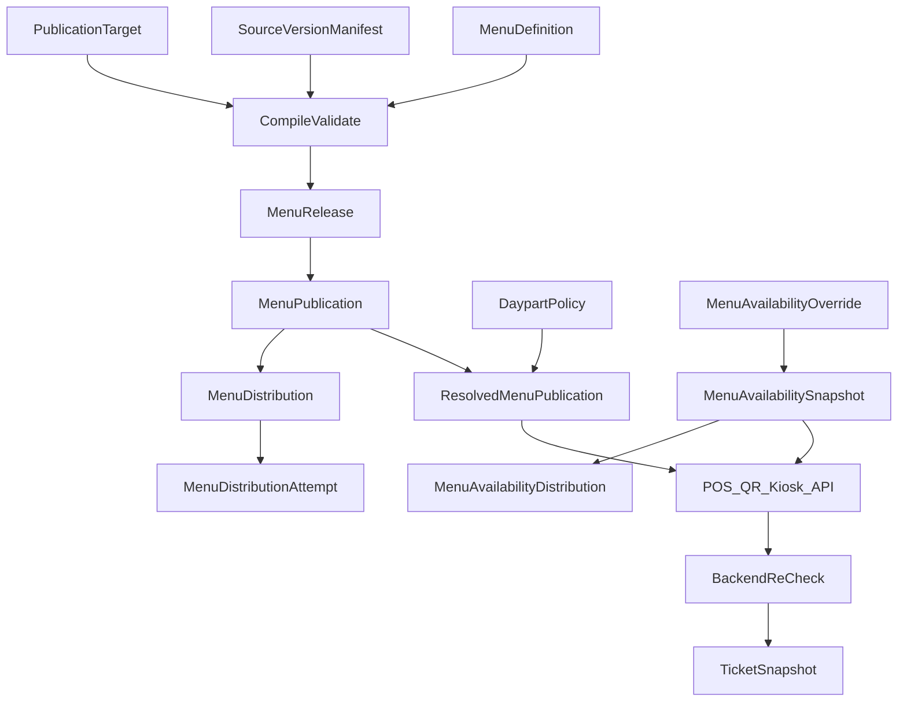

# ADR 0029: Menu Publishing, Availability and Dayparts

## Status

Proposed

This ADR may be documented and merged while `Proposed`.

This ADR does not authorize a menu editor, a provider menu wire format, or application code.

## Date

2026-08-16

## Context

ADR 0002 owns Product. ADR 0006 owns `SaleAction`. ADR 0007 owns modifiers. ADR 0008 owns bundles. ADR 0009 owns tax. ADR 0014 owns production routes. ADR 0016 owns `PriceList`. ADR 0020 owns `OfflineDataSnapshot`. ADR 0022 owns `ChannelOrder` and `external_menu_revision`. ADR 0028 owns the public API contract.

Without this ADR, clients would read authoring tables, a sold-out item would force a full republish, a breakfast and dinner menu would merge at read time, an `AVAILABLE` override would reopen a closed daypart, and a late provider ACK would reactivate a withdrawn release.

Database names, API names, and source code use English. The user interface may localize them to Croatian and other languages.

This ADR locks menu authoring, publishing, availability, and dayparts **before** a menu editor. Physical schema details belong in a later implementation. The semantics below must not change once accepted.

The governing rule:

```text
Tablio separates menu authoring from the published menu.

Each publish compiles an immutable MenuRelease
for one exact location, channel, service type, and time window.

Temporary availability is a separate versioned layer
so sold-out does not require a new publish.

At order accept the backend re-checks
release, price, daypart, and current availability.
```

```text
Product ACTIVE              ≠ on the menu
Menu item visible           ≠ currently available
Menu item available         ≠ backend must accept the order
MenuRelease ACTIVE          ≠ external platform confirmed publish
Provider ACK                ≠ price became canonical
Sold out                    ≠ Product deactivated
Daypart ended               ≠ existing Ticket cancelled
DaypartPolicy               ≠ PriceList
Display price in release    ≠ charge authority
Displayed price mismatch    ≠ silent charge
Local ACTIVE                ≠ provider ACKNOWLEDGED
Availability ACK            ≠ MenuDistribution ACK
LIMITED remaining_quantity  ≠ reservation
```

```text
Canonical Product / SaleAction     = 0002 / 0006
Modifiers                          = 0007
Bundles                            = 0008
Tax                                = 0009
Production route                   = 0014
PriceList                          = 0016
Offline catalog snapshot           = 0020
ChannelOrder / external mapping    = 0022
Public API                         = 0028
Menu authoring / publishing        = 0029
```



## Decision

### 1. Ownership

Source ADRs still own Product, `SaleAction`, modifiers, bundles, tax, production routes, and `PriceList`. This ADR must not redefine them.

ADR 0020 still owns `OfflineDataSnapshot`. This ADR only says that snapshot **references** `release_id`, `release_payload_hash`, and `availability_generation`.

ADR 0022 still owns `ChannelOrder`, inbound mapping, and `external_menu_revision`. Delivery-zone rules stay 0022. This ADR owns `MenuDistribution` and `MenuAvailabilityDistribution` of a published release to a provider.

ADR 0028 still owns the public API contract. `PUBLIC_API` is a publication channel. Clients read the published release, not authoring tables.

ADR 0018 still owns day and shift close. This ADR expires matching overrides when those closes happen.

This ADR owns `MenuDefinition`, `MenuSection`, `MenuItemDefinition`, `MenuRelease`, `MenuPublicationTarget`, `MenuPublication`, `ResolvedMenuPublication`, `MenuAvailabilityOverride`, `MenuAvailabilitySnapshot`, `DaypartPolicy`, `DaypartWindow`, `DaypartException`, `MenuDistribution`, `MenuDistributionAttempt`, and `MenuAvailabilityDistribution`.

POS button chrome and drag-and-drop layout are **not** this ADR. ADR 0006 already left layout to a later POS-layout decision.

ADR 0001 is not amended. Tenant still comes from authentication. A menu body field cannot select another tenant.

ADR 0030 later owns gift cards. This ADR is not ADR 0030.

### 2. Menu item targets `sale_action_id`

```text
MenuItemDefinition
------------------
menu_item_id
section_id
sale_action_id
localized_content
display_order
image_reference
visibility_rules
```

A menu item does not target a raw Product. Price (0016), modifiers, bundle, and sale behavior already target `sale_action_id`. One Product may have several actions: glass and bottle, small and large, dine-in and delivery pack, item versus bundle, different tax or service configurations.

### 3. Authoring versus immutable release

Authoring (`MenuDefinition`, `MenuSection`, `MenuItemDefinition`) is mutable. Clients never use it as the published menu.

```text
MenuRelease
-----------
tenant_id
menu_id
release_id
publication_target_id
target_configuration_generation
location_timezone_snapshot
currency
service_type
channel
provider_capability_version?
compiled_target_hash
authoring_version
compiled_at
source_version_manifest
payload_hash
status
```

`MenuRelease` is immutable. A correction is a new release. The release is compiled for that exact target. The same release must not attach to another location or channel unless price, tax, route, capabilities, and timezone are identical and proven shared. Changing `target_id` must not activate a location-A release on location B.

The source-version manifest freezes at least: Product, SaleAction, ModifierSet, Bundle, tax classification, PriceList, routing validation, localized content, media, and daypart policy versions.

A later Product or price-list change does not mutate an existing release. New commercial data appears only through a new release, or through the availability layer when the change is temporary availability only.

### 4. Publication target

```text
MenuPublicationTarget
---------------------
tenant_id
location_id
channel                    # POS | WEB | QR | KIOSK
                           # | DELIVERY_PLATFORM | PUBLIC_API
provider_connection_id?
service_type               # DINE_IN | TAKEAWAY | DELIVERY | ROOM_SERVICE
audience
currency
timezone
```

One release does not automatically become available at every tenant location.

```text
MenuPublication
---------------
publication_id
target_id
release_id
valid_from
valid_until
order_accept_until
status                     # DRAFT | VALIDATING | READY | SCHEDULED
                           # | ACTIVE | SUPERSEDED | WITHDRAWN | FAILED
activation_generation
```

### 5. One resolved release per target and instant

For one target and one instant there is exactly one effective `MenuPublication`. Daypart may control item visibility inside a release or select a pre-published publication. Resolution always yields one `release_id`. Sections from several releases are never merged at read time. If breakfast and dinner use different releases, publication intervals and the daypart selector must pick one deterministically.

```text
ResolvedMenuPublication
-----------------------
target_id
business_instant
publication_id
release_id
daypart_policy_version
resolution_generation
```

At most one `ACTIVE` or `SCHEDULED` publication that would become the resolved release at the same instant for the same target and overlapping interval.

Atomic activation of a chosen publication:

```text
old ACTIVE → SUPERSEDED
new READY/SCHEDULED → ACTIVE
```

There is no moment with half old and half new menu. Failed activation leaves the last valid publication active.

Make release artifacts reachable **first**, then swap the resolved pointer. Cache or CDN must not return a new pointer to content that is not yet available. A provider call is **not** inside the publication-activation transaction.

### 6. Validation before activate

Reject activate if: `sale_action_id` belongs to another tenant; SaleAction is not allowed for the target location or service type; a required item has no valid price; currency is incompatible; a required tax classification is missing; the modifier or bundle graph has a cycle; a required modifier option has no valid action or price; the item needs a production route and the route is invalid; the target or provider connection is not active; two equally specific daypart or visibility decisions conflict; the provider lacks a required capability.

Validation uses one frozen source high-water. A source change during compile must not enter the release in part.

A missing provider capability blocks publish **or** uses a preconfigured audited degradation. Never silently drop a required modifier, price, or tax.

### 7. Hard veto versus operational precedence

```text
STRUCTURAL
SCHEDULE
OPERATIONAL
CHANNEL
```

`STRUCTURAL` changes only via a new release. Temporary `OPERATIONAL` sold-out does **not** create a new release.

Hard veto and operational precedence are **not** the same:

```text
Hard veto:
- not in the resolved release
- target / location not active
- closed daypart
- SYSTEM_SAFETY
- invalid route / capability
- withdrawn release

Operational precedence:
- exact menu item
- sale action + channel + service type
- sale action + channel
- sale action + location
- release operational default
```

An `AVAILABLE` override must not reopen an item missing from the release, a closed daypart, a withdrawn release, `SYSTEM_SAFETY`, or an invalid production route.

“More restrictive wins” applies among hard-veto layers. Specificity applies inside operational overrides. Two contradictory operational decisions of the same specificity and priority are rejected at activation, not resolved at order time.

### 8. Availability state and overrides

```text
AvailabilityState:
AVAILABLE
UNAVAILABLE
LIMITED
UNKNOWN
```

`LIMITED.remaining_quantity` is an **advisory display signal**. It is not a reservation and not a guarantee. Last-piece truth belongs to the inventory or domain claim at order accept. If that claim does not exist, the backend may show `LIMITED` as information and must still be able to reject the order.

`UNKNOWN` is not `AVAILABLE`. A channel may have configured behavior, but the backend must not treat unknown as confirmed availability without an explicit rule.

```text
MenuAvailabilityOverride
------------------------
tenant_id
location_id
target_scope
sale_action_id
menu_item_id?
release_id?                # required for item-scoped override
channel?
service_type?
state
remaining_quantity?        # advisory only
reason_code
valid_from
valid_until
override_expiry_mode       # AT_INSTANT | AT_BUSINESS_DAY_CLOSE
                           # | AT_SHIFT_CLOSE | UNTIL_EXPLICIT_CLEAR
source                     # MANUAL | INVENTORY_SIGNAL
                           # | PRODUCTION_SIGNAL | CHANNEL_SIGNAL
                           # | SYSTEM_SAFETY
version
created_by
```

Manual sold-out has a controlled life. `UNTIL_EXPLICIT_CLEAR` needs a dedicated permission or confirmation, a visible warning, and audit review. A menu-item override binds to the exact `release_id`. A sale-action override may span releases only when that is explicitly chosen. Withdrawing a release closes its item-scoped overrides. Override expiry creates a new availability generation.

```text
MenuAvailabilitySnapshot
------------------------
target_id
release_id
availability_generation
source_high_water
generated_at
expires_at?
payload_hash
```

The client receives `release_id`, `release_payload_hash`, `availability_generation`, and `availability_payload_hash`. An older availability generation must not overwrite a newer one. An availability change does not change `MenuRelease.payload_hash`.

### 9. Daypart, overnight, DST, and exceptions

```text
DaypartWindow
-------------
weekday
local_start_time
local_end_time
service_types
channels
menu_release_selector
```

Intervals are `[start, end)`. Examples: BREAKFAST, LUNCH, DINNER, LATE_NIGHT, HAPPY_HOUR, DELIVERY_ONLY.

A window `22:00–02:00` belongs to the business date on which it started and extends into the next calendar day. Timezone comes from the location and is stored on the policy and release snapshot.

DST must yield one deterministic instant: a nonexistent local time is rejected or normalized by an explicit rule; a duplicated local time picks the exact offset. Never use the device or provider-server timezone.

```text
DaypartException
----------------
location_id
local_date
exception_type             # CLOSED | SPECIAL_HOURS
                           # | HOLIDAY_MENU | EVENT_MENU
valid_from
valid_until
affected_channels
affected_service_types
replacement_policy?
```

Precedence: dated exception → exact channel or service override → weekly daypart → location default → tenant default. A same-level conflict blocks policy publish.

Daypart may change item visibility inside the resolved release or select which pre-published publication is resolved. It does **not** merge releases and does **not** replace ADR 0016 `PriceList` selection. Happy-hour **price** stays 0016.

### 10. Price, cart pinning, and backend authority

The release stores display price plus source references: `display_price`, currency, `tax_display_snapshot`, `price_list_version`, `price_list_entry_reference`. Display price is **not** lasting charge authority. At order create the backend re-applies ADR 0016.

```text
displayed price == resolved price → accept
displayed price != resolved price → PRICE_CHANGED conflict
```

The backend must not silently charge a higher or different price because the current list is newer. The client refreshes the release or price and the guest confirms the new value. `ChannelOrder` keeps the ADR 0022 path with provider monetary breakdown and mismatch-adjustment rules.

The client must send `release_id`, `menu_item_id`, `sale_action_id`, `displayed_price_reference`, and `availability_generation`. The backend must not silently remap an old item onto today’s item of the same name.

`order_accept_until` allows finishing a cart opened just before a new publish. After expiry the old release is not accepted for a new order. The client must refresh. An already-created Ticket stays on its original snapshot.

Before accept the backend re-checks: tenant, location, channel; the resolved or allowed grace publication; exact menu item → `sale_action_id`; service type; daypart; hard veto then operational availability; price and tax snapshot; `PRICE_CHANGED`; modifier and bundle rules; approval rules; production routing eligibility.

A screen display is not a quantity reservation. `LIMITED` is not a claim. Concurrent last pieces resolve under the inventory or domain lock, not in the browser. Detailed inventory reservation stays out of this ADR.

### 11. External menu distribution

```text
MenuDistribution
----------------
publication_id
provider_connection_id
external_menu_revision
adapter_version
status                     # PENDING | SUBMITTED | ACKNOWLEDGED
                           # | REJECTED | UNKNOWN | SUPERSEDED
request_hash
response_hash
submitted_at
acknowledged_at
```

Local `ACTIVE` ≠ provider `ACKNOWLEDGED`. If policy requires provider ACK before taking orders, the target stays unavailable until ACK. Timeout is `UNKNOWN`. No blind retry with a new external revision. Recovery uses the same request or reference.

```text
MenuDistributionAttempt
-----------------------
attempt_id
distribution_id
attempt_number
request_hash
provider_connection_generation
publication_activation_generation
started_at
outcome
response_hash
```

An ACK is accepted only if it matches `distribution_id` + `release_id` + `provider_connection_id` + `external_menu_revision` + `activation_generation`. A late ACK of an old release may close only that old delivery attempt. It must not reactivate or mark current a superseded or withdrawn menu. Provider HTTP is outside the publication-activation transaction.

### 12. Availability distribution

Temporary sold-out does not create a new `MenuRelease`, but the external platform still needs the availability change.

```text
MenuAvailabilityDistribution
----------------------------
target_id
release_id
availability_generation
provider_connection_id
request_hash
status                     # PENDING | SUBMITTED | ACKNOWLEDGED
                           # | REJECTED | UNKNOWN | SUPERSEDED
external_reference
```

An older generation is not sent after a newer one. Timeout stays `UNKNOWN`. Retry uses the same generation and external reference. A provider that cannot do temporary sold-out uses a preconfigured fallback. An availability-generation ACK does **not** ACK the whole menu release. Withdrawing the release beats a late availability ACK.

The adapter capability profile covers nested sections, modifier groups, bundles, multiple prices, dayparts, temporary sold-out, scheduled publication, localization, images, and per-channel availability.

### 13. POS, QR, kiosk, offline, and cache

POS, QR, and kiosk read the published release, not authoring tables. The release is content-addressed and supports `ETag` / `If-None-Match`.

Offline uses the signed ADR 0020 `OfflineDataSnapshot`, which references `release_id`, `release_payload_hash`, `availability_generation`, and price, tax, and routing source versions. The device does not compile a release, invent price or availability, fetch an authoring draft, widen scope beyond the lease, or detach a synced command from the release it used.

Mutable pointers only: the current `ResolvedMenuPublication` and `target.availability_generation`.

### 14. Withdrawal and privacy

`WITHDRAWN` stops new orders and does not delete the release. Historical payload stays for Ticket proof, delayed `ChannelOrder` mapping, refund or correction, audit, and ADR 0027 retention. Emergency withdrawal must not move old orders onto a new release.

The public payload is allow-listed presentation and sale data only. Internal operator names, manual-override reasons, provider credential references, audit actors, unpublished margins, and internal codes stay out.

### 15. Permissions and audit

ADR 0017 owns the catalog. This ADR adds:

```text
menu.view
menu.author
menu.validate
menu.publish
menu.schedule
menu.withdraw
menu.availability_manage
menu.daypart_manage
menu.distribution_manage
menu.recovery_resolve
```

The same actor must not alone publish a sensitive degradation that drops a required modifier or changes sale availability across a large set of locations. `UNTIL_EXPLICIT_CLEAR` needs a dedicated permission or confirmation.

ADR 0027 audits at least: authoring version; validation result; release compile and freeze; publish, schedule, and withdraw; resolved-publication pointer swap; daypart changes; availability override create and expiry; `UNTIL_EXPLICIT_CLEAR`; provider submit, ACK, `UNKNOWN`, and recovery; distribution attempts; availability distribution; stale-ACK rejection; `PRICE_CHANGED`; manual capability degradation; actor, membership episode, and permissions.

### 16. Mandatory acceptance tests

An implementation of this ADR must cover at least:

- A draft change does not change the active menu.
- A Product or price change does not change an old release.
- A menu item targets `sale_action_id`, not an arbitrary Product.
- A release with another tenant’s sale action is rejected.
- Missing price, tax, or required modifier blocks publish.
- Two concurrent publish attempts yield one active release.
- Failed activation leaves the last-good release.
- There is no moment with half old and half new content.
- Manual sold-out does not create a new release.
- An older availability generation does not win over a newer one.
- Same-specificity conflict blocks the policy or override.
- `[start, end)` is a deterministic boundary.
- An overnight daypart belongs to the start date.
- DST yields one determined instant.
- A dated exception beats the weekly daypart.
- An old cart uses the exact release only until `order_accept_until`.
- The backend rejects an item that became unavailable after display.
- Today’s menu item does not replace an old item of the same name.
- Local `ACTIVE` is not provider ACK.
- A provider ACK for another release or connection is rejected.
- Timed-out distribution stays `UNKNOWN`.
- A missing provider capability blocks or uses an audited configured degradation.
- A delayed `ChannelOrder` uses `external_menu_revision`.
- An offline device does not invent price, tax, route, or availability.
- A CDN pointer never points at an unavailable release.
- A `WITHDRAWN` release remains available to historical Tickets and refunds.
- The public payload does not contain internal codes, actor, or a credential reference.
- A release compiled for location A cannot activate on location B.
- Daypart resolution for one target and instant returns exactly one release.
- An exact `AVAILABLE` override does not open a closed daypart.
- `AVAILABLE` does not beat `SYSTEM_SAFETY`.
- `LIMITED` does not reserve the last piece without a domain claim.
- Business-day close automatically closes a matching manual override.
- An item override of an old release does not carry onto a new release.
- A changed price returns `PRICE_CHANGED` with no silent charge.
- An old provider ACK does not activate a superseded release.
- An availability ACK does not change `MenuDistribution` status.
- An older availability generation is not sent after a newer one.
- A withdrawn release beats a late provider availability ACK.

## Rejected alternatives

- Clients reading authoring tables.
- A menu item targeting only Product.
- A draft change immediately changing sale.
- Every sold-out creating a new release.
- One global menu for all locations and channels.
- Attaching a release to another location by changing `target_id`.
- Merging sections from several releases at read time.
- An `AVAILABLE` override reopening a hard veto.
- Treating `LIMITED` as a reservation.
- A manual override with no expiry mode.
- Silently charging a newer PriceList.
- Treating a late provider ACK as current.
- Treating availability ACK as menu-release ACK.
- Device timezone deciding daypart.
- `DaypartPolicy` replacing `PriceList`.
- Provider ACK meaning local activation.
- Today’s mapping processing a delayed provider order.
- Blind retry after distribution timeout.
- Silently dropping unsupported modifiers.
- Caching a mutable menu without release identity.
- An old cart silently moving to a new release.
- Withdrawal deleting the historical release.
- An offline device compiling its own menu.
- Writing ADR 0030 in this change.

## Consequences

### Positive

- A sold-out item does not force a full republish.
- Breakfast and dinner cannot merge into one mixed read.
- An `AVAILABLE` override cannot reopen a closed daypart or a withdrawn release.
- A late provider ACK cannot reactivate a superseded menu.

### Negative

- Every publish must compile for an exact target and freeze a source manifest.
- Last-piece truth still needs an inventory or domain claim; `LIMITED` is display only.
- Price mismatch requires a guest-visible `PRICE_CHANGED` refresh.

### Neutral

- Documentation can merge without a menu editor or a provider wire format.
- ADR 0016 still owns charge price. ADR 0022 still owns delayed `ChannelOrder` mapping.
- ADR 0030 stays a reserved roadmap entry.

## Invariants

1. Published `MenuRelease` is immutable. Current availability is a separate versioned layer.
2. A menu item targets `sale_action_id`, not an arbitrary Product.
3. The release stores target identity. A location-A release cannot activate on location B by changing `target_id`.
4. For one target and one instant, resolution returns exactly one `release_id`. Sections from several releases are never merged.
5. Hard veto is not operational precedence. `AVAILABLE` cannot reopen a missing item, closed daypart, withdrawn release, `SYSTEM_SAFETY`, or invalid route.
6. `LIMITED.remaining_quantity` is advisory. Last-piece truth is the domain claim at accept.
7. Displayed price ≠ resolved 0016 price → `PRICE_CHANGED`. No silent charge.
8. A late distribution ACK cannot reactivate a superseded or withdrawn menu. Availability ACK ≠ menu ACK.
9. A withdrawn release is retained for Ticket proof, refund, and delayed mapping.
10. Tenant isolation. Ids alone do not authorize.

## Follow-up ADRs

```text
Gift Cards, Vouchers and Stored Value
```

Do not implement a menu editor, provider menu SDK, or gift cards from this ADR.

## See also

- [ADR 0002: Canonical Product domain](0002-canonical-product-domain.md)
- [ADR 0006: POS Sales and Sale Actions](0006-pos-sales-and-sale-actions.md)
- [ADR 0007: POS Modifiers](0007-pos-modifiers.md)
- [ADR 0008: Bundles and Promotions](0008-bundles-and-promotions.md)
- [ADR 0014: Kitchen, Bar Production Routing and KDS](0014-kitchen-bar-production-routing-and-kds.md)
- [ADR 0016: Price Lists, Discounts, Comps and Approval Rules](0016-price-lists-discounts-comps-and-approval-rules.md)
- [ADR 0017: Staff Identity, Roles and Operator Authorization](0017-staff-identity-roles-and-operator-authorization.md)
- [ADR 0018: Shifts, Cash Drawers and Daily Closing](0018-shifts-cash-drawers-and-daily-closing.md)
- [ADR 0020: Offline POS Operation and Synchronization](0020-offline-pos-operation-and-synchronization.md)
- [ADR 0022: Ordering Channels, Delivery and External Platforms](0022-ordering-channels-delivery-and-external-platforms.md)
- [ADR 0027: Audit Trail, Data Retention and Privacy](0027-audit-trail-data-retention-and-privacy.md)
- [ADR 0028: Public API, Webhooks and Integration Idempotency](0028-public-api-webhooks-and-integration-idempotency.md)

## Out of scope

This ADR does not define:

- a concrete menu-editor UI
- drag-and-drop behaviour
- image dimensions
- SEO and public URL structure
- an automatic availability-forecast algorithm
- detailed inventory reservation
- marketplace ranking
- personalized recommendations
- delivery-zone rules (ADR 0022)
- gift cards (ADR 0030)
- a concrete provider menu wire format
- POS screen chrome

## Amendment — 2026-08-16: Gift-card sale item targets sale_action_id

The original Decision that a menu item targets `sale_action_id`, and that a release display price is not charge authority, remain in the original text.

ADR 0030 owns gift cards, vouchers, and stored value. A gift-card sale item targets `sale_action_id`. It is not food or drink revenue.

This amendment does not change release immutability, hard veto versus operational precedence, or `PRICE_CHANGED`.
