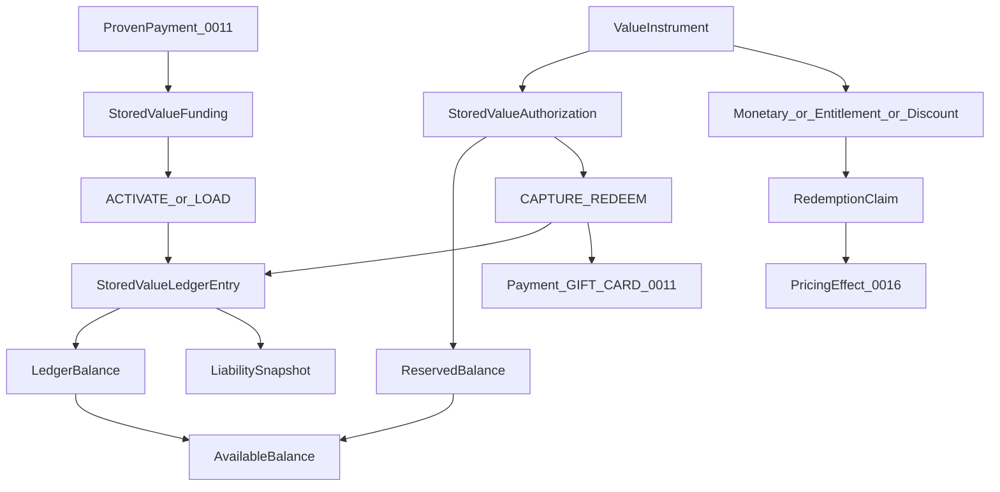

# ADR 0030: Gift Cards, Vouchers and Stored Value

## Status

Proposed

This ADR may be documented and merged while `Proposed`.

This ADR does not authorize a gift-card product, a payment-scheme licence, or application code.

## Date

2026-08-16

## Context

ADR 0006 owns `SaleAction`. ADR 0008 owns automatic promotions. ADR 0009 owns tax rates. ADR 0010 owns the fiscal document. ADR 0011 owns Payment and allocation. ADR 0016 owns pricing effect. ADR 0020 owns offline POS. ADR 0021 owns `CustomerProfile` and loyalty. ADR 0022 owns `ChannelOrder`. ADR 0025 owns accounting export. ADR 0027 owns retention and privacy. ADR 0028 owns the public API. ADR 0029 owns the published menu.

Without this ADR, a gift card, a meal voucher, a public promo code, and loyalty points would share one balance field; tax class would be a marketing label; `AUTHORIZED` would be treated as spend; expiry would zero a cached balance; a chargeback would delete a redemption; and a location of another legal entity would redeem an instrument because it shares a tenant.

Database names, API names, and source code use English. The user interface may localize them to Croatian and other languages.

This ADR locks instrument identity, classification, ledger, issuance, activation, and redemption **before** a gift-card product. Physical schema details belong in a later implementation. The semantics below must not change once accepted.

Classification cites duties, not a legal opinion. [Directive (EU) 2016/1065](https://eur-lex.europa.eu/eli/dir/2016/1065/oj/eng) distinguishes single-purpose and multi-purpose vouchers; a discount with no right to goods or services is a different category. [EBA Limited Network Guidelines](https://www.eba.europa.eu/publications-and-media/press-releases/eba-publishes-final-guidelines-limited-network-exclusion) require real contractual and technical limits for limited-network status, not a UI label.

The governing rule:

```text
Tablio strictly separates economic form, tax class,
and regulatory class. They are not one enum.

Each issued instrument belongs to one issuer legal entity,
one currency, and a frozen classification snapshot.

Monetary value lives on an immutable ledger.
Ledger balance is not reserved balance.

v1: the issuer legal entity is the only acceptor.
No general money transfer, cash-out, or peer-to-peer transfer.
```

```text
Gift card balance       ≠ customer wallet
Voucher                 ≠ promo code campaign
Discount voucher        ≠ Payment
Loyalty points          ≠ stored value
Comp                    ≠ gift card
Gift card issue         ≠ redemption
Gift card sale          ≠ food/drink revenue
CREATED card            ≠ liability
EXPIRE                  ≠ BREAKAGE_RECOGNITION
Ledger balance          ≠ available balance
AUTHORIZED              ≠ REDEEM
Cached balance          ≠ ledger
Same tenant             ≠ same legal entity
```

```text
0009  = tax classification
0010  = invoice / fiscal document
0011  = Payment and allocation
0016  = discount / pricing effect
0020  = offline rules
0021  = CustomerProfile and loyalty
0025  = accounting export
0027  = retention / privacy
0028  = public API / webhook / idempotency
0029  = display and sale through the menu
0030  = instrument, ledger, issuance, activation, redemption
```

This ADR does not compute the final Ticket price and does not issue an invoice. It authorizes use of the instrument and returns proof used by ADR 0011, ADR 0016, and ADR 0010.



## Decision

### 1. Ownership

Source ADRs still own tax, invoice, Payment, pricing, loyalty, accounting export, privacy, public API, and menu publish. This ADR must not redefine them.

ADR 0011 still owns Payment and allocation. A captured `StoredValueAuthorization` becomes a `GIFT_CARD` Payment. A discount voucher is **not** a Payment method.

ADR 0016 still owns the pricing effect of a discount or entitlement voucher. Consume and pricing apply in the **same** transaction.

ADR 0021 still owns loyalty. Points stay a program benefit, not cash or a tender.

ADR 0009 still resolves rates. This ADR freezes `voucher_tax_class` and the other classification axes. There is no generic gift-card tax flag.

ADR 0010 still decides the fiscal document. This ADR hands issue and redemption facts.

ADR 0025 still owns accounting export. This ADR requires `StoredValueLiabilitySnapshot` reconciliation before program activate. The racunai adapter may still be later.

ADR 0001 is not amended. Tenant still comes from authentication. An instrument body field cannot select another tenant or issuer.

This ADR owns `StoredValueProgram`, `AcceptanceNetwork`, `InstrumentClassificationSnapshot`, `ValueInstrument`, `MonetaryInstrumentAccount`, `EntitlementInstrument`, `DiscountInstrument`, `StoredValueLedgerEntry`, `StoredValueAuthorization`, `StoredValueFunding`, `StoredValueLiabilitySnapshot`, `VoucherRedemptionClaim`, `ExpiryPolicy`, and `StoredValueRiskPolicy`. Cross-legal-entity `StoredValueIntercompanySettlement` is **not** v1.

ADR 0031 later owns deposits. This ADR is not ADR 0031.

### 2. Orthogonal classification axes

Economic form, tax class, and regulatory class are **not** one enum.

```text
economic_form:
MONETARY_BALANCE
ENTITLEMENT
DISCOUNT

voucher_tax_class:
SINGLE_PURPOSE
MULTI_PURPOSE
NOT_A_VOUCHER
REVIEW_REQUIRED

regulatory_class:
CLOSED_LOOP
LIMITED_NETWORK
REGULATED_OR_REVIEW_REQUIRED
```

Examples:

```text
Money gift card for all items     = MONETARY_BALANCE + MULTI_PURPOSE
Voucher for a defined service+VAT = ENTITLEMENT + SINGLE_PURPOSE
One-time 10% off code             = DISCOUNT + NOT_A_VOUCHER
```

A monetary gift card may be tax SPV or MPV. SPV tax treatment is locked at issue or transfer. MPV VAT is at redemption. A discount with no right to goods or services is `NOT_A_VOUCHER`. Classification is not a marketing label. `REVIEW_REQUIRED` or `REGULATED_OR_REVIEW_REQUIRED` blocks activation.

### 3. Issuer and closed acceptance network

```text
StoredValueProgram
------------------
tenant_id
issuer_legal_entity_id
program_type
currency
acceptance_network_id
legal_classification_policy_version
tax_policy_version
terms_version
reload_policy
expiry_policy_version
status
```

```text
AcceptanceNetwork
-----------------
tenant_id
issuer_legal_entity_id
allowed_location_ids          # same issuer legal entity only in v1
allowed_sale_action_ids?
allowed_product_categories?
allowed_channels
valid_from
valid_until
regulatory_assessment_version
```

v1: the instrument is issued by one legal entity and may be used only at locations of **that same** legal entity.

```text
accepting_legal_entity_id == issuer_legal_entity_id
```

Several locations are allowed if they belong to the issuer. Tenant boundary alone is not enough. Cross-legal-entity acceptance waits for later `StoredValueIntercompanySettlement` (acceptance contract, clearing, reconciliation, tax, accounting export).

Also forbidden in v1: cross-tenant redemption; third-merchant pay; cash-out; peer-to-peer transfer; conversion to loyalty; interest; arbitrary FX. Widening the network needs a new regulatory assessment and a new program version. It must not retroactively widen old instruments.

### 4. Frozen classification at activation

```text
InstrumentClassificationSnapshot
--------------------------------
economic_form
voucher_tax_class
regulatory_class
place_of_supply_rule
applicable_tax_rule?
eligible_suppliers
eligible_goods_services
currency
regulatory_basis_version
classified_at
classified_by
```

Locked at activation. A later program change must not change an old instrument’s axes (for example SPV → MPV, `MONETARY_BALANCE` → `DISCOUNT`, `CLOSED_LOOP` → a general payment instrument). Ambiguous tax or regulatory class blocks activation.

### 5. Shared ValueInstrument lifecycle

```text
ValueInstrument
---------------
instrument_id
tenant_id
issuer_legal_entity_id
program_id
economic_form
classification_snapshot_id
public_reference
secret_hash
secret_prefix
pin_hash?
status
valid_from
issued_at
activated_at
expires_at
replaced_by_id?
customer_profile_id?
terms_version
```

Children:

```text
MonetaryInstrumentAccount
- currency
- ledger_high_water

EntitlementInstrument
- entitlement_reference
- maximum_uses
- remaining_uses

DiscountInstrument
- pricing_effect_reference
- maximum_uses
```

All instruments share tenant and issuer protection, bearer credential, activation, suspension, expiry, compromise or reissue, privacy, audit, and idempotent redemption. Monetary, entitlement, and discount are children, not a second credential model. A suspended or compromised instrument must not start a new authorization.

```text
CREATED | PENDING_ACTIVATION | ACTIVE | SUSPENDED
| EXHAUSTED | EXPIRED | VOIDED | COMPROMISED | REPLACED
```

`CREATED` or a printed card has no value and creates no liability. Value exists only after a successful, idempotent activation or load ledger event on a **proven** payment or other authorized basis.

The barcode or QR is a bearer credential: unpredictable token; no balance or internal id in the code; raw secret shown only at issue or print; hash and prefix stored; not logged; rate-limit and enumeration protection; constant-time compare; high amount may require PIN or step-up; status and balance not returned to an unauthorized caller; a photo of the code is a sensitive credential. Knowing the code does not grant admin transfer, refund, reissue, or buyer PII.

Link to `CustomerProfile` is optional: `ANONYMOUS_BEARER` | `LINKED_TO_CUSTOMER`.

### 6. Append-only ledger

```text
StoredValueLedgerEntry
----------------------
ledger_entry_id
instrument_id
issuer_legal_entity_id
entry_type
effect_class            # BALANCE_EFFECT | ACCOUNTING_ONLY
                        # | AUTHORIZATION_ONLY
amount
currency
effective_at
server_recorded_at
source_type
source_id
idempotency_key
reverses_entry_id?
authorization_id?
actor_reference
policy_versions
```

```text
BALANCE_EFFECT:       ACTIVATE | LOAD | REDEEM | REFUND_TO_VALUE
                      | VOID_LOAD | EXPIRE
                      | ADJUSTMENT_CREDIT | ADJUSTMENT_DEBIT
                      | REISSUE_OUT | REISSUE_IN
ACCOUNTING_ONLY:      BREAKAGE_RECOGNITION
AUTHORIZATION_ONLY:   optional evidence only; not a balance change
```

`RELEASE` is **not** a monetary ledger entry. Authorization `AUTHORIZED`, `RELEASED`, and `EXPIRED` change reservation only.

```text
ledger_balance     = SUM(committed BALANCE_EFFECT entries)
reserved_balance   = SUM(AUTHORIZED authorizations
                         not CAPTURED / RELEASED / EXPIRED)
available_balance  = ledger_balance - reserved_balance
```

`REDEEM` is written only at capture. Two active authorizations must not reserve more than `ledger_balance`. Amounts are non-negative. Currency must match. Entries are not updated or deleted. Correction is a compensating `BALANCE_EFFECT`. `ledger_balance` must not go below zero. One source or idempotency proof must not change the balance twice.

A cached balance is derived and must be rebuildable from the ledger. Balance is never a freely editable field.

Atomic claim for every money change:

```text
1. lock instrument
2. lock authorization if any
3. lock source Ticket / Payment
4. check ledger high-water
5. claim idempotency key
6. re-check status, reservation, expiry, available balance
7. write ledger entry
8. update derived high-water
9. commit
```

### 7. Redemption authorization and partial pay

```text
StoredValueAuthorization
------------------------
authorization_id
instrument_id
ticket_id
payment_id?
requested_amount
currency
status                  # PENDING | AUTHORIZED | CAPTURED
                        # | RELEASED | DECLINED | UNKNOWN | EXPIRED
expires_at
captured_entry_id?
```

Authorization reserves `available_balance`. It does **not** change `ledger_balance`. Capture writes `REDEEM` atomically and creates the ADR 0011 `GIFT_CARD` Payment. A failed Ticket payment `RELEASE`s the hold without a balance entry. The same authorization cannot be captured twice. `UNKNOWN` is reconciled, not blindly retried. Ticket close re-checks all stored-value authorizations.

Capture races have **one** winner. Same lock order for:

```text
CAPTURE vs AUTHORIZATION EXPIRY
CAPTURE vs instrument SUSPEND
CAPTURE vs instrument EXPIRE
CAPTURE vs REISSUE
CAPTURE vs REFUND / VOID of funding
```

```text
1. instrument
2. authorization
3. source Ticket / Payment
4. ledger high-water
5. idempotency claim
```

After the locks, re-check status, reservation, expiry, and available balance. Only one terminal decision may win. A committed capture beats a later reissue. A suspended or compromised instrument must not start a new authorization.

Stored value may cover the whole Ticket, part of it with another tender, or multiple allocations only if the program allows. Remainder stays on the instrument. It is not paid out as cash. ADR 0011 still owns Payment and allocation.

v1 **forbids** paying for a gift-card purchase with another gift card.

### 8. Sale, activation, funding, VOID_LOAD

Distinguish: payment received for the instrument; instrument activated; tax and fiscal treatment; stored-value liability created. Activation is allowed only after the source payment is proven successful. Payment `UNKNOWN` → instrument stays `PENDING_ACTIVATION` and is not spendable.

```text
StoredValueFunding
------------------
instrument_id
activation_entry_id
source_payment_id
source_payment_version
funded_amount
funding_status
funding_hash
```

`StoredValueFunding` permanently links activation to the source payment.

If after activation there is a card chargeback, payment reversal, bank return, or refund of the gift-card purchase:

- unused value → `VOID_LOAD`
- partial or full redeem → must not create a negative balance and must not delete the redemption

That case opens `FUNDING_DISPUTE` / `RECOVERY_REQUIRED`: suspend the instrument, require approval, and raise an accounting claim against the responsible party.

Selling the instrument may use a 0006 `NON_STOCK` Sale Action. That sale is not food or drink revenue.

Unused instrument: `ACTIVATE → VOID_LOAD`. Partial use forbids a simple void. Never delete the original activation entry.

### 9. Entitlement and discount children versus promo code

`ENTITLEMENT` and `DISCOUNT` use the shared `ValueInstrument` plus `EntitlementInstrument` / `DiscountInstrument`. Entitlement types: `ONE_FREE_ITEM`, `FIXED_AMOUNT_BENEFIT`, `PERCENTAGE_BENEFIT`, `SPECIFIC_SERVICE`, `MEAL_PACKAGE`.

This ADR decides whether the instrument may be used and atomically consumes a use. ADR 0016 computes the pricing effect. The voucher must not arbitrarily rewrite the Ticket price.

```text
VoucherRedemptionClaim
UNIQUE (instrument_id, use_number)
```

The same QR on two POS devices has one winner. A failed pricing or Ticket transaction must not consume the voucher. Consume and pricing apply in the same transaction.

A public campaign code such as `LJETO10` stays ADR 0008 / ADR 0016. This ADR is used only when there is an issued instrument with its own identity, status, rules, lifecycle, claim, and audit. Do not mint a million stored-value instruments for an ordinary promotion.

### 10. Refund, reissue, reload

Refund of goods paid with a gift card returns value to the same instrument as `REFUND_TO_VALUE`, referencing the original `REDEEM`, the ADR 0011 Refund, the original Ticket or Invoice, and the returned amount. It must not create more value than originally redeemed or refunded. Compromised or replaced → controlled replacement instrument with a full chain. Cash refund of stored value is not automatically allowed.

Reissue is not editing the secret on the old instrument:

```text
old ACTIVE/COMPROMISED → REPLACED
new CREATED → ACTIVE
old REISSUE_OUT
new REISSUE_IN
```

One transaction: lock old; verify claimant; stop further use of old; transfer the exact available balance; activate new; link both; audit reason and actor. An anonymous bearer without a registered owner has **no** promised replacement on a mere “I lost it” claim.

v1 `reload_policy = NON_RELOADABLE`. A later reload needs program permission, a separate proven payment plus `LOAD`, balance and velocity limits, a regulatory assessment that the program remains allowed, and must not bypass expiry, refund, or fraud rules.

### 11. Expiry and breakage

Expiry is not `balance = 0`. The instrument stores a frozen `ExpiryPolicy` version and exact `expires_at`. On expiry: lock → check balance and holds → write `EXPIRE` (`BALANCE_EFFECT`) → change status. Later, per accounting rule, `BREAKAGE_RECOGNITION` is `ACCOUNTING_ONLY` (or a 0025 source event). It must **not** reduce `ledger_balance` a second time. A terms change must not retroactively shorten an already-issued instrument without a valid legal basis and an audited migration.

### 12. Tax, fiscal, liability, accounting

ADR 0009 and ADR 0010 stay owners. This ADR hands over `classification_snapshot` (all three axes), issue or redemption event, consideration, issuer legal entity, and source references. It must not decide whether to issue a fiscal invoice. There is no generic “gift card tax” flag.

Liability reconciliation is **not** optional. Before a program may activate, at least this snapshot must exist and reconcile:

```text
StoredValueLiabilitySnapshot
----------------------------
issuer_legal_entity_id
currency
ledger_high_water
opening_liability
loads
redemptions
refunds
expiries
closing_liability
control_hash
```

Go-live identity:

```text
opening + loads + refunds
- redemptions - expiries
= closing liability
```

The 0025 racunai or provider adapter may still be a later step. The liability report must be available from day one. The adapter, when added, reads frozen ledger or source events, not the cached balance.

The same event must not be booked both as instrument sale and again as food or drink sale unless the frozen classification allows it.

### 13. Offline, channels, API

v1: offline POS must not activate, reload, reissue, or redeem stored value or a unique voucher. It may show stored value as temporarily unavailable, store an unfinished attempt with no business effect, and after reconnect start a new server authorization with user confirmation. A future exclusive offline budget is not v1.

A channel provider must not claim redemption only because a code arrived on a `ChannelOrder`. Server-side authorization from this ADR is required.

ADR 0028 scopes:

```text
stored_value.read
stored_value.issue
stored_value.activate
stored_value.redeem
stored_value.refund
stored_value.admin
```

Every mutation has an idempotency claim. A webhook is created only after a committed ledger event. The full secret is never in a webhook.

### 14. Privacy, fraud, permissions

Erasure of a `CustomerProfile` does not delete the legal ledger, does not change the balance, removes or pseudonymizes an unnecessary person link, and does not make a bearer instrument available to the requester. The secret is a credential.

`StoredValueRiskPolicy`: max issue, max balance, daily load and redemption, failed-lookup limit, PIN threshold, approval threshold, velocity window. Breach is not a casual override.

`emergency.override` must not: make a negative balance; bypass tenant or issuer; redeem another party’s instrument; skip the ledger; turn stored value into cash; widen the acceptance network.

ADR 0017 catalog:

```text
stored_value.view
stored_value.issue
stored_value.activate
stored_value.redeem
stored_value.refund
stored_value.suspend
stored_value.reissue
stored_value.adjust
stored_value.program_manage
stored_value.expiry_manage
stored_value.recovery_resolve
stored_value.audit
```

Maker-checker at least for: manual credit or debit above threshold; high-balance reissue; shortening expiry; widening the network; changing regulatory classification; breakage resolution; `UNKNOWN` recovery that could create value.

### 15. Mandatory acceptance tests

An implementation of this ADR must cover at least:

- A `CREATED` card has no balance and no liability.
- A failed or `UNKNOWN` payment does not activate the instrument.
- The same activation request does not create two values.
- A ledger entry cannot be updated or deleted.
- Two devices cannot spend the same last balance.
- Balance never goes below zero.
- Partial redemption leaves the exact remainder.
- Stored value and another tender allocate exactly.
- Voucher consume and pricing effect commit together.
- A failed pricing transaction does not consume the voucher.
- A public promo code is not modeled as a stored-value instrument.
- SPV and MPV keep the classification from issue.
- A program change does not change an old instrument’s classification.
- Another tenant’s or issuer’s instrument cannot be redeemed.
- A location outside the acceptance network is rejected.
- A gift card cannot be exchanged for cash with an ordinary POS right.
- A refund does not return more than originally redeemed.
- Reissue atomically retires the old card and transfers the balance.
- An anonymous bearer without ownership proof has no guaranteed replacement.
- Expiry writes a ledger entry; it does not set balance to zero.
- Breakage is not the same event as expiry.
- An offline device does not activate or spend stored value.
- An API retry with the same key does not create a second ledger entry.
- A webhook does not contain the full secret.
- Erasing a CustomerProfile does not delete the ledger or change the balance.
- An adjustment above threshold requires a second approver.
- Accounting export does not book the same economic event twice.
- Paying for a gift-card purchase with another gift card is rejected.
- A `MONETARY_BALANCE` instrument may be tax SPV or MPV.
- Two active authorizations cannot together reserve more than the ledger balance.
- Releasing an authorization does not change ledger balance.
- `EXPIRE` and `BREAKAGE_RECOGNITION` do not reduce the balance twice.
- Concurrent capture and authorization expiry have one winner.
- Reissue cannot beat an already-committed capture.
- A location of another legal entity cannot redeem a v1 instrument.
- A chargeback after partial redemption does not create a negative balance or delete the redemption.
- The liability snapshot reconciles to the ledger high-water.
- A program cannot activate without liability-reconciliation configuration.
- Voucher and monetary card use the same tenant/issuer credential lifecycle.
- A suspended or compromised instrument does not allow a new authorization.

## Rejected alternatives

- One model for gift card, loyalty, promo, and Comp.
- A single enum that mixes economic, tax, and regulatory class.
- A mutable balance field without a ledger.
- Treating `AUTHORIZED` as a `REDEEM`.
- `RELEASE` as a monetary debit.
- `BREAKAGE_RECOGNITION` reducing balance after `EXPIRE`.
- Product or `CustomerProfile` as balance owner.
- Activation before proven payment.
- v1 cross-legal-entity acceptance.
- Cross-tenant redemption.
- General peer-to-peer transfer.
- Free cash-out.
- Changing SPV or MPV after issue.
- Deleting a ledger entry to correct.
- A chargeback that wipes a redemption or goes negative.
- Making liability reconciliation optional.
- A second credential lifecycle for vouchers.
- Offline redemption without an exclusive budget.
- Barcode as enough proof for admin reissue.
- Automatic cash refund.
- Expiry as `balance = 0`.
- Accounting from the cached balance.
- Paying for a gift card with a gift card in v1.
- Writing ADR 0031 in this change.

## Consequences

### Positive

- Tax, economic, and regulatory class cannot collapse into one marketing flag.
- Authorization cannot spend value that capture has not committed.
- Expiry and breakage cannot reduce the same balance twice.
- A location of another legal entity cannot redeem a v1 instrument because it shares a tenant.

### Negative

- Every money change needs the fixed lock order and an idempotency claim.
- Liability reconciliation is required before the first program activate, even if the accounting adapter is later.
- Offline POS cannot sell or redeem stored value in v1.

### Neutral

- Documentation can merge without a gift-card product or a payment-scheme licence.
- ADR 0009 still owns rates. ADR 0010 still owns the fiscal document. ADR 0011 still owns Payment.
- ADR 0031 stays a reserved roadmap entry.

## Invariants

1. Economic form, tax class, and regulatory class are orthogonal. A monetary gift card may be tax SPV or MPV.
2. `ledger_balance` ≠ `available_balance`. `AUTHORIZED` and `RELEASED` are reservation, not monetary ledger effects. `REDEEM` only at capture.
3. `EXPIRE` is `BALANCE_EFFECT`. `BREAKAGE_RECOGNITION` is `ACCOUNTING_ONLY` and must not reduce the balance a second time.
4. Capture versus authorization expiry, suspend, instrument expire, reissue, or funding void has one winner under the fixed lock order.
5. v1: `accepting_legal_entity_id == issuer_legal_entity_id`. Cross-entity acceptance waits for later `StoredValueIntercompanySettlement`.
6. `StoredValueFunding` permanently links activation to the source payment. Post-activation chargeback after partial redeem opens `FUNDING_DISPUTE` / `RECOVERY_REQUIRED`, not a negative balance.
7. `StoredValueLiabilitySnapshot` reconciliation is required before program activate. The 0025 adapter may still be later.
8. Shared `ValueInstrument` lifecycle. Monetary, entitlement, and discount are children, not a second credential model.
9. Balance is never a freely editable field. A cached balance is rebuildable from the ledger.
10. Tenant isolation. Ids alone do not authorize. An instrument body field cannot select another tenant or issuer.

## Follow-up ADRs

```text
Deposits, Prepayments and No-show Charges
```

Do not implement a gift-card product, a payment-scheme licence, or deposits from this ADR.

## See also

- [ADR 0006: POS Sales and Sale Actions](0006-pos-sales-and-sale-actions.md)
- [ADR 0008: Bundles and Promotions](0008-bundles-and-promotions.md)
- [ADR 0009: Tax Model](0009-tax-model.md)
- [ADR 0010: Invoices and Fiscalization](0010-invoices-and-fiscalization.md)
- [ADR 0011: Payments and Settlement](0011-payments-and-settlement.md)
- [ADR 0016: Price Lists, Discounts, Comps and Approval Rules](0016-price-lists-discounts-comps-and-approval-rules.md)
- [ADR 0017: Staff Identity, Roles and Operator Authorization](0017-staff-identity-roles-and-operator-authorization.md)
- [ADR 0020: Offline POS Operation and Synchronization](0020-offline-pos-operation-and-synchronization.md)
- [ADR 0021: Customer Profiles, Consent and Loyalty](0021-customer-profiles-consent-and-loyalty.md)
- [ADR 0022: Ordering Channels, Delivery and External Platforms](0022-ordering-channels-delivery-and-external-platforms.md)
- [ADR 0025: Accounting Posting and Export](0025-accounting-posting-and-export.md)
- [ADR 0027: Audit Trail, Data Retention and Privacy](0027-audit-trail-data-retention-and-privacy.md)
- [ADR 0028: Public API, Webhooks and Integration Idempotency](0028-public-api-webhooks-and-integration-idempotency.md)
- [ADR 0029: Menu Publishing, Availability and Dayparts](0029-menu-publishing-availability-and-dayparts.md)

## Out of scope

This ADR does not define:

- general e-money
- a bank or payment account
- an international card scheme
- peer-to-peer transfer
- cross-currency stored value
- cryptocurrency
- v1 cross-legal-entity acceptance
- an automatic regulatory legal opinion
- concrete Croatian validity periods
- physical card layout
- loyalty points (ADR 0021)
- deposits (ADR 0031)
- SaaS billing (ADR 0032)
- POS screen layout
