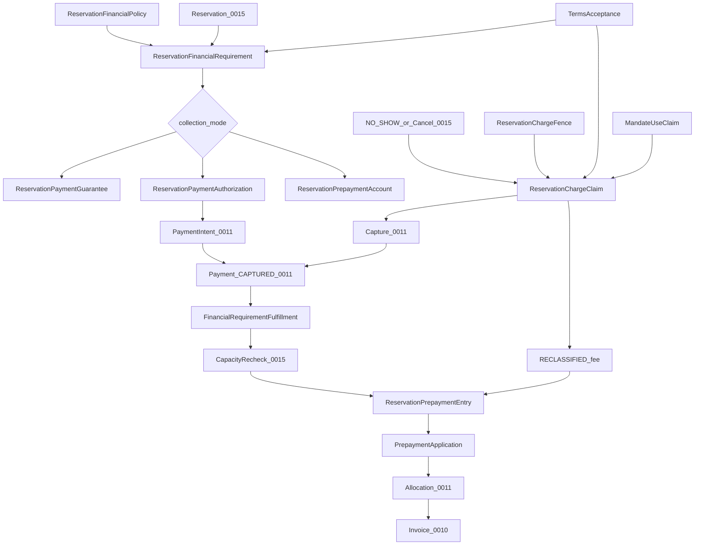

# ADR 0031: Deposits, Prepayments and No-show Charges

## Status

Proposed

This ADR may be documented and merged while `Proposed`.

This ADR does not authorize a booking product, a payment-scheme licence, or application code.

## Date

2026-08-16

## Context

ADR 0009 owns tax rates. ADR 0010 owns the fiscal document. ADR 0011 owns Payment, Intent, capture, refund, and allocation. ADR 0015 owns Reservation, arrival, cancellation, and the `NO_SHOW` decision. ADR 0017 owns staff permissions. ADR 0020 owns offline POS. ADR 0022 owns channel claims. ADR 0025 owns accounting export. ADR 0027 owns retention and privacy. ADR 0028 owns the public API. ADR 0030 owns gift cards and stored value.

Without this ADR, a card token, an authorization hold, a received prepayment, and a no-show fee would share one `deposit_status`; a clock tick would invent `NO_SHOW`; a late webhook would move a guest into a stricter cancellation window; a provider `prepaid` claim would look like local cash; and a successful Payment after capacity was gone would leave money as a free customer balance.

Database names, API names, and source code use English. The user interface may localize them to Croatian and other languages.

This ADR locks reservation financial requirements, the prepayment ledger, and fee claims **before** a booking product. Physical schema details belong in a later implementation. The semantics below must not change once accepted.

Classification cites duties, not a legal opinion. [Directive 2006/112/EC art. 65](https://eur-lex.europa.eu/eli/dir/2006/112/2024-01-01/eng) may make VAT chargeable on an amount paid on account. [CJEU C-277/05](https://curia.europa.eu/juris/liste.jsf?language=en&num=C-277%2F05) shows a retained deposit may be damages, not consideration for a supply — not one universal program rule. [PSD2 art. 97](https://eur-lex.europa.eu/eli/dir/2015/2366/2025-01-17/eng) requires strong customer authentication and amount/payee binding.

The governing rule:

```text
Tablio strictly separates card guarantee, authorization hold,
received prepayment, and a later cancellation or no-show charge.

A prepayment belongs to one arrival and one legal entity.
It is not a gift card and not a free customer balance.

A no-show charge exists only after an audited business decision
and a separate check of a valid payment mandate.
```

```text
Card stored              ≠ guarantee valid
Guarantee valid          ≠ future charge guaranteed
Authorization            ≠ captured Payment
Prepayment received      ≠ reservation seated
Reservation NO_SHOW      ≠ fee successfully charged
Cancellation fee claim   ≠ Payment
Prepayment               ≠ GiftCard
Prepayment               ≠ Customer wallet
Prepayment applied       ≠ refunded
CONFIRMED_CONDITIONALLY  ≠ a new 0015 status
Policy snapshot          ≠ guest accepted these terms
Mandate snapshot         ≠ mandate still usable
Payment captured         ≠ reservation confirmed
CHARGEBACK               ≠ available_balance debit
RECLASSIFIED_TO_FEE      ≠ CAPTURED
Provider collected       ≠ local RECEIVED
Webhook received_at      ≠ business_event_occurred_at
```

```text
0009  = tax model
0010  = invoice, advance/final document, fiscalization
0011  = Payment, authorization, capture, refund, allocation
0015  = Reservation, arrival, cancellation, NO_SHOW decision
0017  = staff rights and approval
0020  = offline
0022  = external ordering/channel claims
0025  = accounting export
0027  = audit, retention, privacy
0028  = public API / webhook / idempotency
0030  = gift cards and stored value
0031  = reservation financial requirement, prepayment ledger, fee claim
```

This ADR does not mark a reservation `NO_SHOW`, does not charge a card outside ADR 0011, and does not issue a fiscal document outside ADR 0010.



## Decision

### 1. Ownership

Source ADRs still own tax, invoice, Payment, reservation status, staff catalog, offline, channel claims, accounting export, privacy, public API, and stored value. This ADR must not redefine them.

ADR 0015 still owns Reservation status, capacity, Seat party, cancellation, and the audited `NO_SHOW` decision. This ADR returns only `financial_requirement_satisfied`. It does not add `CONFIRMED_CONDITIONALLY` to the 0015 matrix.

ADR 0011 still owns Payment, Intent, capture, refund, and allocation. `ReservationPaymentAuthorization` references `payment_intent_id`. There is no Payment method `PREPAYMENT` or `NO_SHOW`.

ADR 0010 still decides whether to issue an advance or final document. This ADR hands receive, apply, refund, and reclassify facts plus `PrepaymentDocumentLink`. Recurring invoices stay out of 0010.

ADR 0009 still resolves rates. This ADR freezes `ReservationFinancialClassificationSnapshot` per event. There is no universal deposit VAT flag.

ADR 0025 still owns accounting export. This ADR requires `ReservationPrepaymentLiabilitySnapshot` reconciliation before a prepayment policy may activate. The racunai adapter may still be later.

ADR 0030 still owns gift cards. A prepayment is not stored value. Surplus becomes a gift card only with explicit consent and a new 0030 instrument.

ADR 0016 is not amended. Ticket pricing stays 0016. Surplus, refund, wallet, and tip are not 0016.

ADR 0001 is not amended. Tenant still comes from authentication. A reservation or prepayment body field cannot select another tenant or issuer.

This ADR owns `ReservationFinancialPolicy`, `ReservationFinancialRequirement`, `ReservationFinancialTermsAcceptance`, `ReservationPaymentGuarantee`, `PaymentMandateSnapshot`, `MandateUseClaim`, `ReservationPaymentAuthorization`, `ReservationPrepaymentAccount`, `ReservationPrepaymentEntry`, `FinancialRequirementFulfillment`, `PrepaymentApplication`, `ReservationChargeClaim`, `ReservationChargeFence`, `ChargeCalculationSnapshot`, `ReservationFinancialClassificationSnapshot`, `PrepaymentDocumentLink`, `ExternalReservationFinancialClaim`, and `ReservationPrepaymentLiabilitySnapshot`. Cross-legal-entity intercompany settlement is **not** v1.

ADR 0032 later owns SaaS billing. This ADR is not ADR 0032.

### 2. Four instruments

```text
CARD_GUARANTEE
AUTHORIZATION_HOLD
PREPAYMENT
CANCELLATION_OR_NO_SHOW_CHARGE
```

| Kind | Money received? | Can apply to a bill? |
|---|---|---|
| Card guarantee | No | No |
| Authorization hold | No; reserved at the PSP | Only after capture |
| Prepayment | Yes | Yes, only on the linked arrival |
| Cancellation/no-show charge | Yes, if capture succeeds | Separate fee, not a prepayment |

They must not share one `deposit_status` field.

### 3. Financial requirement policy

A location may define policy by location, service type, booking channel, party size, time to arrival, slot or day, special event, allowed customer or risk segment, and reservation kind.

```text
ReservationFinancialPolicy
--------------------------
tenant_id
issuer_legal_entity_id
location_id
policy_version
applicability_rules
collection_mode
amount_rule
currency
due_rule
cancellation_rules
no_show_rules
refund_rules
authorization_rules
mandate_requirements
tax_classification_policy_version
terms_version
status
```

```text
collection_mode:
NONE
CARD_GUARANTEE
AUTHORIZATION_HOLD
PREPAYMENT
```

Equal-specificity overlapping policies are rejected at publish.

### 4. Frozen requirement and terms acceptance

At create or confirm, store:

```text
ReservationFinancialRequirement
-------------------------------
reservation_id
linked_arrival_id
issuer_legal_entity_id
location_id
policy_version
terms_version
collection_mode
required_amount
currency
due_at
cancellation_schedule_snapshot
no_show_schedule_snapshot
tax_classification_snapshot
status
```

```text
NOT_REQUIRED | PENDING | SATISFIED | PARTIALLY_SATISFIED
| WAIVED | FAILED | EXPIRED | SUPERSEDED
```

A later global policy change must not change an already-confirmed reservation’s frozen requirement.

A policy snapshot is **not** proof the guest accepted the terms. Freeze a separate acceptance:

```text
ReservationFinancialTermsAcceptance
-----------------------------------
linked_arrival_id
financial_requirement_version
terms_version
terms_content_hash
locale
presented_amount
currency
cancellation_schedule_hash
no_show_schedule_hash
accepted_at
acceptance_channel
authenticated_customer_reference?
evidence_reference
```

Without that proof, do not: set a mandate for a future charge; increase the amount; apply a stricter cancellation policy; start a no-show charge.

A click on one old booking flow’s general terms must not attach to a newer policy version.

### 5. Confirm handoff and late payment

Location policy says whether ADR 0015 may confirm before the requirement is satisfied. This ADR returns only:

```text
financial_requirement_satisfied = true | false
```

`CONFIRMED_CONDITIONALLY` is a policy or UX class, not a new 0015 status. If policy requires prepayment before confirm, the reservation stays `PENDING` (already holds no capacity).

Successful payment and requirement satisfaction must be idempotent. Payment timeout stays `UNKNOWN`. The reservation is not confirmed until payment is proven successful.

A late success after the due window goes to recovery and does not confirm without a new capacity check:

```text
FinancialRequirementFulfillment
-------------------------------
linked_arrival_id
payment_id
requirement_version
capacity_claim_reference?
status
```

```text
PENDING
FULFILLED_AND_CONFIRMED
PAYMENT_RECEIVED_CAPACITY_UNAVAILABLE
REFUND_PENDING
REFUNDED
MANUAL_RECOVERY
```

If Payment succeeded and capacity is gone: do not confirm; do not leave money as a free customer balance; start an idempotent refund or audited recovery; the same Payment must not later confirm another reservation.

Where possible, take a short-lived capacity or payment hold bound to the same requirement generation **before** the external payment flow.

### 6. Card guarantee

```text
ReservationPaymentGuarantee
---------------------------
reservation_id
customer_payment_credential_id
provider
provider_credential_reference
mandate_id?
mandate_scope
maximum_charge_amount
currency
terms_version
authenticated_at
valid_until
status
```

```text
PENDING_SETUP | VALID | REQUIRES_ACTION | EXPIRED
| REVOKED | COMPROMISED | INVALID
```

Tablio does not store PAN or CVV. It stores only a provider token or reference and allowed metadata. CVV must not be kept for a future no-show charge. A guarantee does not reserve or capture money.

### 7. Mandate snapshot and MandateUseClaim

A no-show or cancellation charge without the guest present requires proof that the guest accepted the concrete policy, maximum amount or calculation method, currency, payee, cancellation or no-show terms, and how the payment credential is stored.

```text
PaymentMandateSnapshot
----------------------
mandate_id
reservation_id
provider_reference
mandate_type
maximum_amount
currency
terms_version
accepted_at
authentication_evidence
valid_until
revoked_at
```

A tokenized card does not automatically grant a merchant-initiated no-show charge.

The snapshot proves what was accepted. Before every charge, check the **current** mandate and claim one use:

```text
MandateUseClaim
---------------
mandate_id
reservation_charge_claim_id
mandate_generation
requested_amount
currency
status
claimed_at
```

Same transaction:

```text
1. lock charge claim
2. lock mandate
3. verify not revoked / expired
4. verify amount and currency
5. claim one use
6. create 0011 PaymentIntent
```

Concurrent revoke and charge have one winner. A revoked mandate must not be used because an old snapshot exists.

### 8. Authorization hold

```text
ReservationPaymentAuthorization
-------------------------------
reservation_id
payment_intent_id
provider_authorization_id
authorized_amount
currency
status
authorized_at
expires_at
captured_amount
```

```text
PENDING | AUTHORIZED | PARTIALLY_CAPTURED | CAPTURED
| RELEASED | EXPIRED | DECLINED | UNKNOWN
```

Authorization is not a prepayment and not revenue. Only capture creates an 0011 Payment and, if the mode is prepayment, a `RECEIVED` ledger entry.

A hold may expire before arrival. After `expires_at` it must not be shown as an active guarantee. Re-authorization needs a provider-allowed flow and a valid mandate or customer action.

### 9. Append-only prepayment ledger

A prepayment is not stored value. It may be used only for one reservation or the same arrival.

```text
ReservationPrepaymentAccount
----------------------------
reservation_id
linked_arrival_id
issuer_legal_entity_id
currency
status
ledger_high_water
cached_balance
```

```text
ReservationPrepaymentEntry
--------------------------
entry_id
prepayment_account_id
entry_type
effect_class            # PREPAYMENT_BALANCE | ACCOUNTING_ONLY
                        # | RECOVERY_ONLY
amount
currency
source_type
source_id
reverses_entry_id?
idempotency_key
effective_at
server_recorded_at
tax_snapshot
fiscal_document_reference?
```

```text
PREPAYMENT_BALANCE:  RECEIVED | APPLIED_TO_TICKET | REFUNDED
                     | RECLASSIFIED_TO_CANCELLATION_FEE
                     | RECLASSIFIED_TO_NO_SHOW_FEE
                     | ADJUSTMENT_CREDIT | ADJUSTMENT_DEBIT
ACCOUNTING_ONLY:     optional evidence only; not available-balance
RECOVERY_ONLY:       CHARGEBACK after apply; receivable / recovery
```

```text
received_balance =
RECEIVED + ADJUSTMENT_CREDIT

consumed_balance =
APPLIED_TO_TICKET
+ REFUNDED
+ RECLASSIFIED_TO_CANCELLATION_FEE
+ RECLASSIFIED_TO_NO_SHOW_FEE
+ ADJUSTMENT_DEBIT

available_balance =
received_balance - consumed_balance
```

Rules: append-only; amounts non-negative; direction from entry type; no direct balance edit; `available_balance` must not go below zero; one Payment must not fund a prepayment twice; one prepayment must not be applied or refunded twice.

A cached balance is derived and must be rebuildable from the ledger.

`CHARGEBACK` after an already-applied prepayment must not create a negative balance or void the Invoice. That case is `RECOVERY_ONLY`, not another available-balance debit.

### 10. One arrival, one account

A linked Reservation and WaitlistEntry from ADR 0015 are the same arrival. For that arrival there is at most one `ReservationPrepaymentAccount`. The database claim is on `linked_arrival_id`, not on each row alone.

A walk-in without a reservation has no fake reservation prepayment. It may have an ordinary Payment on the Ticket.

### 11. v1 same legal entity

```text
prepayment issuer legal entity
= reservation location legal entity
= final Ticket/Invoice legal entity
```

If the reservation moves to a location of another legal entity: the old prepayment does not transfer automatically; the old legal entity refunds; the new legal entity collects separately. Later intercompany settlement is not v1.

A same-entity location change may retarget the link with audit and a new policy check.

### 12. Reservation change

On a change of time, party size, service type, or location:

1. lock the reservation and financial requirement
2. compute the new policy
3. compare with the frozen old requirement
4. do not change the old one until the new decision is accepted
5. if more money is due, create a new payment requirement
6. if a reduction is due, create a refund or credit decision
7. only then atomically activate the new requirement version

An amount increase must not be charged without additional consent or a valid mandate. A stricter cancellation policy needs a new `ReservationFinancialTermsAcceptance`. If the change fails, the old reservation and financial requirement stay untouched.

### 13. Apply to Ticket

`Seat party` must not automatically spend the prepayment.

Apply only with an exact Ticket or Invoice allocation:

```text
PrepaymentApplication
---------------------
prepayment_account_id
reservation_id
seating_session_id
ticket_id
invoice_id?
amount
status
applied_entry_id
```

```text
PENDING | APPLIED | REVERSED | FAILED | UNKNOWN
```

Before apply, check: same arrival; same legal entity; same currency; Ticket belongs to the matching session; prepayment is not already applied or refunded; amount does not exceed the open debt.

Application and ADR 0011 Payment allocation must commit together.

### 14. Surplus

If the prepayment exceeds the final bill, the surplus does not automatically become a gift card, customer wallet, loyalty, tip, revenue, or drawer cash.

The surplus goes to a controlled refund on the original tender, or another legally allowed procedure. Conversion to a gift card needs explicit consent and a new 0030 instrument. Refund and allocation stay ADR 0011.

### 15. Charge claim

```text
ReservationChargeClaim
----------------------
reservation_id
linked_arrival_id
claim_type
policy_snapshot_id
triggering_event_id
calculated_amount
currency
classification_snapshot
mandate_id?
status
approved_by?
payment_id?
```

```text
claim_type:
CANCELLATION_CHARGE
NO_SHOW_CHARGE
```

```text
PENDING_EVALUATION | ELIGIBLE | APPROVAL_REQUIRED | APPROVED
| SUBMITTED | CAPTURED | DECLINED | UNKNOWN | WAIVED
| REJECTED | REVERSED
| SETTLED_FROM_PREPAYMENT
| PARTIALLY_SETTLED_FROM_PREPAYMENT
| PAYMENT_REQUIRED
| REFUNDED
```

A claim is not a Payment. Only a successful capture creates a Payment.

One cancellation or no-show event must not create two economic claims:

```text
UNIQUE (
  linked_arrival_id,
  triggering_event_id,
  claim_type,
  policy_generation
)
```

Amount correction does not edit the claim. It creates a new version or a compensating claim.

### 16. No-show is an audited 0015 decision

Time alone yields `overdue`. It does not create `NO_SHOW`.

A no-show claim may start only after ADR 0015 has an audited `NO_SHOW` decision. The claim must reference that exact event and the policy snapshot the guest accepted.

If `NO_SHOW` is later corrected by compensation, the charge claim does not disappear. A separate reversal or refund decision is required.

### 17. Charge fence

Lock the race among arrival, cancellation, reservation move, no-show decision, and fee capture:

```text
ReservationChargeFence
----------------------
linked_arrival_id
financial_generation
terminal_arrival_event
claimed_at
```

The lock covers the whole arrival.

`Seat party` before the claim lock blocks a new no-show charge. A confirmed cancellation event blocks a stale no-show claim. A no-show decision must not beat an already-committed arrival. An old worker must not charge against a superseded policy generation.

### 18. Reclassify prepayment to fee

If a prepayment was received, a cancellation or no-show outcome may, under the accepted policy, reclassify part or all of it:

```text
RECLASSIFIED_TO_CANCELLATION_FEE
RECLASSIFIED_TO_NO_SHOW_FEE
```

That is not a new card charge. It must not exceed available prepayment; it references the original `RECEIVED` and the charge claim; the same amount cannot be both refunded and reclassified; any remainder above the prepayment needs a separate charge and mandate; tax and fiscal class are re-evaluated from the frozen policy and the actual outcome.

`RECLASSIFIED_TO_NO_SHOW_FEE` finishes as `SETTLED_FROM_PREPAYMENT` or `PARTIALLY_SETTLED_FROM_PREPAYMENT`. It is not `CAPTURED`.

```text
claim amount
- settled from prepayment
= remaining amount eligible for new charge
```

Only the remainder may start a new PaymentIntent.

### 19. Fresh remainder capture

If there is no prepayment, or it is not enough:

1. verify `ReservationChargeClaim` is `APPROVED` or `PAYMENT_REQUIRED`
2. verify `ReservationFinancialTermsAcceptance` for that requirement version
3. take `MandateUseClaim` (current mandate, not a stale snapshot)
4. verify payment-credential status
5. create an idempotent 0011 PaymentIntent for the **remainder only**
6. provider result: success → `CAPTURED`; declined → `DECLINED`; timeout → `UNKNOWN`
7. `UNKNOWN` is first reconciled on the same external reference
8. no blind retry with a new PaymentIntent

`NO_SHOW` stays `NO_SHOW` when the charge is declined. Charge and reservation status are not the same lifecycle.

### 20. Charge amount and frozen event time

```text
ChargeCalculationSnapshot
-------------------------
policy_version
reservation_version
cancellation/no_show_time
scheduled_arrival_at
party_size
reserved_value_basis
amount_rule
maximum_amount
calculated_amount
currency
calculation_hash
business_event_occurred_at
server_recorded_at
provider_occurred_at?
provider_time_verified
location_timezone_snapshot
policy_window_id
```

```text
amount_rule:
FIXED
PERCENTAGE_OF_RESERVED_VALUE
PER_PERSON
FIRST_PERIOD
FULL_RESERVED_VALUE
```

The final amount must be deterministic and must not exceed the contracted maximum, the valid mandate, the policy limit, and the actually allowed amount. A manual override above that needs new approval or new guest consent. An ordinary manager override is not enough.

Fee amount must not depend on when a late webhook arrived. A local event uses the server-recorded business instant. A provider timestamp is used only if authentic and bound to the original provider event. A delayed webhook must not enter a stricter cancellation window because it arrived later. An unreliable or contradictory provider timestamp goes to review. Intervals are `[start, end)`. DST yields one determined instant.

### 21. Tax and fiscal classification

Do not lock universally:

```text
all prepayments taxable
all retained deposits damages
all no-show fees outside VAT
```

Instead:

```text
ReservationFinancialClassificationSnapshot
------------------------------------------
event_type
jurisdiction
legal_entity_id
supply_identified
consideration_type
tax_treatment_rule
fiscal_document_rule
policy_version
classified_at
```

Classify at least on: prepayment receive; apply to final supply; refund; reclassify to cancellation or no-show fee; a separate fee capture.

ADR 0009 decides tax. ADR 0010 decides the document and fiscalization.

### 22. Prepayment and the final invoice

```text
PrepaymentDocumentLink
----------------------
prepayment_entry_id
advance_document_id
final_invoice_id?
applied_amount
tax_snapshot_reference
status
```

The final invoice must prove:

```text
gross supply
- valid prepayment applications
= remaining amount due
```

The same prepayment must not be deducted on two final invoices. A void or correction of the final invoice does not delete the historical prepayment.

### 23. Refund and chargeback

Refund: references the original Payment and `RECEIVED`; does not exceed unapplied and unreclassified balance; goes to the original tender when possible; does not delete the original ledger entry; timeout stays `UNKNOWN`.

Chargeback after apply: does not delete the Ticket or Invoice; does not restore the old reservation; opens a recovery or dispute case; prevents a false second refund; sends a frozen source event to accounting as `RECOVERY_ONLY`.

### 24. External channels and funds control

A provider may claim `prepaid`, `deposit_collected`, or `card_guaranteed`. That is an external claim, not a local fact.

```text
ExternalReservationFinancialClaim
---------------------------------
channel_order_id / external_reservation_id
external_payment_reference
claim_type
amount
currency
provider_payload_hash
status
funds_control_model
merchant_of_record
collecting_legal_entity
settlement_reference?
```

```text
funds_control_model:
PROPERTY_COLLECTED
PROVIDER_COLLECTED_FOR_PROPERTY
PROVIDER_MERCHANT_OF_RECORD
UNRESOLVED
```

Only verification or reconciliation may create a local Payment or prepayment entry. A delayed webhook uses the original provider reservation or revision, not today’s policy, and not webhook receive time.

A local `RECEIVED` entry is allowed only when it is proven that the Tablio legal entity controls the funds, or that a confirmed receivable or settlement toward the provider belongs to that legal entity.

`PROVIDER_MERCHANT_OF_RECORD` must not automatically become a local received prepayment.

A provider refund or cancel remains a claim until the local Refund is confirmed.

### 25. Accounting reconciliation

Prepayments create a liability or other financial position that must be reconciled from day one.

```text
ReservationPrepaymentLiabilitySnapshot
--------------------------------------
legal_entity_id
currency
ledger_high_water
opening_balance
received
applied
refunded
reclassified
chargebacks
closing_balance
control_hash
```

A program or policy with prepayment must not become `ACTIVE` without configured liability reconciliation.

Named sources for ADR 0025:

```text
PREPAYMENT_RECEIVED
PREPAYMENT_APPLIED
PREPAYMENT_REFUNDED
PREPAYMENT_RECLASSIFIED
NO_SHOW_CHARGE_CAPTURED
CANCELLATION_CHARGE_CAPTURED
CHARGEBACK
```

The 0025 adapter may still be later. Accounting uses frozen source events, not the cached balance. Payment `UNKNOWN` is not exportable.

### 26. Offline

v1 offline POS must not: set a new card guarantee; authorize or capture a hold; receive a prepayment; apply a prepayment to a Ticket; refund a prepayment; decide or charge a cancellation or no-show fee.

An offline snapshot may show the last-known status as information only, not as authority for a new financial action. After reconnect, a new server-side check and user confirmation are required.

### 27. Public API and webhooks

ADR 0028 scopes:

```text
reservation_financials.read
reservation_financials.requirement_manage
reservation_financials.collect
reservation_financials.apply
reservation_financials.refund
reservation_financials.charge_claim
reservation_financials.charge_execute
```

Every mutation uses an ADR 0028 idempotency claim. A webhook is created only after a committed fact:

```text
prepayment.received
prepayment.applied
prepayment.refunded
reservation.charge_claimed
reservation.charge_captured
reservation.charge_declined
reservation.charge.unknown
```

A webhook must not contain PAN, CVV, a payment token, or full mandate or terms-acceptance proof.

### 28. Privacy and retention

Payment credential, mandate, terms acceptance, and guest identity follow ADR 0027.

Erasure of a `CustomerProfile`: does not delete a legal Payment, prepayment document, charge claim, or terms-acceptance proof; does not start a refund; does not revoke a mandate that has its own lifecycle; does not revive a spent prepayment; removes unnecessary marketing or CRM links.

### 29. Permissions

ADR 0017 catalog:

```text
reservation_financials.view
reservation_financials.policy_manage
reservation_financials.collect
reservation_financials.apply
reservation_financials.refund
reservation_financials.waive
reservation_financials.charge_evaluate
reservation_financials.charge_approve
reservation_financials.charge_execute
reservation_financials.adjust
reservation_financials.recovery_resolve
reservation_financials.audit
```

Maker-checker at least for: a charge above the defined threshold; a manual increase of the calculated amount; a prepayment-balance adjustment; a refund to another tender; a waiver after a charge already started; `UNKNOWN` recovery that could create a new charge; a policy change that reduces rights of already-confirmed guests.

### 30. Mandatory acceptance tests

An implementation of this ADR must cover at least:

- A card guarantee has no balance and no Payment.
- An authorization hold is not a prepayment before capture.
- An `UNKNOWN` payment does not confirm the reservation.
- A late payment after expiry does not confirm without a new capacity check.
- One Payment does not fund a prepayment twice.
- One prepayment is not applied to two Tickets.
- A linked Reservation and Waitlist share one prepayment account.
- A walk-in does not create a fake reservation.
- A move to another legal entity does not transfer the prepayment.
- A failed reservation change leaves the old requirement untouched.
- `Seat party` does not spend the prepayment.
- Application and Payment allocation commit together.
- Surplus does not become a gift card, tip, or revenue without a separate decision.
- Time alone yields overdue; it does not create `NO_SHOW`.
- A charge claim does not start before an audited `NO_SHOW` or cancellation event.
- Concurrent seat, cancel, and no-show claim have one winner.
- An old worker does not use a superseded policy generation.
- A reclassified amount is not also refunded.
- A new no-show charge does not exceed the mandate.
- A timeout charge is `UNKNOWN`; there is no blind retry.
- A `DECLINED` charge does not change `NO_SHOW` status.
- Prepayment and no-show fee have no single universal tax class.
- The final invoice deducts the same prepayment only once.
- A chargeback does not delete the Invoice or Reservation.
- A provider `prepaid` claim is not a local Payment.
- Offline POS does not execute a financial action.
- The liability snapshot reconciles to the ledger high-water.
- A prepayment policy is not `ACTIVE` without reconciliation configuration.
- A webhook does not contain a payment credential.
- Profile erasure does not delete the legal ledger or start a refund.
- One actor cannot both approve and execute a charge above the threshold.
- An old terms version does not authorize a charge under a new policy.
- A mandate revoked before the claim blocks the charge.
- Concurrent mandate revoke and charge have one winner.
- A successful late Payment without capacity starts refund or recovery, not confirm.
- The same Payment does not fulfill two financial requirements.
- Chargeback after apply does not create a negative prepayment balance.
- One no-show event does not create two economic charge claims.
- Prepayment reclassification finishes as `SETTLED_FROM_PREPAYMENT`, not `CAPTURED`.
- A new card charge covers only the uncovered remainder of the claim.
- A provider merchant-of-record claim does not become local `RECEIVED`.
- A delayed provider cancellation uses the original event, not webhook receive time.
- A DST or cancellation boundary yields one deterministic result.

## Rejected alternatives

- One `deposit_status` field.
- A card token as a charge right.
- Authorization as prepayment.
- No-show from the clock alone.
- Automatic charge without claim or mandate.
- Using a mandate snapshot after revoke.
- Treating a policy snapshot as terms acceptance.
- Leaving late-captured money as a customer balance.
- `CHARGEBACK` as an available-balance debit.
- Editing a charge claim in place.
- Treating reclassification as `CAPTURED`.
- Provider `prepaid` or merchant-of-record as local `RECEIVED`.
- Fee amount from webhook receive time.
- Prepayment as a gift card or customer wallet.
- Automatic cross-entity transfer.
- An editable balance.
- Automatic surplus as tip or revenue.
- Blind retry of a no-show charge.
- Universal VAT treatment of all deposits.
- Offline charge.
- Accounting from the cached balance.
- Adding `CONFIRMED_CONDITIONALLY` to ADR 0015.
- A new Payment method `PREPAYMENT` or `NO_SHOW`.
- Amending ADR 0016.
- Writing ADR 0032 in this change.

## Consequences

### Positive

- A card token cannot be treated as captured money or as a no-show mandate.
- A late webhook cannot move a guest into a stricter cancellation window.
- A successful Payment after capacity is gone cannot confirm a reservation or become a free wallet.
- A provider merchant-of-record claim cannot look like local cash.

### Negative

- Every charge needs terms acceptance, a live mandate-use claim, and the arrival fence.
- Liability reconciliation is required before the first prepayment policy activate, even if the accounting adapter is later.
- Offline POS cannot collect or apply a deposit in v1.

### Neutral

- Documentation can merge without a booking product or a payment-scheme licence.
- ADR 0015 still owns `NO_SHOW`. ADR 0011 still owns capture. ADR 0010 still owns the fiscal document.
- ADR 0032 stays a reserved roadmap entry.

## Invariants

1. Card guarantee, authorization hold, received prepayment, and cancellation or no-show charge are four instruments. They do not share one `deposit_status`.
2. ADR 0015 keeps its status matrix. This ADR returns only `financial_requirement_satisfied`.
3. ADR 0011 owns Intent, Payment, refund, and allocation. There is no `PREPAYMENT` or `NO_SHOW` Payment method.
4. A policy snapshot is not terms acceptance. Without `ReservationFinancialTermsAcceptance` there is no mandate, amount increase, stricter cancellation, or no-show charge.
5. A mandate snapshot is not a live right. `MandateUseClaim` and current mandate status decide. Concurrent revoke and charge have one winner.
6. A late captured Payment without capacity does not confirm. It refunds or enters audited recovery. One Payment fulfills at most one requirement.
7. `available_balance = received_balance - consumed_balance` and must not go below zero. `CHARGEBACK` after apply is `RECOVERY_ONLY`.
8. One arrival, one prepayment account on `linked_arrival_id`. v1: issuer legal entity = reservation location legal entity = final Ticket or Invoice legal entity.
9. One economic charge claim per arrival, triggering event, claim type, and policy generation. Reclassification is `SETTLED_FROM_PREPAYMENT`, not `CAPTURED`. A new Intent covers only the remainder.
10. `PROVIDER_MERCHANT_OF_RECORD` is not local `RECEIVED`. Fee time is `business_event_occurred_at`, not webhook receive time. Tenant isolation. Ids alone do not authorize.

## Follow-up ADRs

```text
Tenant Plans, Entitlements and SaaS Billing
```

Do not implement a booking product, a payment-scheme licence, or SaaS billing from this ADR.

## See also

- [ADR 0009: Tax Model](0009-tax-model.md)
- [ADR 0010: Invoices and Fiscalization](0010-invoices-and-fiscalization.md)
- [ADR 0011: Payments and Settlement](0011-payments-and-settlement.md)
- [ADR 0015: Reservations, Waitlist and Guest Seating](0015-reservations-waitlist-and-guest-seating.md)
- [ADR 0017: Staff Identity, Roles and Operator Authorization](0017-staff-identity-roles-and-operator-authorization.md)
- [ADR 0020: Offline POS Operation and Synchronization](0020-offline-pos-operation-and-synchronization.md)
- [ADR 0022: Ordering Channels, Delivery and External Platforms](0022-ordering-channels-delivery-and-external-platforms.md)
- [ADR 0025: Accounting Posting and Export](0025-accounting-posting-and-export.md)
- [ADR 0027: Audit Trail, Data Retention and Privacy](0027-audit-trail-data-retention-and-privacy.md)
- [ADR 0028: Public API, Webhooks and Integration Idempotency](0028-public-api-webhooks-and-integration-idempotency.md)
- [ADR 0030: Gift Cards, Vouchers and Stored Value](0030-gift-cards-vouchers-and-stored-value.md)

## Out of scope

This ADR does not define:

- general e-money
- PAN or CVV storage
- intercompany settlement
- court collection of a declined no-show charge
- gift cards (ADR 0030)
- SaaS billing (ADR 0032)
- an automatic legal VAT opinion
- concrete Croatian amounts or deadlines
- a concrete payment provider
- Ticket pricing (ADR 0016)
- POS screen layout
