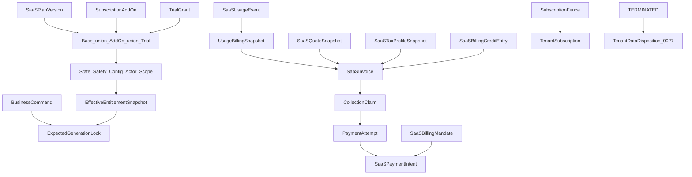

# ADR 0032: Tenant Plans, Entitlements and SaaS Billing

## Status

Proposed

This ADR may be documented and merged while `Proposed`.

This ADR does not authorize a billing portal, a payment-scheme licence, or application code.

## Date

2026-08-16

## Context

ADR 0001 owns deployment, tenancy, and platform surfaces. ADR 0009 owns tenant POS tax. ADR 0010 owns tenant POS and fiscal invoices to guests. ADR 0017 owns staff permissions. ADR 0019 owns POS devices. ADR 0020 owns the offline lease. ADR 0025 owns tenant accounting export. ADR 0027 owns retention, privacy, audit, and `TenantDataDisposition`. ADR 0028 owns the public API. ADR 0030 owns gift cards and stored value.

Without this ADR, a plan name would be treated as a staff permission; a missing trial would extinguish a paid right; a frontend cache would authorize a new location; a late renewal would undo an effective cancel; a missing usage watermark would bill zero; and a SaaS invoice would enter the tenant POS sequence.

Database names, API names, and source code use English. The user interface may localize them to Croatian and other languages.

This ADR locks SaaS plan, entitlement, usage, and platform billing **before** a billing product. Physical schema details belong in a later implementation. The semantics below must not change once accepted.

Classification cites duties, not a legal opinion. [EU VAT Directive art. 44](https://eur-lex.europa.eu/eli/dir/2006/112/2020-01-01/eng) may place B2B supply at the customer’s establishment. [European Commission – VAT for businesses](https://taxation-customs.ec.europa.eu/taxation/vat/vat-businesses_en) distinguishes B2B and B2C electronic services. Tax is a versioned `SaaSTaxProfileSnapshot`, not one global `vat_rate`.

The governing rule:

```text
Tablio strictly separates the commercial plan, effective platform rights,
usage measurement, and SaaS billing.

A plan sets a capability ceiling. It never grants a staff permission.

Entitlement is computed from an immutable plan version
and audited subscription changes.

A SaaS invoice is issued by the Tablio platform billing legal entity.
It is never mixed with POS invoices the tenant issues to guests.
```

```text
Plan includes feature      ≠ staff has permission
Staff permission           ≠ tenant plan includes feature
Subscription ACTIVE        ≠ invoice PAID
Payment FAILED             ≠ tenant data deleted
Tenant SUSPENDED           ≠ legal documents inaccessible
Usage observed             ≠ usage billed
SaaS invoice               ≠ tenant POS Invoice
Billing credit             ≠ GiftCard
Location exists            ≠ location is billable
TenantSubscription         ≠ WebhookSubscription
0001 suspended 404         ≠ billing/recovery lockout
Missing trial              ≠ base plan off
CANCEL_AT_PERIOD_END       ≠ primary subscription status
Entitlement cache          ≠ authority
Missing watermark          ≠ zero usage
ISSUED                     ≠ VOIDED in place
VAT ID change              ≠ rewrite issued invoice
```

```text
0001  = deployment, tenancy, platform surfaces
0009  = tenant POS tax model
0010  = tenant POS / fiscal invoices to guests
0017  = staff permissions and LocationAssignment
0019  = POS devices
0020  = offline lease
0025  = tenant accounting export
0027  = retention, privacy, audit, TenantDataDisposition
0028  = public API / webhook / idempotency
0030  = gift cards and stored value
0032  = SaaS plan, entitlement, usage, platform billing
```

This ADR must not: issue a document into the tenant’s books; become venue revenue; mutate Ticket, Payment, or BusinessDay; grant a user permission; delete tenant data for non-payment.

ADR 0001 is not amended. A valid key on a suspended tenant remains a controlled product-API **404**. That 404 is not a billing or recovery lockout. Authentication still selects the tenant. A billing body field cannot select another tenant.

ADR 0016 is not amended. Guest product price stays 0016. SaaS price stays this ADR.



## Decision

### 1. Ownership

Source ADRs still own tenancy, tenant POS tax, guest invoices, staff permissions, devices, offline leases, tenant accounting export, privacy, the public API, and stored value. This ADR must not redefine them.

ADR 0001 still owns host surfaces and tenant resolution. Product-API 404 on a suspended tenant stays 0001. Billing, debt payment, export window, legal POS documents, privacy requests, credential shutdown, and support stay a controlled recovery surface owned by this ADR. Celery product workers stay fail-closed. Billing, dunning, and disposition run on clearly marked platform paths.

ADR 0009 still owns tenant POS tax. This ADR freezes `SaaSTaxProfileSnapshot`. There is no global SaaS `vat_rate`.

ADR 0010 still owns tenant POS invoices. `SaaSInvoice` is not that Invoice.

ADR 0017 still authorizes the actor. A plan entitlement is not a staff permission. Tenant billing and platform-operator billing are **separate catalogs**.

ADR 0019 still owns device registration and the device capability ceiling. This ADR owns the tenant plan ceiling. 0019 must not raise a device ceiling above the current `EffectiveEntitlementSnapshot`.

ADR 0020 still owns `OfflineLease`. This ADR only says the lease and snapshot **reference** `entitlement_generation`, `subscription_state`, and `entitlement_lease_expires_at`.

ADR 0025 still owns tenant accounting export. A SaaS invoice is not venue revenue. Tablio platform accounting stays a later control-plane process.

ADR 0027 still owns `TenantDataDisposition`. This ADR starts it on termination.

ADR 0028 still owns the public API contract. `TenantSubscription` is not `WebhookSubscription`.

ADR 0030 still owns gift cards. A billing credit is not stored value.

This ADR owns `PlatformBillingEntity`, `TenantBillingAccount`, `SaaSPlan`, `SaaSPlanVersion`, `EntitlementDefinition`, `PlanEntitlement`, `TenantSubscription`, `SubscriptionAddOn`, `EffectiveEntitlementSnapshot`, `EntitlementRemediationPlan`, `TrialGrant`, `SubscriptionChangeOrder`, `ProrationSnapshot`, `SaaSPriceVersion`, `UsageMeterDefinition`, `SaaSUsageEvent`, `UsageBillingSnapshot`, `SaaSBillingPeriod`, `SaaSQuoteSnapshot`, `SaaSTaxProfileSnapshot`, `SaaSInvoice`, `SaaSCollectionClaim`, `SaaSPaymentAttempt`, `SaaSPaymentIntent`, `SaaSBillingMandate`, `SaaSBillingCreditEntry`, `DunningPolicy`, and `DunningCase`.

This ADR is not ADR 0033. No later number is reserved here.

### 2. Four concepts

```text
PlanVersion          = what the commercial package contains
TenantSubscription   = the tenant’s contract on a plan version
EffectiveEntitlement = what the tenant may technically use now
SaaSBilling          = what Tablio charges and documents
```

They must not collapse into one `feature_enabled` JSON.

### 3. Platform billing entity and billing account

```text
PlatformBillingEntity
---------------------
legal_entity_id
legal_name
tax_identifier
country
billing_address
supported_currencies
invoice_sequence_profile
tax_registration_profile
status
```

A SaaS document is issued by the Tablio platform legal entity, not by the tenant legal entity to a guest.

If Tablio later has several billing entities, a subscription is permanently bound to exactly one issuer. Changing issuer is not an in-place edit of the old subscription.

```text
TenantBillingAccount
--------------------
tenant_id
platform_billing_entity_id
customer_legal_name
customer_tax_identifier
customer_type
billing_country
billing_address
billing_email
currency
billing_timezone
tax_profile_version
status
```

```text
customer_type:
BUSINESS
CONSUMER
PUBLIC_BODY
REVIEW_REQUIRED
```

v1:

```text
one tenant
→ one active TenantBillingAccount
→ one active base TenantSubscription
```

Reseller and one invoice for many tenants wait.

### 4. Immutable plan versions

```text
SaaSPlan
--------
plan_id
code
status
```

```text
SaaSPlanVersion
---------------
plan_id
version
name
commercial_terms_version
entitlement_set_version
pricing_model_version
available_from
available_until
status
```

```text
DRAFT | ACTIVE | RETIRED
```

An active version is immutable. A price, limit, or content change creates a new version. An existing tenant does not move because the marketing name stayed the same.

### 5. Entitlement catalog

```text
EntitlementDefinition
---------------------
entitlement_code
definition_version
capability
value_type
enforcement_mode
reset_rule?
status
```

```text
BOOLEAN | LIMIT | QUOTA | ENUM | CONFIGURATION
```

Examples: `locations.maximum`, `staff.active.maximum`, `devices.active.maximum`, `public_api.enabled`, `public_api.monthly_requests`, `webhooks.enabled`, `offline_pos.enabled`, `kds.enabled`, `reservations.enabled`, `loyalty.enabled`, `accounting_export.enabled`, `external_channels.maximum`, `analytics.history_months`, `storage.maximum_bytes`.

An entitlement code must not be an arbitrary feature string from a frontend request.

```text
PlanEntitlement
---------------
plan_version_id
entitlement_definition_version
value
enforcement_policy_version
```

### 6. Union-then-ceiling and enforcement

```text
(base plan entitlements
 ∪ active add-ons
 ∪ active trial grants)
∩ subscription-state ceiling
∩ platform safety policy
∩ tenant configuration
∩ actor permission
∩ location/device scope
```

A missing `TrialGrant` must not turn off the base plan. Add-on and trial may widen the base package only inside the catalog and their own allowed maximum. They must not exceed the platform capability ceiling.

`reservations.enabled = true` does not let a user manage reservations. ADR 0017 still authorizes the actor.

Each entitlement defines behaviour:

```text
HARD_BLOCK_NEW
ALLOW_EXISTING_READ_ONLY
SOFT_LIMIT_WARN
METER_OVERAGE
SAFETY_ONLY
```

Examples: over location limit — do not create a new one; do not delete existing. Over device limit — do not register a new one; do not auto-reassign. Analytics history downgrade — do not delete history; limit future access per retention. Webhooks disabled — do not create new webhook subscriptions; suspend existing in a controlled way. API quota exceeded — `429`, not tenant suspension. KDS disabled — do not delete production history.

### 7. Atomic entitlement check

An entitlement cache or the frontend is not authority. Every business command must:

```text
1. record the expected entitlement_generation
2. under the domain lock, re-check the current generation
3. reject a new action if the generation is stale
4. return an already-committed result idempotently
```

A plan change and a business command must not race in a non-deterministic order.

### 8. Subscription, add-on, and cancellation fence

```text
TenantSubscription
------------------
subscription_id
tenant_id
billing_account_id
plan_version_id
billing_model
billing_interval
period_start
period_end
renewal_rule
status
entitlement_generation
billing_generation
started_at
cancellation_effective_at?
non_renewing
cancelled_at?
```

```text
billing_model:
PREPAID_FIXED
POSTPAID_FIXED
USAGE_BASED
HYBRID
```

Primary status:

```text
TRIALING
ACTIVE
PAST_DUE
GRACE
RESTRICTED
SUSPENDED
TERMINATED
```

`CANCEL_AT_PERIOD_END` is **not** a primary status. It is a scheduled change: `cancellation_effective_at` plus `non_renewing = true`. Until that instant the subscription stays `ACTIVE`, `PAST_DUE`, or `GRACE`.

One tenant must not have two overlapping active base subscriptions.

```text
SubscriptionAddOn
-----------------
subscription_id
add_on_version_id
quantity
valid_from
valid_until
status
```

Examples: extra location, extra POS device, extra API traffic, longer analytics history, extra channel, premium support. An add-on must not widen capability past the platform ceiling.

Subscription fence: one deterministic subscription lock. Renewal, cancel, and plan-change run under that fence. A late renewal must not undo an already-effective termination. Terminal `TERMINATED` does not return to `ACTIVE`. Return is a new subscription.

### 9. Effective entitlement snapshot

```text
EffectiveEntitlementSnapshot
----------------------------
tenant_id
subscription_id
entitlement_generation
plan_version_id
add_on_versions
trial_grant_versions
subscription_status
resolved_values
source_hash
generated_at
valid_until?
```

The snapshot is immutable. The mutable pointer is `tenant.current_entitlement_generation`. A new configuration is fully computed and validated first, then the pointer swaps atomically. A failed change leaves the last-good generation.

### 10. Deterministic remediation

Downgrade:

1. compute planned entitlements
2. detect over-limit resources
3. build `EntitlementRemediationPlan`
4. show consequences
5. require confirmation
6. schedule the change
7. activate the new generation
8. block only the defined new actions

```text
EntitlementRemediationItem
- entitlement_code
- current_usage
- new_limit
- affected_resources
- remediation_mode
- deadline?
```

Existing resources stay readable. The system does not randomly deactivate a location or device. The tenant explicitly chooses what to archive or deactivate. While over limit, create and reactivate of new resources are blocked. Dropping usage below the limit atomically closes remediation.

Must not automatically delete: location, device, staff membership, invoice, audit, reservation, Ticket, accounting export, historical analytics snapshot. No automatic move between locations.

### 11. Legal and recovery access

Even under `RESTRICTED`, `SUSPENDED`, or `TERMINATED`, the tenant must, per policy, keep controlled access to at least: its SaaS invoices; debt payment; data export during the export window; legal POS and fiscal documents; privacy requests; security recovery; shutdown of compromised credentials; support contact.

Non-payment must not block a required legal correction or data protection.

### 12. Trial

```text
TrialGrant
----------
tenant_id
plan_version_id
starts_at
ends_at
entitlement_overrides
conversion_rule
payment_mandate_required
status
```

Trial uses server time and `[starts_at, ends_at)`. A missing trial does not extinguish the base plan.

Trial expiry: does not charge automatically without accepted commercial terms and a valid payment mandate; does not delete data; creates a new entitlement generation; moves to the contracted paid, free, or restricted outcome.

Extending a trial is an audited new version, not an edit of the old `ends_at`.

### 13. Change order and proration

Upgrade, downgrade, add-on, interval, or quantity must not edit the active subscription in place.

```text
SubscriptionChangeOrder
-----------------------
subscription_id
from_plan_version
to_plan_version
change_type
effective_at
quote_snapshot_id
proration_snapshot_id?
accepted_terms_version
accepted_at
status
```

```text
DRAFT | QUOTED | AWAITING_ACCEPTANCE | ACCEPTED
| SCHEDULED | APPLIED | FAILED | CANCELLED
```

Apply is idempotent and under the subscription lock.

```text
ProrationSnapshot
-----------------
billing_period
old_price_basis
new_price_basis
elapsed_fraction
remaining_fraction
credit_amount
charge_amount
currency
rounding_rule_version
tax_treatment
calculation_hash
```

Proration freezes old and new price, interval, quantity, rounding, and tax treatment. It must not use the current price without both plan versions. The same change order must not create a charge or credit twice.

Downgrade refund is not automatic. Use the contracted rule: `NO_REFUND` | `BILLING_CREDIT` | `REFUND_TO_ORIGINAL_TENDER` | `EFFECTIVE_NEXT_PERIOD`.

### 14. SaaS price, currency, and `NO_INVOICE_DUE`

```text
SaaSPriceVersion
----------------
plan_version_id / add_on_version_id
customer_segment
billing_interval
currency
unit_amount
included_quantity
overage_rate?
tax_inclusive
valid_from
valid_until
```

ADR 0016 owns prices the tenant sells to guests. It does not own Tablio SaaS prices. A later `SaaSPriceVersion` must not change an already-accepted quote or an issued SaaS invoice.

One frozen currency per subscription. No mid-period currency change. Intervals are `[valid_from, valid_until)` in the billing timezone. Equal-specificity overlapping prices are rejected at publish. Quantity tiers must be complete and non-overlapping.

A zero-price or free plan need not emit a nonsense invoice, but must close the billing period with an audited `NO_INVOICE_DUE`.

### 15. Usage meters, ledger, freeze, late usage

```text
UsageMeterDefinition
--------------------
meter_code
unit
aggregation_type
source_event_types
measurement_rule_version
billing_rule_version
status
```

```text
aggregation_type:
SUM | MAX | LAST | UNIQUE_COUNT | TIME_WEIGHTED
```

Examples: `active_locations`, `active_staff`, `active_devices`, `api_requests`, `webhook_deliveries`, `external_channel_orders`, `storage_bytes`.

Each meter defines a grain. Already-aggregated child results must not be summed if that would double usage.

```text
SaaSUsageEvent
--------------
tenant_id
subscription_id
meter_code
source_type
source_id
source_version
quantity
occurred_at
server_recorded_at
billing_period_id
effect_type
idempotency_key
```

```text
effect_type:
APPLY | REVERSE | CORRECT
```

```text
UNIQUE (
  tenant_id,
  meter_code,
  source_type,
  source_id,
  source_version,
  meter_definition_version,
  effect_type
)
```

A client request must not self-report a billable quantity without server-side proof.

```text
UsageBillingSnapshot
--------------------
subscription_id
billing_period_id
usage_meter_definition_version
aggregation_grain
dimensions
unit
decimal_precision
source_cutoff_vector
pricing_version
billing_timezone
opening_counts
usage_totals
included_quantities
billable_quantities
control_totals
payload_hash
status
```

```text
BUILDING | VALIDATED | FROZEN | SUPERSEDED | FAILED | PARTIAL
```

Each source stream has its own high-water. A skipped source version or missing watermark is `PARTIAL` / reconciliation, never quantity zero. An invoice is issued only from a `FROZEN` snapshot.

An event after cutoff becomes `LATE_USAGE_ADJUSTMENT` on the next invoice, a separate debit or credit note, or an audited waiver. It must not overwrite the old snapshot or invoice.

### 16. Billing period

```text
SaaSBillingPeriod
-----------------
subscription_id
period_start
period_end
billing_timezone_snapshot
status
```

Interval is `[period_start, period_end)`. Billing timezone is frozen in the contract. It must not use the browser timezone or a single tenant location. An interval change starts a new change-order version.

### 17. Quote

```text
SaaSQuoteSnapshot
-----------------
billing_account_id
plan_version_id
add_on_versions
quantities
billing_period
net_amount
tax_amount
gross_amount
currency
tax_classification_snapshot
price_versions
expires_at
payload_hash
```

Accepting a quote stores the exact version, content or terms hash, actor, time, customer-authority evidence, and payment mandate if required. An expired quote must not be accepted.

### 18. Tax profile

```text
SaaSTaxProfileSnapshot
----------------------
supplier_billing_entity
customer_type
customer_country
customer_tax_identifier
VAT_identifier_status
evidence_sources
place_of_supply_rule
reverse_charge_rule
tax_rate_rule
classified_at
policy_version
```

Do not lock: all SaaS invoices have Croatian VAT; all business buyers have reverse charge; a VAT ID string means the number is valid.

```text
VAT_identifier_status:
VERIFIED | INVALID | UNAVAILABLE | REVIEW_REQUIRED
```

`VERIFIED` must store source, check time, and evidence. `UNAVAILABLE` is not `VERIFIED`. A tax-check outage goes to `REVIEW_REQUIRED`, per the published issuer rule.

A VAT ID or address change is prospective. It does not change an issued invoice.

ADR 0009 still owns tenant POS tax.

### 19. SaaS Invoice

```text
SaaSInvoice
-----------
invoice_id
platform_billing_entity_id
billing_account_id
subscription_id
billing_period_id
invoice_number
invoice_type
currency
net_amount
tax_amount
gross_amount
tax_snapshot
usage_snapshot_id?
status
issued_at
due_at
```

```text
invoice_type:
INVOICE | CREDIT_NOTE | DEBIT_NOTE
```

```text
DRAFT | ISSUED | PARTIALLY_PAID | PAID | UNCOLLECTIBLE
```

`VOIDED` is restricted. After a legally valid `ISSUED` document there is no overwrite and no ordinary void. Correction is a credit or debit document.

A SaaS invoice is not ADR 0010 `Invoice`. It does not use the tenant fiscal sequence, BusinessDay, or Ticket.

### 20. Collection claim and payment attempts

```text
SaaSCollectionClaim
-------------------
invoice_id
amount_due
currency
status
```

One logical collection claim per invoice and amount due.

```text
SaaSPaymentAttempt
------------------
payment_attempt_id
collection_claim_id
provider
amount
currency
idempotency_key
provider_reference
status
```

```text
SaaSPaymentIntent
-----------------
billing_account_id
invoice_id
payment_attempt_id
provider
amount
currency
idempotency_key
provider_reference
status
```

```text
PENDING | REQUIRES_ACTION | AUTHORIZED | CAPTURED
| DECLINED | UNKNOWN | CANCELLED
```

Tablio does not store PAN or CVV. A provider token is not automatically a mandate.

Timeout is `UNKNOWN`. A new try requires provider reconciliation first. Webhook and polling use the same idempotent transition. There is no blind retry with a new intent.

A SaaS Payment does not enter the tenant POS Payment ledger, cash drawer, or BusinessDay.

Chargeback or refund does not rewrite historical entitlement. It creates a new obligation, credit, or dunning event.

### 21. Mandate and auto-renew

```text
SaaSBillingMandate
------------------
billing_account_id
provider_reference
mandate_scope
maximum_rule
currency
terms_version
accepted_at
authentication_evidence
status
revoked_at
```

Auto-renew requires: accepted subscription terms; a valid current mandate; notice per contracted policy; amount inside the mandate; a current payment credential; an idempotent renewal claim.

A tokenized card alone is not proof of a right to a future charge. Renewal, cancel, and plan-change share the subscription fence.

### 22. Billing credit

A billing credit is not a gift card and not payable stored value.

```text
SaaSBillingCreditEntry
----------------------
billing_account_id
entry_type
amount
currency
source_reference
expires_at?
idempotency_key
```

```text
GRANT | APPLY | REVERSE | EXPIRE
```

It may be applied only to SaaS invoices of the same billing account and platform billing entity. It must not: be paid as cash; be used on POS; transfer to another tenant; convert to loyalty; pay a guest bill.

Balance is the result of an append-only ledger. Apply under lock must prevent double spend.

### 23. Dunning and termination

```text
DunningPolicy
-------------
retry_schedule
grace_duration
reminder_schedule
restriction_stages
recovery_access_policy
termination_rule
policy_version
```

```text
DunningCase
-----------
billing_account_id
invoice_id
stage
next_action_at
attempts
status
```

Payment failure: `ACTIVE → PAST_DUE → GRACE → RESTRICTED → SUSPENDED`. Not straight to delete.

Each retry uses the same invoice and a controlled payment attempt. Provider timeout stays `UNKNOWN`.

Termination: stops future renewal invoices; closes entitlement on the contracted date; does not void issued invoices; does not erase the debt; does not delete tenant data; starts ADR 0027 `TenantDataDisposition`; gives a controlled export window; after the retention period deletes or retains per policy.

Reactivation must not reuse an old membership or device session generation without new checks. `TERMINATED` does not return to `ACTIVE`. Return is a new subscription.

### 24. Offline entitlement lease

ADR 0020 `OfflineDataSnapshot` and lease also carry:

```text
entitlement_generation
subscription_state
entitlement_lease_expires_at
```

An offline device may use only capabilities inside the already-issued lease. A downgrade cannot retroactively change a signed lease without a connection. After reconnect the server rejects newly forbidden commands. A stale generation is not authority.

For a security or legal incident a shorter emergency revocation or fence may exist, but devices receive it only when they have a connection. A high-risk capability must not have a long offline entitlement lease.

### 25. Public API and webhooks

ADR 0028 scopes:

```text
billing.read
billing.subscription_manage
billing.payment_manage
billing.invoice_download
billing.usage_read
billing.credit_manage
```

`TenantSubscription` is not `WebhookSubscription`.

Webhooks after a committed fact:

```text
subscription.changed
subscription.past_due
subscription.restricted
subscription.suspended
subscription.terminated
saas_invoice.issued
saas_invoice.paid
saas_payment.failed
entitlement.changed
usage.threshold_reached
```

A webhook must not contain a payment credential, full tax evidence, or internal risk data. Developer-portal product billing stays out of ADR 0028.

### 26. Privacy and audit

Billing data follow ADR 0027. Tablio may be a separate controller for SaaS billing.

Erasure of a staff or customer profile: does not delete a SaaS invoice; does not delete payment proof; does not change the subscription; removes unnecessary contacts; does not reset usage; does not forgive debt.

Audit at least: plan version publish or retire; entitlement definition or version; subscription create, change, or cancel; trial grant or extend; quote acceptance; tax classification; usage freeze or restate; invoice issue, credit, or debit; payment and `UNKNOWN` recovery; dunning stage; entitlement pointer swap; manual billing credit; suspension or termination; actor and authority evidence.

### 27. Two permission catalogs

Tenant billing catalog (ADR 0017, tenant-scoped):

```text
billing.view
billing.invoice_download
billing.subscription_manage
billing.payment_manage
billing.usage_view
billing.credit_apply
billing.recovery_resolve
```

A tenant admin may manage that tenant’s subscription only with a tenant billing permission. The tenant admin must not edit `PlatformBillingEntity`, global plans, tax rules, or the global price list.

Platform-operator catalog (separate):

```text
platform.billing_entity_manage
platform.plan_manage
platform.entitlement_manage
platform.tax_manage
platform.price_manage
platform.usage_adjust
platform.credit_manage
platform.dunning_manage
platform.billing_recovery
```

Maker-checker at least for: global plan publish; retroactive usage adjustment; manual credit above threshold; debt waiver; tax-classification change of an issued document; reactivation after fraud or security suspension; `UNKNOWN` recovery that could create a charge; manual entitlement extension without a billing basis.

### 28. Mandatory acceptance tests

An implementation of this ADR must cover at least:

- A plan entitlement does not grant a staff permission.
- A staff permission does not bypass a plan capability.
- An active plan version cannot be edited.
- A price change does not change an accepted quote or an issued invoice.
- A tenant has at most one overlapping active base subscription.
- Two concurrent change orders have one winner.
- A failed entitlement activation leaves the last-good generation.
- A downgrade does not delete a location, device, staff, or history.
- An exceeded limit blocks only the defined new action.
- A suspended tenant can still reach billing, recovery, and export functions.
- A trial does not charge without accepted terms and a mandate.
- The same renewal does not create two invoices or PaymentIntents.
- A usage replay does not increase the invoice twice.
- A missing source watermark is not zero usage.
- An invoice uses one frozen usage cutoff.
- Late usage does not change an issued invoice.
- A client-reported quantity without server proof is rejected.
- Ratios, MAX, and LAST are not summed as SUM.
- The same proration change does not give a double credit.
- VAT ID `UNAVAILABLE` is not `VERIFIED`.
- A SaaS Invoice does not use the tenant POS sequence or BusinessDay.
- A SaaS Payment does not enter the cash drawer.
- An `UNKNOWN` SaaS payment has no blind retry.
- A billing credit is not a gift card and does not transfer to another tenant.
- Payment failure does not delete tenant data.
- Termination does not void issued invoices or erase the debt.
- An offline device does not receive a capability outside the entitlement lease.
- An old entitlement generation does not win after reconnect.
- A billing webhook does not contain a payment credential.
- One actor cannot both issue a large credit and close their own debt.
- An add-on works without a trial.
- A plan change versus a concurrent business command has one winner; a stale generation is rejected; an already-committed result returns.
- Cancel versus renewal has one winner; a late renewal does not undo an effective termination.
- Over-limit remediation is deterministic; the system does not pick a random device; create and reactivate stay blocked until the tenant chooses.
- A missing usage watermark is `PARTIAL`, not zero.
- A payment timeout then a late provider webhook binds the same attempt; no second capture.
- Two concurrent billing-credit spends have one winner.
- A VAT ID change after issue does not rewrite the issued invoice.

## Rejected alternatives

- Plan name as entitlement.
- Permission as plan, or plan as permission.
- Intersecting trial with the base plan so a missing trial turns rights off.
- A mutable active plan version.
- One global `feature_enabled` JSON without version.
- Frontend or cache as entitlement authority.
- `CANCEL_AT_PERIOD_END` as a primary status.
- Random deactivation of over-limit resources.
- Deleting data on downgrade.
- Instant suspension without grace or recovery.
- Client-reported billable usage.
- Missing watermark as zero.
- A mutable usage snapshot.
- Late usage rewriting an issued invoice.
- In-place void of an `ISSUED` SaaS invoice.
- SaaS Invoice in the tenant POS domain.
- SaaS Payment in the cash drawer.
- Mid-period currency change.
- A static `vat_rate` for all buyers.
- A VAT ID change rewriting an issued invoice.
- A tokenized card as a mandate.
- Blind payment retry.
- Billing credit as a gift card.
- One billing account for many tenants in v1.
- Tenant admin editing global plans or `PlatformBillingEntity`.
- Treating ADR 0025 as Tablio platform accounting.
- Offset pagination as billing proof.
- Accounting from the entitlement cache.
- Treating 0001 product-API 404 as a billing lockout.
- Amending ADR 0001 or ADR 0016.
- Writing ADR 0033 in this change.

## Consequences

### Positive

- A missing trial cannot extinguish a paid base-plan right.
- A plan change and a business command cannot race past a stale generation.
- A late renewal cannot undo an already-effective termination.
- An `ISSUED` SaaS invoice cannot be overwritten or casually voided.

### Negative

- Every business command must carry and re-check `entitlement_generation`.
- Over-limit tenants must choose resources; the system will not pick for them.
- Platform accounting of SaaS revenue waits for a later control-plane process.

### Neutral

- Documentation can merge without a billing portal or a payment-scheme licence.
- ADR 0001 still owns product-API 404. ADR 0010 still owns guest invoices. ADR 0017 still owns staff permissions.
- No further ADR number is reserved here.

## Invariants

1. Plan, subscription, effective entitlement, and SaaS billing are four concepts. A plan never grants a staff permission.
2. Entitlement is `(base ∪ add-ons ∪ trial) ∩ ceilings`. A missing trial does not turn the base plan off.
3. Cache and frontend are not authority. Every new business command re-checks `entitlement_generation` under the domain lock.
4. `CANCEL_AT_PERIOD_END` is a scheduled change, not a primary status. Renewal, cancel, and plan-change share one subscription fence. `TERMINATED` does not return to `ACTIVE`.
5. Over-limit remediation is deterministic. The tenant chooses. No automatic delete or location move.
6. A missing usage watermark is `PARTIAL`, not zero. An invoice uses one `FROZEN` snapshot. Late usage does not rewrite it.
7. One frozen currency per subscription. After a legally valid `ISSUED` document, correction is credit or debit, not in-place void.
8. One collection claim per invoice and amount due. Each PSP try has `payment_attempt_id`. `UNKNOWN` is reconciled before a new try. Credit apply is locked against double spend.
9. VAT ID or address change is prospective. `UNAVAILABLE` is not `VERIFIED`. Platform-operator and tenant-billing permissions are separate catalogs.
10. SaaS invoice and payment are not POS Invoice, cash drawer, or BusinessDay. Tenant isolation. Ids alone do not authorize. A billing body field cannot select another tenant.

## Follow-up ADRs

No further ADR number is reserved from this document.

Do not implement a billing portal, a payment-scheme licence, or Tablio platform GL export from this ADR.

## See also

- [ADR 0001: Platform deployment and tenancy boundary](0001-platform-deployment-and-tenancy-boundary.md)
- [ADR 0009: Tax Model](0009-tax-model.md)
- [ADR 0010: Invoices and Fiscalization](0010-invoices-and-fiscalization.md)
- [ADR 0017: Staff Identity, Roles and Operator Authorization](0017-staff-identity-roles-and-operator-authorization.md)
- [ADR 0019: POS Devices, Registration and Configuration](0019-pos-devices-registration-and-configuration.md)
- [ADR 0020: Offline POS Operation and Synchronization](0020-offline-pos-operation-and-synchronization.md)
- [ADR 0025: Accounting Posting and Export](0025-accounting-posting-and-export.md)
- [ADR 0027: Audit Trail, Data Retention and Privacy](0027-audit-trail-data-retention-and-privacy.md)
- [ADR 0028: Public API, Webhooks and Integration Idempotency](0028-public-api-webhooks-and-integration-idempotency.md)
- [ADR 0030: Gift Cards, Vouchers and Stored Value](0030-gift-cards-vouchers-and-stored-value.md)

## Out of scope

This ADR does not define:

- concrete commercial packages or prices
- a concrete payment provider
- reseller or multi-tenant billing
- marketplace revenue share
- payroll
- advertising
- a bank account
- gift cards (ADR 0030)
- tenant POS invoices (ADR 0010)
- Ticket pricing (ADR 0016)
- an automatic legal VAT opinion
- year-by-year ViDA rollout
- a tenant billing portal UI
- Tablio platform GL export (later control-plane)
- POS screen layout
